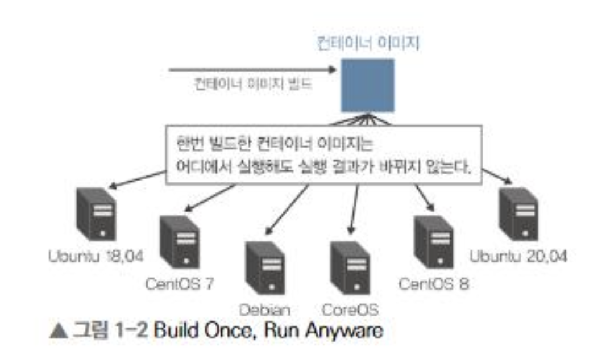
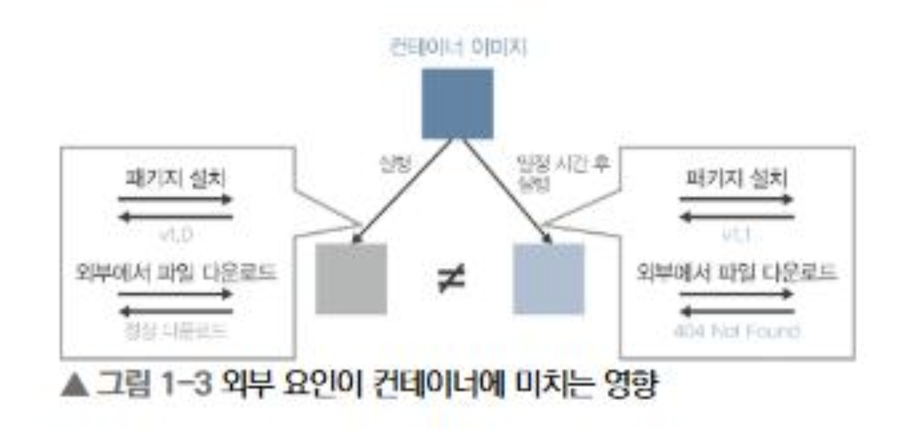
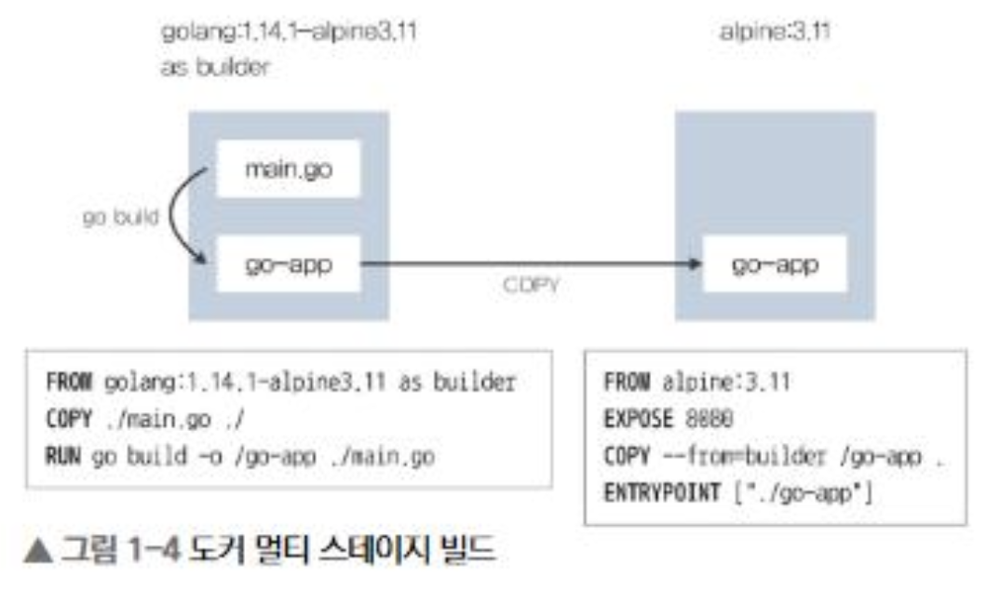
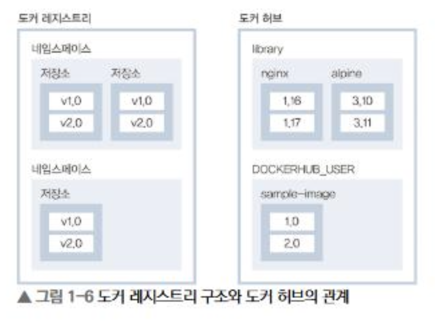

> 요약) 앱을 이미지로 포장(Dockerfile → build)하고, 가볍게 만들어(멀티 스테이지), 창고에 올려두면(push), 어디서든 실행(run)할 수 있다

---

## Docker란

> 컨테이너를 실행해주는 실행 환경 + 도구 모음,
>
> 앱을 컨테이너에 통째로 포장해서 어디서든 똑같이 실행할 수 있게 해주는 기술
>
> | 용어              | 설명                                                                                  |
> | ----------------- | ------------------------------------------------------------------------------------- |
> | 컨테이너          | 앱 + 실행에 필요한 모든 것(라이브러리, 설정)을 하나로 묶은 것                         |
> | 이미지            | 실행하면 컨테이너가 되는 템플릿,                                                      |
> | 이미지 → 컨테이너 |
> | 레지스트리        | 이미지를 올려두고 공유하는 서버 (github이 코드 저장소라면 레지스트리는 이미지 저장소) |

→ 쿠버네티스는 **컨테이너를 관리(오케스트레이션)하는 도구**

쿠버네티스를 쓰면 도커를 깊게 알 필요는 없지만, 아래 4가지는 반드시 알아야 함

1. 도커 컨테이너 설계
2. 도커 파일(Dockerfile) 작성법
3. 도커 이미지 빌드
4. 도커 레지스트리로 이미지 푸시 (업로드)

---

## 1. 컨테이너 vs 가상 머신(VM)

**BORA (Build Once, Run Anywhere)**:


(기존 VM 환경과의 차이점, 하나의 이미지 안에 여러 프로세스 x)

한 번 이미지를 만들면 어떤 환경(내 노트북, 서버, 클라우드)에서든 동일하게 동작한다는 도커의 핵심 철학 (ft. java의 WORA에서 따온 말)

| 구분      | 가상 머신(VM)                             | 컨테이너                               |
| --------- | ----------------------------------------- | -------------------------------------- |
| 격리 방식 | 하이퍼바이저 위에 게스트 OS를 통째로 띄움 | 호스트 커널을 빌려 씀                  |
| 격리 도구 | OS 레벨 분리                              | namespace(칸막이) + cgroups(자원 제한) |
| 무게      | 무거움 (OS 부팅 필요)                     | 가벼움                                 |
| 시작/중지 | 느림                                      | 빠름 (프로세스 실행 수준)              |

- **namespace**: 프로세스·네트워크·파일시스템을 격리해 서로 안 보이게 하는 칸막이 역할
- **cgroups**: CPU·메모리 사용량을 제한하는 장치
- 컨테이너는 게스트 OS 부팅을 기다릴 필요가 없어 프로세스를 빠르게 시작/중지할 수 있음

---

## 2. 도커 컨테이너 설계 4원칙

1. **1 컨테이너 = 1 프로세스** (pid 1)
   - 웹서버와 DB를 한 컨테이너에 다 넣지 않고 각각 분리
   - 주변 에코시스템(쿠버네티스 등)이 전부 해당 전제로 설계되어 있어, 어기면 관리가 어려워짐



1. **변경 불가능한 인프라(Immutable Infrastructure)**
   - 한번 만든 환경은 수정하지 않고, 바꿀 일이 있으면 새로 만들어 교체
   - 실행 중 외부에서 파일을 받아오면 결과가 매번 달라질 수 있음 → 필요한 건 전부 이미지 안에 미리 포함
1. **이미지는 최대한 가볍게**
   - 노드에 이미지가 없으면 pull(다운로드)부터 해야 하므로 작을수록 빠름(유리함)
   - 방법: 캐시 파일 삭제, 멀티 스테이지 빌드, 경량 배포판(alpine, distroless) 사용
1. **root 실행하지 않기 & 권한 최소화**
   - root로 돌리다 해킹되면 대형 사고 → 별도의 전용(일반) 계정으로 실행

---

## 3. Dockerfile 작성법

> Dockerfile = **이미지를 만드는 레시피**

기본 흐름은 FROM으로 기반 이미지를 지정한 뒤 RUN/COPY 등으로 처리해 이미지를 생성하는 것

```docker
FROM golang:1.14.1-alpine3.11 # 기반 이미지 (베이스)
COPY ./main.go ./ # 내 컴퓨터의 파일을 컨테이너로 복사
RUN go build -o ./go-app ./main.go # 빌드 중 명령 실행 (컴파일)
USER nobody # 실행 계정 지정 (root 아님!)
ENTRYPOINT ["./go-app"] # 컨테이너 시작 시 실행할 명령
```

### 주요 명령어 정리

| 명령어     | 역할                                       |
| ---------- | ------------------------------------------ |
| FROM       | 기반 이미지 지정                           |
| RUN        | 이미지 빌드 시 실행할 명령                 |
| COPY       | 호스트 파일을 이미지에 복사                |
| ADD        | COPY + tar 압축 해제 / URL 취득            |
| CMD        | 컨테이너 기동 시 기본 실행 명령(인수)      |
| ENTRYPOINT | 컨테이너 기동 시 반드시 실행되는 명령      |
| USER       | 실행 사용자 지정 (root 지양)               |
| WORKDIR    | 작업 디렉터리 지정 (없으면 생성)           |
| EXPOSE     | 컨테이너가 리슨할 포트 명세                |
| LABEL      | 메타데이터를 키:밸류로 지정                |
| MAINTAINER | 관리자 정보 기입 (deprecated → LABEL 권장) |

### ENTRYPOINT vs CMD

- 컨테이너 시작 시 `$ENTRYPOINT $CMD`가 합쳐져 실행됨
  - ex) ENTRYPOINT=`/bin/sleep`, CMD=`3600` → `/bin/sleep 3600` 실행
- **관례**: ENTRYPOINT엔 바꿀 일 없는 "고정 명령", CMD엔 "덮어쓸 수 있는 기본 인수"를 넣음, 실행 시 CMD만 바꾸면 되도록

|      | ENTRYPOINT           | CMD                               |
| ---- | -------------------- | --------------------------------- |
| 역할 | 반드시 실행되는 명령 | 기본 인수 (덮어쓰기 가능)         |
| 조합 | 실행 파일 고정       | 기본 인수 지정, 단독 시 전체 명령 |

### 기반 이미지 선택

| 이미지        | 크기 | 특징                                                    |
| ------------- | ---- | ------------------------------------------------------- |
| scratch       | 최소 | 아예 빈 것. 셸이 없어 디버깅 어려움, 바이너리만 올릴 때 |
| alpine        | 작다 | musl libc 기반, 가장 널리 쓰임                          |
| distroless    | 작다 | 특정 런타임만 포함, 셸 없음 → 보안 강화                 |
| ubuntu        | 크다 | 디버깅 편의                                             |
| centos        | 크다 | RHEL 호환                                               |
| UBI (Red Hat) | 크다 | 기술 지원 필요 환경에 적합                              |

실제 크기는 5MB ~ 210MB까지 차이가 남

단, scratch는 셸(shell)도 없어서 디버깅이 어렵다는 단점

---

## 4. 이미지 빌드

```bash
$ docker image build -t sample-image:0.1 .
$ docker image ls
```

- `-t 이름:태그`로 이미지 이름과 버전 지정, 마지막 `.`은 "현재 폴더의 Dockerfile 사용”이라는 뜻
- **but 문제)** 위 방식으로 만들면 이미지가 **377MB**나 됨
  - 이유) go 컴파일 도구(약 364MB)가 통째로 들어가기 때문, 앱 실행에는 컴파일러가 필요 없는데도 포함됨 → 멀티 스테이지 빌드로 해결

---

## 5. 멀티 스테이지 빌드

빌드 환경과 실행 환경을 분리해 최종 이미지 크기를 크게 줄이는 기법

```docker
# Stage 1: 컴파일 전용 (도구가 많은 큰 이미지)
FROM golang:1.14.1-alpine3.11 as builder
COPY ./main.go ./
RUN go build -o /go-app ./main.go

# Stage 2: 실행 전용 (작은 이미지에 결과물만 복사)
FROM alpine:3.11
COPY --from=builder /go-app .
ENTRYPOINT ["./go-app"]
```

- 비유: 큰 공장에서 제품을 만든 뒤, 완성품만 작은 상자에 담아 배송
- 효과: **377MB → 13.1MB**(alpine 기반), scratch 사용 시 **7.41MB**까지 축소
- 보너스: 실행 컨테이너에 불필요한 도구가 없어 **보안에도 유리,** BuildKit으로 빌드 단계 병렬 처리도 가능



---

## 6. 이미지 레이어 최소화

- 도커 이미지는 명령 한 줄마다 **레이어**가 쌓이는 구조 → 레이어가 많을수록 이미지 커짐
- **Dive**: 각 레이어에서 어떤 파일이 얼마나 용량을 먹는지 조사하는 도구
- **—squash**: 여러 레이어를 하나로 눌러서(스쿼시) 용량을 줄이는 옵션 (experimental)
  - 여러 `RUN` 명령을 `&&`로 이어 붙여 레이어 수를 줄일 수 있음

---

## 7. 도커 레지스트리에 푸시

- **대표 레지스트리**: Docker Hub, GCR(구글), ECR(아마존)
- **주의**: 아무 이미지나 쓰지 말고 **Docker Official Images** 표시가 있는 공식 이미지를 사용. 공식이라도 취약점이 있을 수 있으니 실무에선 **Trivy, Clair** 같은 보안 스캔 도구도 검토
- **푸시용 이름 규칙**: `레지스트리호스트명/네임스페이스/저장소:태그` → Docker Hub면 `내아이디/sample-image:0.1`
  - 절차)
    ```bash
    docker login # 로그인
    docker image tag sample-image:0.1 DOCKERHUB_USER/sample-image:0.1 # 태그 부여
    docker image push DOCKERHUB_USER/sample-image:0.1 # 푸시
    docker logout # 로그아웃
    ```
    

---

## 8. 컨테이너 기동 & 마무리

```bash
docker container run -d -p 12345:8080 sample-image:0.1
curl http://localhost:12345
# → Hello, Kubernetes
```

- `-d`: 백그라운드 실행
- `-p 12345:8080`: 내 컴퓨터의 12345 포트로 들어온 요청을 컨테이너의 8080 포트로 전달(포트 포워딩)
- 단, **쿠버네티스에서는 이 명령을 직접 쓰지 않음)** 쿠버네티스가 알아서 컨테이너를 띄워주기 때문

---
