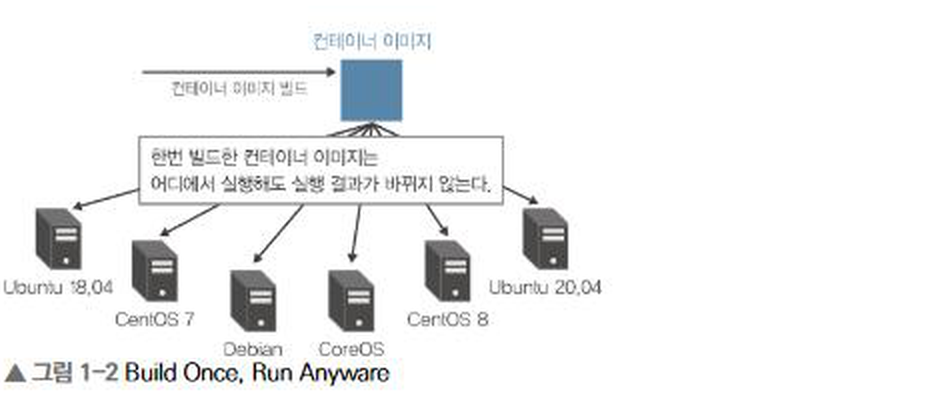
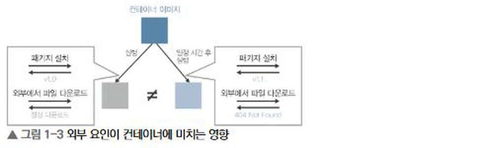
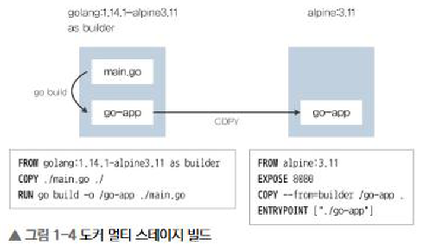
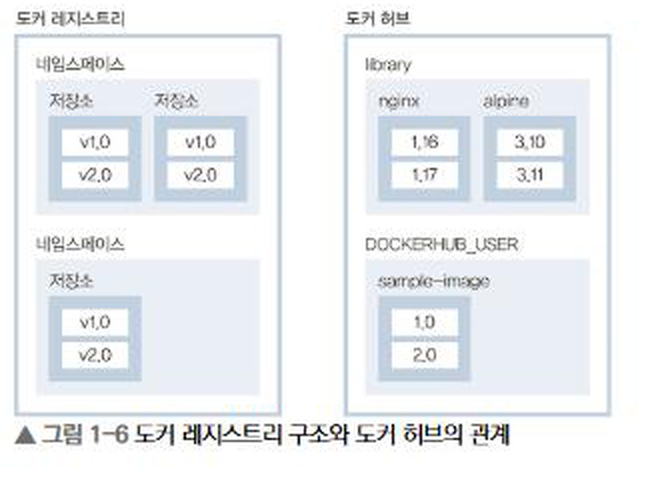
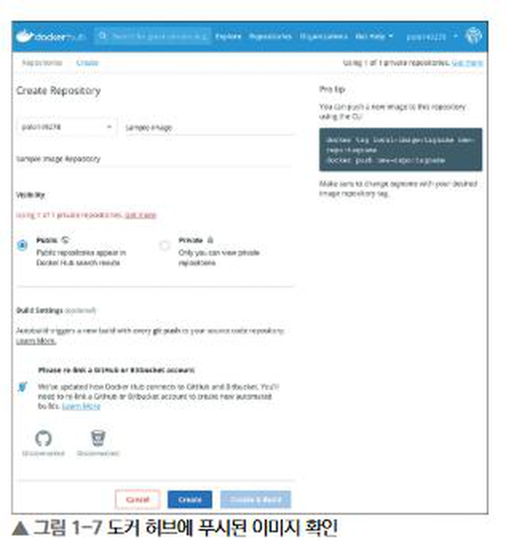
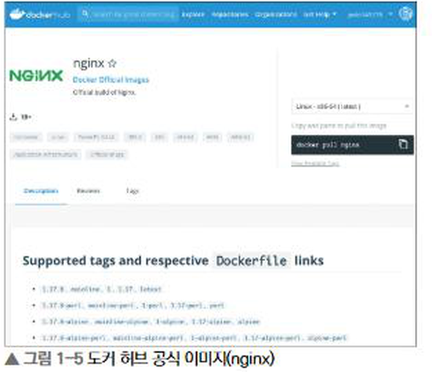

# 1장 도커 복습과 Hello, Kubernetes


도커는 애플리케이션과 실행에 필요한 환경을 이미지로 만들고, 해당 이미지를 컨테이너로 실행할 수 있게 해주는 도구다.

### 도커 컨테이너란?

도커 이미지를 기반으로 실행되는 프로세스

> 한 번 빌드한 이미지는 어느 환경에서 실행해도 같은 동작을 기대할 수 있다.



- 이미지는 애플리케이션, 라이브러리, 설정 등을 담은 정적인 템플릿
- 컨테이너는 이미지를 바탕으로 실제 실행된 프로세스
- 가상 머신과 달리 게스트 OS를 따로 실행하지 않고 호스트 커널을 공유
- namespace로 프로세스와 네트워크 등을 격리
- cgroups로 CPU와 메모리 사용량을 제어

가상 머신보다 크기가 작고 시작과 종료가 빠르다는 장점이 있다.

### 도커 컨테이너 설계

컨테이너를 설계할 때 주의할 점

1. 컨테이너 하나에는 하나의 주된 역할을 담당하는 프로세스를 둔다.
2. 실행 중인 컨테이너를 직접 수정하지 않고, Dockerfile을 수정해 새로운 이미지를 만든다.
3. 실행에 필요하지 않은 파일과 도구를 제거해 이미지를 가볍게 만든다.
4. 컨테이너 내부 프로세스는 가능하면 root가 아닌 사용자로 실행한다.



경량 기반 이미지로 Alpine, Distroless, scratch 등이 있다. 다만 이미지 크기만 볼 것이 아니라 애플리케이션 호환성이나 디버깅 가능성도 고려해야 한다.

## Dockerfile

컨테이너 이미지를 만드는 과정을 코드로 작성한 파일

주요 명령어

- FROM: 기반 이미지 지정
- COPY: 로컬 파일을 이미지로 복사
- RUN: 이미지 빌드 과정에서 명령 실행
- USER: 컨테이너 프로세스를 실행할 사용자 지정
- WORKDIR: 작업 디렉터리 지정
- EXPOSE: 애플리케이션이 사용하는 포트 표시
- ENTRYPOINT: 컨테이너 시작 시 실행할 기본 명령 지정
- CMD: 기본 명령 또는 ENTRYPOINT에 전달할 기본 인수 지정

### ENTRYPOINT와 CMD

ENTRYPOINT에는 컨테이너가 반드시 실행해야 하는 프로그램을 두고, CMD에는 변경 가능한 기본 인수를 두는 방식이 일반적이다.

```
ENTRYPOINT ["/bin/sleep"]
CMD ["3600"]
```

별도의 인수를 전달하지 않으면 /bin/sleep 3600이 실행된다. 컨테이너를 실행할 때 다른 값을 입력하면 CMD의 기본값을 덮어쓸 수 있다.

### Dockerfile 작성 예시

교재에서는 HTTP 요청에 Hello, Kubernetes라고 응답하는 Go 애플리케이션을 사용한다.

```
FROM golang:1.14.1-alpine3.11 //이미지 버전 설정

COPY ./main.go ./   //빌드할 머신이 있는 main.go 파일을 컨테이너에 복사

RUN go build -o /go-app ./main.go   // 빌드 시 컨테이너 내부에서 명령을 실행

USER nobody     //실행 계정을 nobody로 지정

ENTRYPOINT ["/go-app"]      //컨테이너가 가동할 때 실행할 명령어 정의
```

## 도커 이미지 빌드

```
docker image build -t sample-image:0.1 .
docker image ls
```

-t 옵션은 이미지 이름과 태그 지정을 의미하며, .은 현재 directory를 빌드 컨텍스트로 사용한다는 뜻이다.

### 멀티 스테이지 빌드

애플리케이션 빌드 환경과 실제 실행 환경을 분리하고, 최종 이미지에는 빌드 결과물만 복사하는 방식

golang의 도커 이미지에는 Go 컴파일 도구가 포함되어 있으며, sample-image 에도 해당 컴파일 도구가 포함되어 이미지 사이즈가 매우 커지는 문제를 해결한다.

```
FROM golang:1.14.1-alpine3.11 AS builder
COPY ./main.go ./
RUN go build -o /go-app ./main.go

FROM alpine:3.11
COPY --from=builder /go-app /go-app
USER nobody
ENTRYPOINT ["/go-app"]
```



교재 예시에서는 일반 이미지가 약 377MB였지만 멀티 스테이지 빌드 적용 후 약 13.1MB로 줄었다.

최종 이미지에서 컴파일러와 빌드 도구가 빠지기 때문에 이미지 전송 시간과 저장 공간을 줄일 수 있다. 실행에 필요하지 않은 프로그램이 제거되므로 보안 측면에서도 유리하다.

### 이미지 레이어 통합과 이미지 축소화

그 외에도 도커 이미지를 경량화하는 방법이 있다.

- 다이브 : 도커 이미지를 조사하는 도구. 각 레이어에서 어느 파일에 변경이 있어 어느 정도의 용량이 소비되고 있는지 CUI에서 조사할 수 있다.
- docker image build 시 --squash 옵션 : 레이어마다 같은 파일의 변경이 많은 경우 사용하면 최종 파일 상태를 가진 한 개의 레이어로 합쳐지므로 컨테이너 이미지를 축소할 수 있다.

## 도커 레지스트리

컨테이너 이미지를 보관하고 다른 환경에 배포하기 위한 저장소 서버

Docker Hub, Google Container Registry, Amazon ECR 등이 있다.

```
[레지스트리 주소/]사용자 또는 네임스페이스/이미지 이름:태그
```



Docker Hub에 이미지를 업로드하는 과정

```
docker login
docker image tag sample-image:0.1 DOCKERHUB_USER/sample-image:0.1
docker image push DOCKERHUB_USER/sample-image:0.1
```



공개 이미지를 사용할 때는 공식 이미지나 신뢰할 수 있는 게시자의 이미지인지 확인해야 한다. 실제 운영 환경에서는 알려진 취약점이 있는지도 확인할 필요가 있다.



## 컨테이너 실행

호스트의 12345 포트를 컨테이너의 8080 포트로 연결하여 백그라운드로 실행한다.

```
docker container run -d -p 12345:8080 sample-image:0.1
```

애플리케이션 동작 확인

```
curl http://localhost:12345
```

```
Hello, Kubernetes
```

위와 같이 출력이 나온다.
