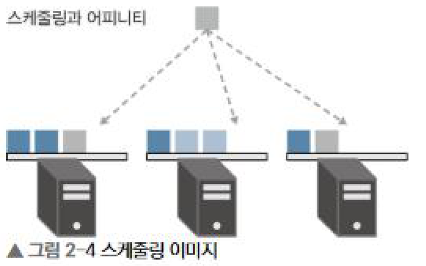
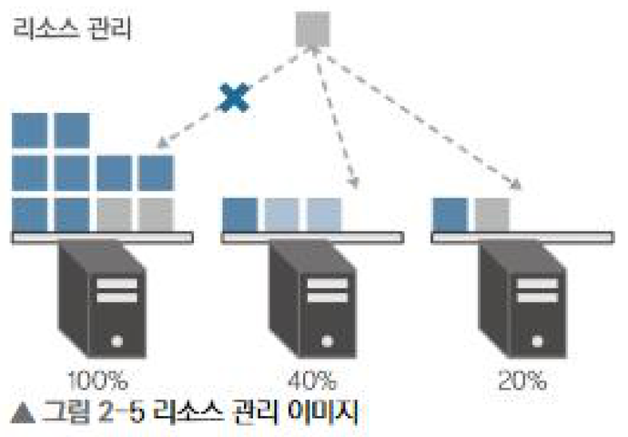
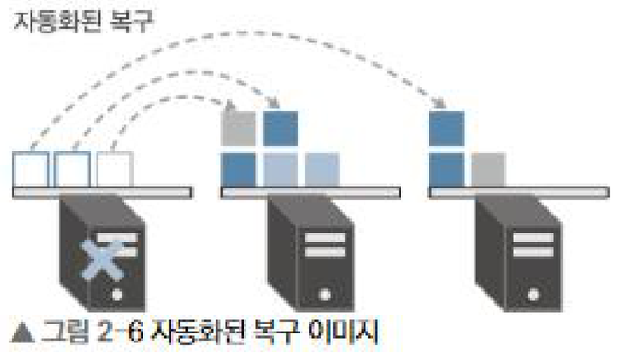
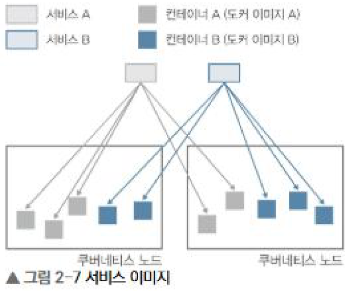
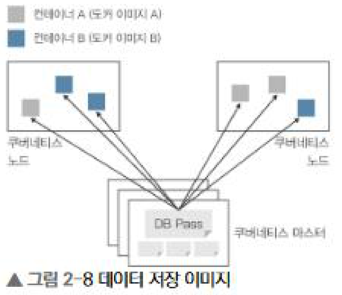

# 2장 왜 쿠버네티스가 필요할까?


도커는 컨테이너를 만들고 실행하는 것까지는 해결해주지만, 여러 대의 호스트를 묶어서 운영하는 부분은 해결해주지 않는다. 쿠버네티스는 그 부분을 담당하는 컨테이너 오케스트레이션 엔진이다.

### 쿠버네티스란?

컨테이너화된 애플리케이션의 배포와 확장 등을 자동화하기 위한 플랫폼. 도커 단독으로는 도커가 설치된 호스트를 여러 대 동시에 동작시키거나 중앙에서 통합 관리할 수 없다.

- 컨테이너 오케스트레이션 엔진은 Docker Swarm, Apache Mesos, kubernetes.
- 그중 서비스 환경에서 가장 많이 사용되는 것은 쿠버네티스이다.
- 컨테이너 런타임은 containerd, cri-o 등을 사용할 수 있다.

실제 컨테이너가 기동하는 물리 머신이나 가상 머신을 쿠버네티스 노드라 하고, 그 노드를 관리하는 노드를 쿠버네티스 마스터라 한다.

## 1. 컨테이너 운영

도커를 사용하면 호스트에 컨테이너화된 애플리케이션을 쉽게 배포할 수 있다. 그러나 컨테이너를 서비스 환경에서 사용하려면 컨테이너 운영과 관련된 다음과 같은 과제도 고려해야 한다.

- 여러 쿠버네티스 노드 관리
- 컨테이너 스케줄링
- 롤링 업데이트
- 스케일링/오토 스케일링
- 컨테이너 모니터링
- 자동화된 복구
- 서비스 디스커버리
- 로드 밸런싱
- 데이터 관리
- 워크로드 관리
- 로그 관리
- 선언적 코드를 사용한 관리

## 2. 쿠버네티스 기능

### 선언적 코드를 사용한 관리(IaC)

YAML 형식이나 JSON 형식으로 작성한 선언적 코드(매니페스트)를 통해 배포하는 컨테이너와 주변 리소스를 관리하는 방식

```
apiVersion: apps/v1
kind: Deployment
metadata:
  name: sample-deployment
spec:
  replicas: 3
  selector:
    matchLabels:
      app: sample-app
  template:
    metadata:
      labels:
        app: sample-app
    spec:
      containers:
        - name: nginx-container
          image: nginx:1.16
```

위 매니페스트는 교재에 있던 코드이다. sample-app이라는 레이블을 가진 파드에 레플리카셋 3개의 파드를 띄우라는 의미이며, nginx컨테이너를 배포하고 있다.

### 스케일링/오토 스케일링

쿠버네티스는 컨테이너 클러스터를 구성하여 여러 쿠버네티스 노드를 관리한다.

- 같은 컨테이너 이미지를 기반으로 한 여러 컨테이너를 배포하면 부하 분산 및 다중화 구조를 만들 수 있다.
- 부하에 따라 컨테이너 레플리카 수를 자동으로 늘리거나 줄일 수도 있다.

### 스케줄링

컨테이너를 어떤 쿠버네티스 노드에 배포할 것인지를 결정하는 단계



Affinity와 Anti-Affinity 기능을 사용하여 워크로드의 특징이나 노드의 성능을 기준으로 스케줄링할 수 있다. 동일한 노드 내에 동일한 파드가 뜰 수 있을지 없을지를 결정하는 요소이기도 하다.


### 리소스 관리

컨테이너 배치를 위한 지정이 특별히 없을 경우 쿠버네티스 노드의 CPU나 메모리의 여유 리소스 상태에 따라 스케줄링된다.



사용자는 어떤 노드에 컨테이너를 배치할지 직접 관리할 필요가 없다. 또한, 리소스 사용 상태에 따라 클러스터 오토 스케일링 기능으로 쿠버네티스 노드 자체도 자동으로 추가하거나 삭제할 수 있다.

### 자동화된 복구

쿠버네티스의 중요한 개념 중 하나인 자동화된 자가 치유 기능이다.



- 쿠버네티스는 표준으로 컨테이너 프로세스를 모니터링하고, 프로세스 정지를 감지하면 다시 컨테이너 스케줄링을 실행하여 컨테이너를 자동으로 재배포한다.
- 클러스터 노드에 장애가 발생할 경우, 그 노드의 컨테이너가 사라진다 하더라도 서비스에 영향 없이 애플리케이션을 자동으로 복구할 수 있도록 만들어져 있다.
- 자동화된 복구 실행 조건에는 프로세스 모니터링 외에 HTTP/TCP나 셸 스크립트로 헬스 체크의 성공 여부를 설정할 수도 있다.

### 로드 밸런싱과 서비스 디스커버리

여러 대로 구성된 애플리케이션을 하나의 애플리케이션으로 사용자에게 보여주고 접속시키려면 목적지가 되는 엔드포인트를 준비(할당)해야 한다.



가상 머신을 사용하는 경우라면 로드 밸런서를 통해 여러 가상 머신으로 라우팅되도록 구성하고 그 로드 밸런서 주소를 엔드포인트로 할당한다. 쿠버네티스는 인그레스와 같은 로드 밸런서 기능을 제공하고 있으며 사전에 정의한 조건과 일치하는 컨테이너 그룹에 라우팅하는 엔드포인트를 할당할 수 있다.

컨테이너를 확장할 때 엔드포인트가 되는 서비스에 컨테이너의 자동 등록과 삭제, 컨테이너 장애 시 분리, 컨테이너 롤링 업데이트 시 필요한 사전 분리 작업도 자동으로 실행해준다. 이를 통해 높은 서비스 레벨을 구현하면서 엔드포인트 관리를 쿠버네티스에게 맡길 수 있다.

참고로 Nginx 인그레스는 레거시화 되어가고 있고, 요즘은 Istio Ingress 방식을 도입하면서 서비스 메쉬 보편화되어가고 있다고 한다.

### 데이터 관리

쿠버네티스는 백엔드 데이터 스토어로 etcd를 채용하고 있다.



- etcd는 클러스터를 구성하여 이중화가 가능하고 컨테이너나 서비스의 매니페스트 파일도 이중화 구조로 저장한다.
- 컨테이너가 사용하는 설정 파일이나 인증 정보 등의 데이터를 저장하는 구조도 가지고 있다.
- 컨테이너 공통 설정이나 애플리케이션에서 사용되는 데이터베이스 인증 정보 등을 안전하고 이중화된 상태로 쿠버네티스에서 집중적으로 관리할 수 있다.


## 정리

도커 컨테이너를 서비스 환경에서 사용하려면 컨테이너와 그 주변의 리소스를 관리하기 위한 복잡한 기능이 필요하다. 그러나 쿠버네티스를 사용하면 사전에 개발된 자동화 기능을 사용할 수 있다. 쿠버네티스를 사용하면 컨테이너의 이동성과 경량화를 활용한 빠른 개발과 전체 시스템의 배포 자동화를 구현할 수 있다.
