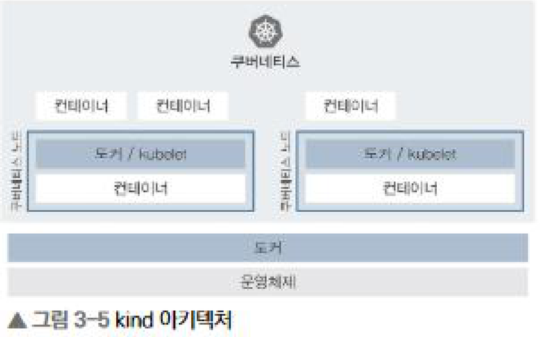
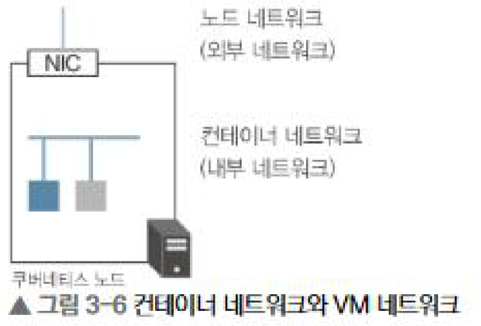
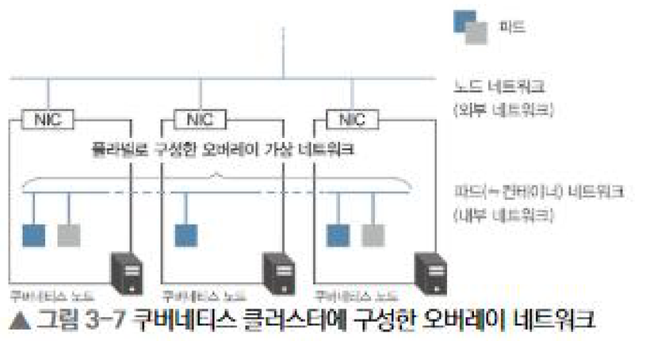
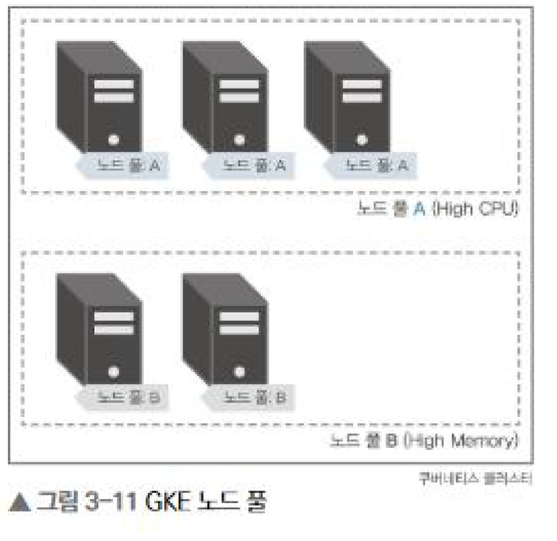

# 3장 쿠버네티스 환경 선택


### 쿠버네티스 환경의 종류

- 로컬 쿠버네티스 : 로컬 머신 한 대에 구축해서 사용
- 쿠버네티스 구축 도구 : 도구를 사용해 온프레미스나 클라우드에 클러스터를 직접 구축
- 관리형 쿠버네티스 서비스 : AWS와 같은 퍼블릭 클라우드가 제공하는 클러스터를 사용


## 1. 로컬 쿠버네티스

로컬 머신 한 대에 쿠버네티스를 구축하는 방법이다.

### minikube

가상 머신이나 도커 위에 쿠버네티스 클러스터를 구축해주는 도구

- `--kubernetes-version`으로 원하는 쿠버네티스 버전을 지정할 수 있다.
- `minikube profile`로 여러 클러스터를 만들고 전환할 수 있다.
- 애드온이 다양해서 기능성 측면에서는 가장 낫지만, 멀티 노드는 지원하지 않는다.

### Docker Desktop

- 로컬에 기동 중인 도커 호스트 자체가 쿠버네티스 노드가 된다.
- 쿠버네티스 구성 요소도 컨테이너로 뜨기 때문에 Show system containers 옵션을 켜면 `docker container ls`로 etcd, kube-apiserver, kube-scheduler 등을 직접 볼 수 있다.
- 가장 간단하지만 버전을 고를 수 없다. Docker Desktop 버전에 묶여 있는 쿠버네티스 버전을 그대로 써야 한다.

### kind

kind(Kubernetes in Docker)는 쿠버네티스 자체 개발을 위해 SIG-Testing에서 만든 도구다.



이름 그대로 도커 컨테이너를 여러 개 띄우고 그 컨테이너를 쿠버네티스 노드로 사용한다. 로컬에서 멀티 노드 클러스터를 구성하려면 kind가 가장 낫다.


```
# 클러스터 생성
kind create cluster --config kind.yaml --name kindcluster
```

- 위 설정은 마스터 3대 + 워커 3대 구성이다.
- 노드로 사용하는 이미지는 도커 허브의 kindest Organization에서 관리된다.
- FeatureGates를 `extraArgs`로 넘겨 알파 기능을 켤 수 있고, 로컬에서 컨테이너로 접속하기 위한 `extraPortMapping` 설정도 자주 쓴다.
- 실행하려면 Docker Desktop의 도커 환경이 떠 있어야 한다.


## 2. 쿠버네티스 구축 도구를 사용해 여러 노드로 구성된 클러스터를 직접 구축하는 방법이다.

### 쿠버네티스 SLO

SIG-Scalability에서 쿠버네티스의 SLI(서비스 수준 지표)와 SLO(서비스 수준 목표)를 정의하고 있다.

- API 응답 시간 : 단일 객체의 변경 API 요청은 지난 5분 동안 99%가 1초 이내
- 비스트리밍 API 요청은 지난 5분 동안 99%가 특정 리소스 1초 / 네임스페이스 전체 5초 / 클러스터 전체 30초 이내
- 파드 기동 시간 : 지난 5분 동안 99%가 5초 이내 (이미지 다운로드 시간과 초기화 컨테이너 처리 시간은 제외)

이 SLO를 충족하는 클러스터의 최대 사이즈는 다음과 같다.

- 노드 수 5,000 노드 이하
- 클러스터 내 총 파드 수  3,000 파드 이하, 전체 150,000 파드 이하
- 1 노드당 파드 수 110 파드 또는 (코어 수 * 10) 중 낮은 쪽
- 서비스 수 5,000 이, 전체 10,000 이하 |

이 이상의 규모로도 클러스터를 만들 수는 있지만 서비스 수준이 떨어질 수 있다. 관리형 서비스는 파드의 네트워크 구성 제약 때문에 파드 수 제한이 다를 수 있으니 주의해야 한다.

또한 관리형 서비스는 마스터 노드의 스케일 업이 자동으로 이루어지지만, 구축 도구를 사용하는 경우에는 마스터 인스턴스 사이즈를 직접 정해야 한다.

### kubeadm

쿠버네티스에서 제공하는 공식 구축 도구. 쿠버네티스 1.13이 릴리스된 2018년 12월에 GA가 되었다.

```
sudo kubeadm init \
--kubernetes-version=1.18.15 \
--pod-network-cidr=172.31.0.0/16
```

- `--pod-network-cidr`은 파드 네트워크용 설정이며, 여기서는 플라넬을 쓰기 위한 값이다.
- 사전에 swap이 비활성화되어 있어야 한다. 일시적으로는 `sudo swapoff -a`, 영구적으로는 /etc/fstab의 swap 행을 주석 처리한다.
- kubectl 인증용 파일은 `/etc/kubernetes/admin.conf`에 있고, 이를 `$HOME/.kube/config`로 복사하면 준비가 끝난다.
- 워커 노드는 `kubeadm init` 실행 후 출력되는 `kubeadm join` 명령어를 그대로 실행해서 붙인다.

### 플라넬(Flannel)

여기까지만 하면 각 노드에 필요한 프로세스는 다 떠 있지만 아직 멀티 노드 클러스터라고 하기엔 부족하다. 서로 다른 노드에 배포된 파드 간 통신이 되지 않기 때문이다.



도커에서 기동한 컨테이너에 할당된 IP는 호스트 외부에서 볼 수 없는 내부 IP다. 그래서 각 노드에 배포된 컨테이너 간 통신이 불가능한 상태다.



플라넬은 노드 사이를 연결하는 네트워크에 가상 터널(오버레이 네트워크)을 구성해서 클러스터 내부의 파드 간 통신을 구현한다.


## 3. 관리형 쿠버네티스 서비스

퍼블릭 클라우드가 제공하는 관리형 서비스를 사용하는 방법이다. 영구 볼륨이나 로드 밸런서와의 연계 등을 쉽게 사용할 수 있도록 기능을 제공한다.

### GKE

가장 먼저 출시된 관리형 쿠버네티스 서비스이다. 수년간 축적된 노하우와 Borg를 바탕으로 만들어져서 관리에 필요한 기능이 많다.

- 릴리스 채널, 노드 자동 업데이트, 노드 자동 복구(Node Auto Repair)
- 노드 인스턴스 유형을 자동으로 결정해주는 노드 자동 프로비저닝
- Cloud Logging과 기본 연계, 고가용성 HTTP 로드 밸런서(인그레스), GPU 사용 가능

노드로는 GCE가 사용된다. 가동 시간이 24시간으로 제약된 저비용 인스턴스인 선점형 인스턴스(Preemptible Instance)를 노드로 쓸 수 있어 비용을 절감할 수 있다. 다만 선점형만으로 클러스터를 구성하면 24시간 후에 모든 노드가 한 번에 정지할 수 있어서, 랜덤으로 서서히 노드를 교체하는 preemptible-killer 같은 도구를 같이 검토하는 게 좋다.



GKE에서 중요한 개념 중 하나가 노드 풀(NodePool)이다. 클러스터 내부 노드에 레이블을 부여해 그룹핑하는 기능으로, 'vCPU가 많은 노드', '메모리가 많은 노드'처럼 성능이 다른 노드를 한 클러스터에 두고 스케줄링 시 배포 제약 조건으로 사용할 수 있다. 지금은 GKE 외의 다른 관리형 서비스에서도 제공된다.

### AKS

마이크로소프트 애저에서 동작하는 관리형 쿠버네티스 서비스로 2018년 6월에 GA가 되었다.

- Azure Active Directory를 쿠버네티스 RBAC와 연계
- 리소스가 부족할 때 Virtual Kubelet을 사용해 Azure Container Instances(ACI)로 버스팅

버스팅은 클러스터를 스케일 아웃하는 게 아니라 ACI로 넘기는 방식이라 파드를 몇 초 안에 띄울 수 있고, 버스팅 전까지는 비용이 발생하지 않는다.


### EKS

AWS re:Invent 2017에서 발표한 AWS의 관리형 쿠버네티스 서비스로 2018년 6월에 GA가 되었다.

- IAM과 쿠버네티스 사용자를 연결해 IAM 기반으로 권한 관리
- 파드 네트워크와 VPC 서브넷이 직접 연결되어 가상 머신에서 컨테이너로 직접 통신 가능
- CloudWatch Logs, CloudTrail과 연계된 로깅

일반적으로 AWS가 제공하는 AMI에서 생성한 EC2 인스턴스를 노드로 사용한다. 운용 부하를 줄이고 싶다면 워커 노드 관리를 AWS에 맡기는 Managed Nodegroups나, Fargate를 노드로 사용하는 EKS on Fargate를 쓰면 좋다. 다만 클러스터 내부의 DNS, CNI, 인그레스 컨트롤러 등의 구성 요소는 관리되지 않으므로 주의해야 한다.

클러스터를 만들 때 AWS CLI + CloudFormation으로 직접 하면 커스터마이즈는 편하지만 작업이 복잡한 편이라, 책에서는 Amazon과 Weaveworks가 개발한 eksctl을 사용한다.
