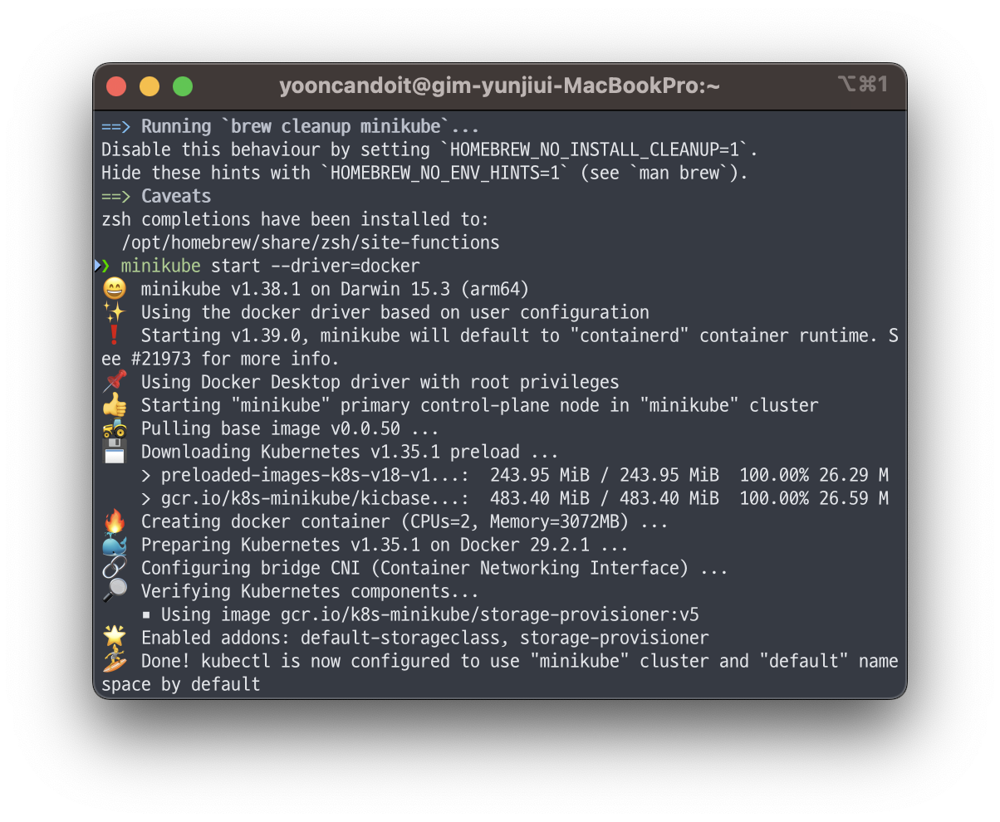

> 요약:
>
> 쿠버네티스 클러스터를 만드는 방법 **3가**지: 로컬 / 구축 도구 / 관리형
>
> 용도(개인 테스트 / 개발 / 스테이징 / 서비스)에 따라 선택이 달라짐

---

### 1. 쿠버네티스 환경의 종류

**[3가지 구성 방법]**

| 로컬 쿠버네티스      | 물리 머신 한 대에 구축                                                                   | 개인 테스트/개발 (이중화 안 됨 → 서비스용 부적합) |
| -------------------- | ---------------------------------------------------------------------------------------- | ------------------------------------------------- |
| 쿠버네티스 구축 도구 | kubeadm/Rancher 등의 도구로 온프레미스/클라우드에 클러스터 직접 구축                     | 온프레미스 배포, 세밀한 커스터마이즈              |
| 관리형 k8s 서비스    | 퍼블릭 클라우드의 관리형 서비스로 제공하는 클러스터를 사용, 클라우드가 제공(GKE/AKS/EKS) | 스테이징 / 서비스 환경                            |

**[선택 기준]**

- 로컬은 네트워크 연결 없이도 되고 눈으로 바로 확인할 수 있어 개인 테스트 / 개발용으로 적당함
  - 이중화가 되어 있지 않으므로 서비스 환경으로 쓰는 것은 부적합
- 개발 부서와 공유하는 스테이징 / 서비스용 클러스터는 구축 도구나 관리형 서비스를 쓰는 편이 좋음
- 가능하다면 개발 환경도 이 둘 중 하나로 맞추면 서비스 환경과 동일하게 구성할 수 있음
- 기본은 관리형 서비스, 온프레미스 배포나 세밀한 커스터마이즈가 필요하면 구축 도구

### 2 로컬 쿠버네티스

| 도구           | 버전 선택 | 멀티 노드 | 특징                                                                     |
| -------------- | --------- | --------- | ------------------------------------------------------------------------ |
| minikube       | O         | X         | 하이퍼바이저 위 VM으로 구동, 기능성 좋음                                 |
| Docker Desktop | X         | X         | 가장 단순, 버전 지정 불가                                                |
| **kind**       | O         | **O**     | 도커 컨테이너를 노드로 사용, 멀티 노드 가능 → 로컬 멀티 노드는 이게 최선 |

**[미니큐브]**

- 로컬 쿠버네티스를 쉽게 구축/실행하는 도구

- 단일 노드 구성이라 여러 대가 필요한 기능은 사용할 수 없음
- 로컬 가상 머신에 설치하므로 하이퍼바이저가 필요함
- 하이퍼바이저에 맞는 드라이버를 지정하면 호스트가 되는 컨테이너나 가상 머신을 자동 생성하고 그 환경에 쿠버네티스를 설치함

```bash
# 설치
# brew install minikube
arch -arm64 brew install minikube

minikube start --driver=docker
# minikube start

# 상태 확인
minikube status
```

> 

만들어진 클러스터(미니큐브 클러스터)는 다른 방법과 마찬가지로 kubectl로 조작함

여러 쿠버네티스 클러스터를 사용하는 경우, kubectl의 컨텐스트를 전환해서 사용해야함

컨텍스트 전환 후 kubectl에서 미니 큐브 클러스터를 조작하는 명령어:

```bash
kubectl config use-context minikube
```

kubectl 에서는 로컬 머신에서 기동하고 있는 가상 머신 미니큐브를 쿠버네티스 노드로 인식한다.

```bash
# 노드 확인
kubectl get nodes
```

사용하지 않는 미니큐브 클러스터 삭제:

```bash
# 미니큐브 클러스터 정지
minikube delete
```

그 외에도 미니큐브에 minikube tunnel 명령어를 사용하여 ClusterIP
서비스에 연결하거나 Addon 기능을 사용해 이스터오 (stio) 등의 다양한
소프트웨어를 설치할 수도 있다.

**[Docker Desktop for Mac / Windows]**

- 쿠버네티스 **버전을 지정할 수 없음**
- 설치) 공식 사이트 인스톨러로 설치 후, Preference에서 쿠버네티스를 활성화해야 함
- 쿠버네티스 클러스터 기능을 담당하는 구성 요소(component) 그룹도 컨테이너로 기동됨
- 활성화 시 **Show system containers (advanced)** 를 켜면 `docker container ls`로 구성 요소를 확인할 수 있음 (kube-apiserver, kube-scheduler, etcd, kube-controller-manager, coredns 등)

**[kind]**

> .png>)
> .png>)

- kind = kubernetes in Docker, 쿠버네티스 **자체 개발을 위한 도구,** 도커 컨테이너 하나하나를 노드로 삼아 여러 노드 클러스터를 로컬에 구성
  - 도커 컨테이너를 여러 개 기동하고 그 컨테이너를 쿠버네티스 노드로 사용함
- 여러 대로 구성된 클러스터를 만들 수 있어, **로컬에서 멀티 노드 클러스터를 구축하려면 kind가 가장 좋음**
- 구성 설정은 YAML 파일로 관리 (마스터 3대 + 워커 3대 구성 예제)
- kind가 쓰는 도커 이미지는 도커 허브의 **kindest** Organization에서 관리됨
- 클러스터 구축 시 Docker Desktop의 도커 환경이 기동되어 있어야 함
- 내부적으로 **kubeadm**을 사용하며, 구축 시 설정 파일에 패치를 적용하는 `kubeadmConfigPatches`, `kubeadmConfigPatchesJson6902` 등으로 다양한 클러스터를 만들 수 있음

> .png>)

---

### 3. 쿠버네티스 구축 도구

> **여러 노드**로 구성된 클러스터를 만드는 방법

**[쿠버네티스 서비스 수준 목표 (SLO)]**

- 쿠버네티스 확장성을 논의하며 SLI(서비스 수준 지표)와 SLO(서비스 수준 목표)를 정의함

**API 응답 시간**

- 단일 객체의 변경 API 요청: 지난 5분 동안 99%가 1초 내에 응답(일부 제외)
- 비스트리밍(non-streaming) API 요청: 지난 5분 동안 99%가 아래 시간 내 응답(일부 제외)
  - 특정 리소스: 1초
  - 네임스페이스 전체: 5초
  - 클러스터 전체: 30초

**파드 기동 시간**

- 지난 5분 동안 99%가 5초 이내에 기동 (이미지 다운로드 시간, Init Container 처리 시간은 미포함)

!SLO를 충족하는 클러스터 최대 사이즈

SLO를 충족하는 클러스터 최대 사이즈

- 이 이상 규모로도 만들 수는 있으나 서비스 수준이 떨어질 수 있음
- 환경에 따라 추가 제한이 있음 → 관리형 서비스는 파드의 네트워크 구성 제약 때문에 파드 수 제한이 다를 수 있음
- 관리형 서비스는 마스터 노드 스케일 업이 자동으로 이루어지지만, **구축 도구를 쓰면 마스터 인스턴스 사이즈를 직접 정해야 함**
- 참고용으로 공식 자동 구축 스크립트 `kube-up`이 GCP/AWS에 클러스터를 만들 때 쓰는 인스턴스 사이즈 기준이 공개되어 있음 → 온프레미스 구축 시 코어 수, 메모리 용량 참고

**[큐브어드민]**

- 쿠버네티스가 제공하는 **공식 구축 도구**
- 책의 예제는 우분투 \*\*\*\*18.04 머신 여러 대로 멀티 노드 클러스터를 구성함

구축 흐름:

1. 모든 노드에 도커, CLI 등 관련 패키지 설치
2. 버전 고정(apt-mark hold)
3. 오버레이 네트워크용 커널 파라미터 변경 (bridge-nf-call-ip6tables, bridge-nf-call-iptables, ip_forward)
4. 마스터로 쓸 노드에서 kubeadm init 실행
   - -pod-network-cidr은 클러스터 내부 네트워크(파드 네트워크)용, 플라넬을 쓰기 위한 설정
   - **사전에 swap이 비활성화되어 있어야 함**
     - 임시 비활성화: swapoff -a
     - 영구 비활성화: /etc/fstab의 swap 설정 행 맨 앞에 # 추가
5. 인증용 파일은 /etc/kubernetes/admin.conf에 있으며, init 후 표시되는 명령어를 그대로 입력하면 준비 끝
6. 마스터 설정이 성공하면 노드에서 실행할 kubeadm join 명령어가 출력됨 → 노드가 될 머신마다 실행
7. 여기까지 하면 각 노드에 필요한 프로세스는 모두 기동된 상태지만, **서로 다른 노드에 배포된 파드 간 통신이 되지 않아** 아직 멀티 노드 클러스터라 하기엔 부족함

**[플라넬]**

> .png>)

- 도커에서 기동한 컨테이너에 할당된 IP는 호스트 외부에서 볼 수 없는 **내부 IP(Internal IP)** → 각 노드에 배포된 컨테이너 간 통신이 불가능한 상태
- 해결하려면 각 호스트의 내부 네트워크 접속성을 확보해야 함
- **플라넬(Flannel)** 은 노드 사이를 연결하는 네트워크에 가상 터널(오버레이 네트워크)을 구성해 클러스터 내부의 파드 간 통신(파드 네트워크)을 구현함
- 준비가 끝난 상태에서 플라넬 데몬 컨테이너를 기동하면 구성 완료
- 파드 네트워크를 구현하는 방법은 플라넬 외에도 여러 가지가 있음

**[랜처]**

> .png>)

- Rancher Labs이 개발하는 오픈 소스 컨테이너 플랫폼
- 특징: 구축과 운용을 지원하는 다양한 기능으로 쿠버네티스 도입을 쉽게 함

(버전 2.3 기준) 기능:

- 여러 클러스터의 통합 관리
- 다양한 플랫폼에 클러스터 배포(AWS, OpenStack, 브이엠웨어 등)
- 온프레미스 포함 기존 클러스터를 랜처로 관리(클러스터 임포트)
- 여러 클러스터에 애플리케이션 배포를 가능하게 하는 멀티 클러스터 앱(Multi-cluster App)
- 중앙 집중적 인증, 모니터링, 웹 UI
- 풍부한 애플리케이션 카탈로그
- 이스티오(Istio)와의 통합/연계

구조:

- 중앙에서 **랜처 서버**를 기동하고, 관리자는 랜처 서버를 통해 클러스터를 구축·관리함
- 클라우드 프로바이더 환경에서도 랜처 서버가 프로바이더 API를 사용해 구축·관리를 대행함
- 실제 서비스 환경에서는 **데이터베이스 이중화와 랜처 서버의 HA 구성**을 고려해야 함

## 4. 퍼블릭 클라우드 관리형 쿠버네티스 서비스

영구 볼륨이나 로드 밸런서 연계 등을 쉽게 사용할 수 있도록 기능을 제공함.

### 4.1 GKE

> .png>)

- Google Kubernetes Engine, **가장 먼저 출시된 관리형 서비스로 2015년 8월 GA**
- 수년간 축적된 노하우와 **Borg**를 바탕으로 만들어져 관리에 필요한 편리한 기능이 많음
  - 릴리스 채널
  - 노드 자동 업데이트
  - 노드 자동 복구(Node Auto Repair)
  - 노드 인스턴스 유형을 자동 결정해주는 노드 자동 프로비저닝
- 클러스터 자체의 운용 부하를 크게 낮출 수 있음

**노드와 선점형 인스턴스**

- 노드로 **GCE**(Google Compute Engine)가 사용됨
- GCE는 가동 시간이 24시간으로 제약된 저비용 **선점형 인스턴스(Preemptible Instance)** 를 노드로 쓸 수 있음
- 비용 절감이 되지만 노드가 정지되는 경우가 있음
- 컨테이너 환경 설정을 서비스 구성에 맞게 해두면 인스턴스가 다시 생성되어도 서비스 영향 없이 자동 복구 가능
- 선점형만으로 구성하면 24시간 후 모든 노드가 정지할 수 있어, 랜덤으로 서서히 노드를 교체하는 **preemptible-killer** 사용도 검토
- 선점형을 쓰지 않아도 장애 시 노드 자동 복구 기능으로 노드를 다시 생성함

**GCP 통합**

- 클라우드 로깅(구 스택드라이버 로깅)과 기본 연계되어 컨테이너 로그를 수집함
- 고가용성을 가진 HTTP 로드 밸런서(인그레스), GPU 사용 가능

**노드 풀(NodePool)**

> .png>)

- 클러스터 내부 노드에 레이블을 부여해 그룹핑하는 기능
- 예: 'vCPU 수가 많은 노드', '메모리 용량이 많은 노드'처럼 성능이 다른 노드를 배치하고 레이블을 붙여 두면 컨테이너 스케줄링 시 **배포 제약 조건**으로 사용할 수 있음
- 노드를 그룹핑해 워크로드를 분리하거나, 어떤 종류의 노드를 어느 규모로 구성할지 제어 가능
- 현재는 GKE 외 다양한 관리형 서비스에서도 제공됨

**그 외**

- 인증 정보는 `~/.kube/config`에 자동 저장됨
- `Kubernetes Engine API is not enabled` 에러가 나면 GCP 프로젝트에서 해당 API를 활성화해야 함 (에러 메시지 마지막 URL에서 실행 가능)
- 여러 IAM 사용자와 공유하는 서비스 환경에서는 IAM 사용자별로 권한을 설정해야 함 (인증/인가는 13장)
- 구글 클라우드 콘솔의 자체 대시보드로도 클러스터를 관리할 수 있음

### 4.2 AKS

> .png>)

- Azure Kubernetes Service, 마이크로소프트 애저에서 동작하는 관리형 서비스, **2018년 6월 GA**
- 애저 액티브 디렉터리(AAD)를 쿠버네티스 **역할 기반 액세스 제어(RBAC)** 와 연계하는 기능 제공
- 클러스터 리소스가 부족할 때 **버추얼 쿠버렛(Virtual Kubelet)** 을 사용해 **ACI**(Azure Container Instances)에 버스팅(bursting)하는 기능 제공
  - 클러스터를 스케일 아웃하는 것이 아니라 ACI로 버스팅하므로 파드를 몇 초 안에 기동할 수 있음
  - 버스팅할 때까지는 비용이 발생하지 않음
- 리소스 그룹을 만든 후 그 그룹을 사용해 클러스터를 생성함
- 쿠버네티스 대시보드를 사용해 GUI에서도 관리 가능

### 4.3 EKS

> .png>)

- **IAM**과 쿠버네티스 사용자를 연결해 IAM 기반으로 권한 관리 가능
- 파드 네트워크와 AWS VPC의 서브넷이 직접 연결되어, 가상 머신에서 컨테이너로 직접 통신할 수 있는 네트워크 구성이 가능
- Amazon CloudWatch Logs, AWS CloudTrail과 연계된 로깅 등 AWS 서비스와 통합된 기능이 기대됨
- 일반적으로 AWS가 제공하는 **AMI**에서 생성한 EC2 인스턴스를 노드로 사용함
- AWS가 공개한 **패커(Packer)** 설정과 스크립트로 커스터마이즈한 AMI를 만들어 노드로 쓸 수도 있음
- 운용 부하를 줄이려면 워커 노드 관리를 AWS에 맡기는 **Managed Nodegroups**, 노드로 Fargate를 쓰는 **EKS on Fargate** 사용이 좋음
- 책 집필 시점 기준으로 클러스터 내부의 DNS, CNI, 인그레스 컨트롤러 등 구성 요소는 관리되지 않으므로 주의
- 일반적으로는 AWS CLI를 쓰면서 CloudFormation으로 여러 Stack을 만들어 VPC와 노드 리소스 그룹을 생성함 → 커스터마이즈는 편하지만 작업이 조금 복잡함
- 책에서는 간단히 생성하기 위해 아마존과 웨이브웍스가 개발한 오픈 소스 **eksctl**을 사용함
- eksctl을 쓰지 않고 생성하는 경우의 문서, EKS/AWS 향후 로드맵 문서도 깃허브에 공개되어 있음

---

## 5. 쿠버네티스 플레이그라운드

- 도커에서 제공하는 웹 기반 플레이그라운드
- 웹 화면에서 손쉽게 테스트할 수 있어 편리함
- 최대 다섯 대의 인스턴스를 기동할 수 있음
- 화면에 표시되는 순서대로 큐브어드민을 사용해 클러스터를 구축해서 사용
- 짧게는 1분 정도에 환경 구축 가능
- 연속 사용 시간이 정해져 있고(최대 4시간) 기능에 제한이 있으므로 주의

## 6. 정리

- **로컬 쿠버네티스**: 물리 머신 한 대에 구축하여 사용
- **쿠버네티스 구축 도구**: 도구를 사용해 온프레미스/클라우드에 클러스터를 구축하여 사용
- **관리형 쿠버네티스 서비스**: 퍼블릭 클라우드의 관리형 서비스로 제공하는 클러스터 사용

선택 기준:

- 플랫폼 종류(퍼블릭/프라이빗 클라우드)와 환경적 측면(개발/스테이징/서비스), 사용 용도에 맞게 고르면 됨
- 인증 프로그램을 통과한 환경이라면 동작의 일관성은 보장되지만, 환경에 따라 기능 차이가 있을 수 있음
- 따라서 개발/스테이징/서비스 환경은 가능하면 같은 환경에서 운용하는 것이 좋고, **적어도 스테이징과 서비스는 같은 환경이어야 함**

---
