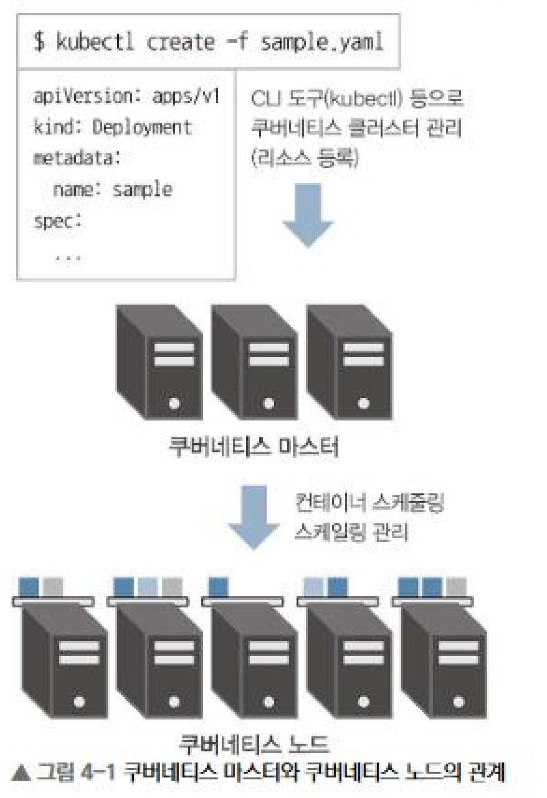
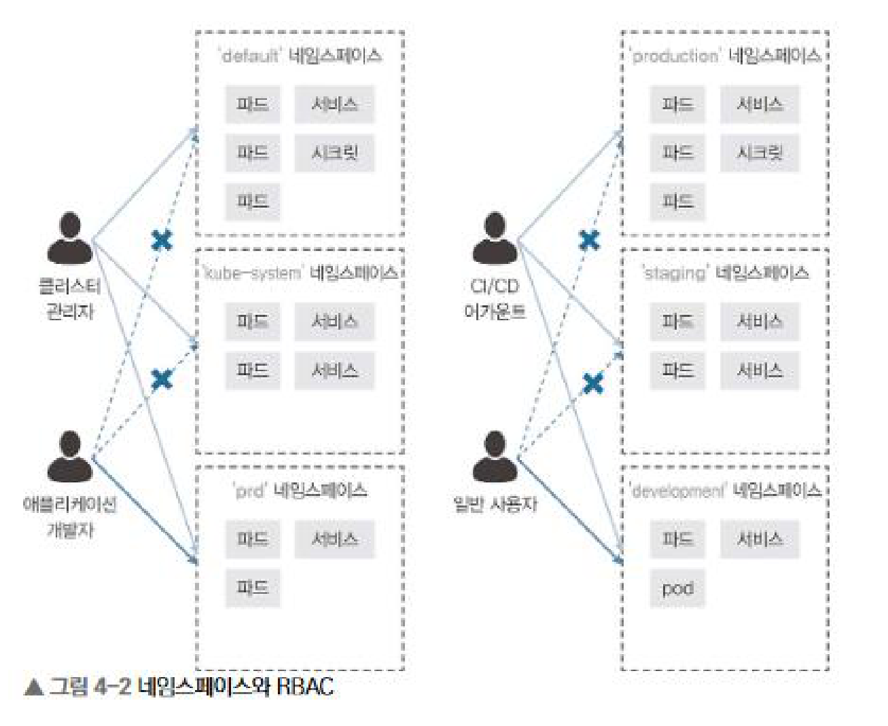
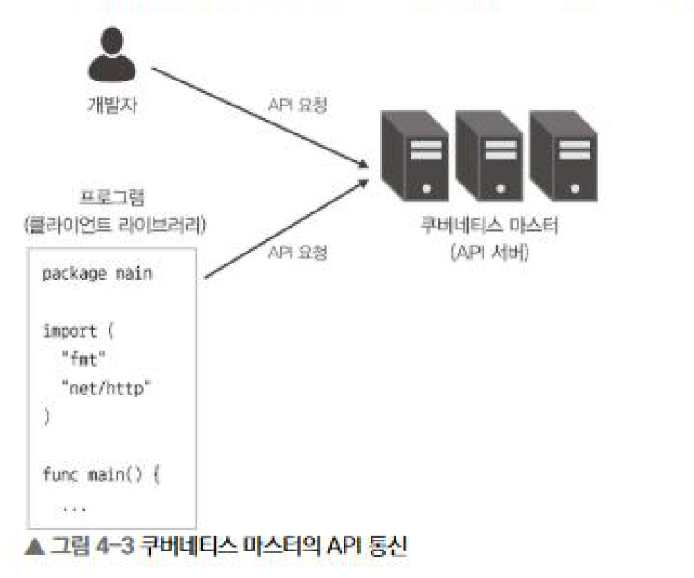
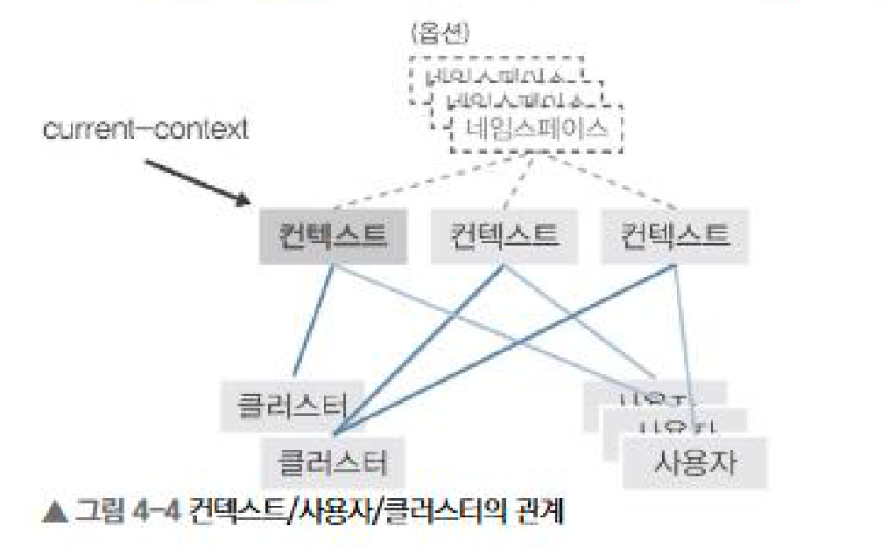
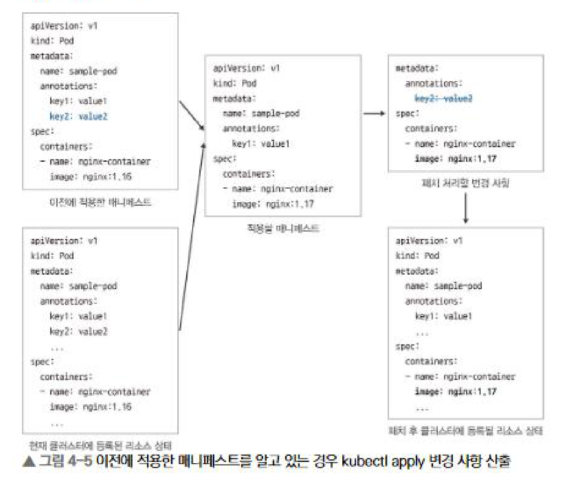

# 4장 API 리소스와 kubectl

한 줄로 요약하면, 쿠버네티스 운영은 매니페스트로 '원하는 상태'를 쓰고 kubectl로 API에 등록하는 일이다. 일부 내용은 5장~13장에 골고루 상세하게 나와있지만, 기초 이론적인 부분 위주로 정리했다.

## 1. 쿠버네티스 기초

### 마스터와 노드

쿠버네티스는 쿠버네티스 마스터와 쿠버네티스 워커로 구성되어 있다.



| 구성 요소 | 역할 |
| --- | --- |
| 쿠버네티스 마스터 | 클러스터의 두뇌. API 엔드포인트 제공, 컨테이너 스케줄링, 컨테이너 스케일링 등을 담당한다. |
| 쿠버네티스 노드 | 이른바 도커 호스트에 해당하며, 실제로 컨테이너를 기동시키는 노드다. 여러 대를 두어 스케일 아웃한다. |

여기서 중요한 건 **사용자는 노드를 직접 만지지 않는다**는 점이다. 사용자가 하는 일은 마스터에게 '원하는 상태'를 등록하는 것까지고, 어느 노드에 몇 개를 띄울지는 마스터가 결정한다. 그래서 4장의 관심사도 '노드 조작법'이 아니라 **'마스터에게 무엇을 어떻게 등록하는가'** 다.

### 클러스터 조작은 모두 마스터의 API를 통한다

클러스터를 관리하려면 CLI 도구인 kubectl과, YAML이나 JSON 형식으로 작성된 매니페스트 파일을 사용하여 마스터에 '리소스'를 등록해야 한다. 전체 흐름은 다음과 같다.

```
1. 매니페스트 작성   YAML(또는 JSON)로 원하는 상태를 기술
2. kubectl 실행      매니페스트를 읽어 API 요청으로 변환
3. 마스터 API 수신   리소스를 등록하고 내부 상태로 기록
4. 노드에 반영       스케줄링되어 컨테이너가 기동
```

매니페스트 파일에 대해 기억할 것은 다음과 같다.

- 리소스를 정의하는 설정 파일이며, 확장자는 .yaml / .yml / .json으로 구분된다.
- 가독성을 고려해 YAML 형식으로 작성하는 것이 일반적이다.
- kubectl은 이 파일 정보를 바탕으로 마스터가 가진 API에 요청을 보낸다.

그리고 쿠버네티스 API는 일반적으로 RESTful API로 구현되어 있다. 따라서 kubectl을 쓰지 않고도 각종 프로그램 언어의 클라이언트 라이브러리나 curl 같은 명령어 도구로 직접 API를 호출해서 관리할 수 있다. 다만 수동으로 조작하는 경우에는 kubectl을 쓰는 것이 일반적이다.

### 매니페스트: 원하는 상태를 선언하는 문서

```yaml
# sample-pod.yaml
apiVersion: v1
kind: Pod
metadata:
  name: sample-pod
spec:
  containers:
    - name: nginx-container
      image: nginx:1.16
```

| 항목 | 의미 |
| --- | --- |
| apiVersion | 이 리소스가 속한 API 그룹과 버전 (예: v1, apps/v1) |
| kind | 리소스의 종류 (Pod, Deployment, Service …) |
| metadata | 이름·네임스페이스·레이블 등 리소스를 식별하는 정보 |
| spec | 이 리소스가 '어떤 상태여야 하는지'에 대한 명세 |

매니페스트는 이렇게 해라라는 절차가 아니라 결과적으로 이런 상태이면 된다는 선언이다. 쿠버네티스는 등록된 상태를 내부에 기록해두고, 현재 상태를 그 선언에 맞추려고 계속 움직인다. 이게 선언형이라는 말의 의미다.


## 2. 쿠버네티스와 리소스

쿠버네티스를 관리하기 위해 등록하는 '리소스'는 컨테이너 실행부터 로드 밸런서 생성까지 종류가 매우 많다. 크게 다섯 가지 카테고리로 나눠서 보면 전체 지도가 잡힌다.

| 종류 | 개요 | 상세 |
| --- | --- | --- |
| 워크로드 API 카테고리 | 컨테이너 실행에 관련된 리소스 |
| 서비스 API 카테고리 | 컨테이너를 외부에 공개하는 엔드포인트를 제공하는 리소스 |
| 컨피그 & 스토리지 API 카테고리 | 설정 / 기밀 정보 / 영구 볼륨 등에 관련된 리소스 |
| 클러스터 API 카테고리 | 보안이나 쿼터 등 클러스터 자체 동작에 관련된 리소스 |
| 메타데이터 API 카테고리 | 클러스터 내부의 다른 리소스를 관리하기 위한 리소스 |

내부적으로만 사용되는 리소스는 제외한 분류다. 그리고 쿠버네티스는 이러한 리소스 등록을 비동기로 처리한다.

### 워크로드 API 카테고리

클러스터 위에서 컨테이너를 기동하기 위해 사용되는 리소스다. 내부적으로 사용되는 것을 제외하고 사용자가 직접 관리할 수 있는 것은 총 여덟 가지다.

- 파드(Pod), 레플리케이션 컨트롤러(ReplicationController), 레플리카셋(ReplicaSet), 디플로이먼트(Deployment)
- 데몬셋(DaemonSet), 스테이트풀셋(StatefulSet), 잡(Job), 크론잡(CronJob)

여덟 개를 외우기보다는 이런 관점으로 묶어서 보면 된다.

| 리소스 | 관점 |
| --- | --- |
| 파드 | 컨테이너를 담는 최소 단위. 다른 워크로드 리소스도 결국 파드를 만든다. |
| 레플리카셋 · 디플로이먼트 | 파드를 '몇 개 유지할지'를 선언하고, 그 상태를 유지·갱신한다. |
| 데몬셋 · 스테이트풀셋 | 모든 노드에 하나씩, 또는 상태를 가지는 워크로드를 위한 형태. |
| 잡 · 크론잡 | 끝이 있는 작업, 그리고 정해진 시간에 반복되는 작업. |

### 서비스 API 카테고리

컨테이너 서비스 디스커버리와 클러스터 외부에서도 접속이 가능한 엔드포인트 등을 제공하는 리소스다. 사용자가 직접 관리하는 것은 **서비스**와 **인그레스** 두 종류다.

- 서비스 : ClusterIP / ExternalIP(ClusterIP의 한 종류) / NodePort / LoadBalancer / Headless(None) / ExternalName / None-Selector
- 인그레스 : HTTP 수준에서 외부 공개를 담당하는 별도 리소스

애초에 이게 왜 필요하냐면, 파드는 언제든 사라지고 다시 만들어지며 그때마다 IP가 바뀌기 때문이다. 그래서 파드를 직접 지목하는 대신 '이 이름으로 오면 이 파드들로'라는 안정적인 창구가 필요하다.

지금 단계에서 기억할 것은 타입에 따라 어디까지 공개되는지가 달라진다는 점이다. 클러스터 내부만 공개하려면 ClusterIP, 외부에 공개하려면 NodePort나 LoadBalancer를 쓴다. ExternalIP 서비스와 None-Selector 서비스는 엄밀히 말하면 타입(type)은 아니지만, 책에서는 하나의 타입으로 묶어 소개한다.

### 컨피그 & 스토리지 API 카테고리

설정과 기밀 데이터를 컨테이너에 담거나 영구 볼륨을 제공하는 리소스다.

- 시크릿(Secret), 컨피그맵(ConfigMap), 영구 볼륨 클레임(PersistentVolumeClaim)

시크릿과 컨피그맵은 모두 키-밸류 형태의 데이터 구조이며, 저장할 데이터가 기밀 데이터인지 일반적인 설정 정보인지에 따라 구분된다. 영구 볼륨 클레임은 컨테이너에서 영구 볼륨을 요청할 때 사용한다.

### 클러스터 API 카테고리

클러스터 자체 동작을 정의하는 리소스다. 보안 관련 설정이나 정책, 클러스터 관리성을 향상시키는 기능을 위한 리소스가 여기 속한다. 주로 클러스터 관리자 영역이다.

- 노드(Node), 네임스페이스(Namespace), 영구 볼륨(PersistentVolume), 리소스 쿼터(ResourceQuota)
- 서비스 어카운트(ServiceAccount), 롤(Role), 클러스터 롤(ClusterRole), 롤바인딩(RoleBinding), 클러스터롤바인딩(ClusterRoleBinding), 네트워크 정책(NetworkPolicy)

### 메타데이터 API 카테고리

클러스터 내부의 다른 리소스 동작을 제어하기 위한 리소스다.

- LimitRange, HorizontalPodAutoscaler(HPA), PodDisruptionBudget(PDB), CustomResourceDefinition

예를 들어 파드를 오토 스케일링시키기 위해 사용하는 HPA는, 디플로이먼트 리소스를 조작해 레플리카 수를 변경함으로써 오토 스케일링을 구현한다. 즉 자기가 직접 뭘 하는 게 아니라 다른 리소스를 조작하는 리소스다.


## 3. 네임스페이스로 가상적인 클러스터 분리

쿠버네티스에는 네임스페이스라고 불리는 가상적인 클러스터 분리 기능이 있다. 완전한 분리 개념이 아니기 때문에 용도는 제한되는데, 이 전제를 먼저 이해하고 시작해야 한다. 주로 이런 때 쓴다.

- 하나의 클러스터를 여러 팀이 나눠 쓸 때
- 서비스 환경 / 스테이징 환경 / 개발 환경을 구분할 때
- 권한을 용도별로 나눠 주고 싶을 때

### 어디까지 네임스페이스로 나눌 것인가

권한 분리 관점에서 마이크로서비스를 개발하는 팀마다 나누는 것이 자연스럽다.

반면 서비스/스테이징/개발 환경은 네임스페이스가 아니라 클러스터별로 나누는 것을 저자는 추천하며, 이유는 세 가지다.

- 클러스터 업그레이드 시 동시에 모든 환경에서 장애가 발생할 가능성이 있다.
- 네임스페이스 명명 규칙이 prd-ns1 / stg-ns1 처럼 되면 매니페스트 재사용성이 현저하게 저하된다. 클러스터를 분리하면 각 환경에서 같은 네임스페이스 이름을 쓸 수 있어 완전히 같은 매니페스트를 재사용할 수 있다.
- 서비스 이름 해석 시 다른 목적지로 통신을 해야 한다.

### 네임스페이스만으로는 부족하다

네임스페이스는 경계를 그어 줄 뿐이고, 그 경계를 실제로 지키는 것은 다른 기능이다.



| 기능 | 역할 |
| --- | --- |
| RBAC(Role-Based Access Control) | 클러스터 조작에 대한 권한을 네임스페이스별로 구분 |
| 네트워크 정책(NetworkPolicy) | 네임스페이스 간의 통신 자체를 제어 |

관리형 서비스나 구축 도구로 구축된 대부분의 클러스터는 RBAC가 기본값으로 활성화되어 있다. 네임스페이스만으로는 높은 분리성을 확보하기 어렵지만, RBAC와 네트워크 정책을 함께 사용하면 분리성을 크게 높일 수 있다.


## 4. 커맨드 라인 인터페이스(CLI) 도구 kubectl

쿠버네티스에서 클러스터 조작은 모두 마스터의 API를 통해 이루어진다. 조작 경로는 세 가지지만, 수동으로 조작하는 경우에는 CLI 도구인 kubectl을 사용하는 것이 일반적이다.



| 경로 | 설명 |
| --- | --- |
| CLI 도구 kubectl | 사람이 손으로 조작할 때의 표준 |
| 클라이언트 라이브러리 | 각 언어의 라이브러리로 API 호출 |
| curl 등 직접 호출 | RESTful API를 직접 호출 |

kubectl이 하는 일은 결국 두 가지로 정리된다.

1. 어디에, 누구로 접속할지 결정한다 — 접속 대상 서버 정보와 인증 정보가 필요하다 → kubeconfig
2. 매니페스트를 API 요청으로 바꿔 보낸다 — 리소스 생성 · 갱신 · 삭제 · 조회를 커맨드로 수행한다

### 인증 정보와 컨텍스트(kubeconfig)

kubectl은 kubeconfig(기본 위치 ~/.kube/config)에 쓰여 있는 정보를 사용해 마스터에 접속한다. kubeconfig도 매니페스트와 동일한 형식으로 작성된다.

```yaml
apiVersion: v1
kind: Config
preferences: {}
clusters:            # 접속 대상 클러스터
  - name: sample-cluster
    cluster:
      server: https://localhost:6443
users:               # 인증 정보
  - name: sample-user
    user:
      client-certificate-data: LS0tLS1CRUdJTi...
      client-key-data: LS0tLS1CRUdJTi...
contexts:            # 접속 대상과 인증 정보 조합
  - name: sample-context
    context:
      cluster: sample-cluster
      namespace: default
      user: sample-user
current-context: sample-context
```

구체적으로 설정이 이루어지는 부분은 clusters / users / contexts 세 가지이며, 세 항목 모두 배열이라 여러 대상을 등록할 수 있다.



current-context는 지금 어느 컨텍스트를 쓰고 있는지를 가리키는 값이다. kubectl은 이 컨텍스트를 전환하는 방식으로 여러 환경을 여러 권한으로 조작할 수 있도록 설계되어 있다.

```bash
# 컨텍스트 목록 표시
kubectl config get-contexts

# 컨텍스트 전환
kubectl config use-context prd-admin

# 현재 컨텍스트 표시
kubectl config current-context
```

- kubeconfig는 직접 편집해도 되고 `kubectl config` 명령어로 변경해도 된다. 명령어로 바꾸면 파일 내용이 자동으로 갱신된다.


### 리소스 생성 · 조회 · 삭제, 그리고 비동기

- 삭제는 매니페스트 파일 없이 '리소스 종류'와 '리소스 이름'만으로도 할 수 있고(kubectl delete pod sample-pod), 리소스 종류만 지정해 모두 삭제할 수도 있다(kubectl delete pod --all).
- kubectl 명령어 실행은 바로 완료되지만, 쿠버네티스에 의한 실제 리소스 처리는 비동기로 실행되어 바로 완료되지 않는다. 즉 커맨드가 성공했다는 것이 곧 완료는 아니다.
- 그래서 상태 확인은 get이나 describe로 따로 해야 하고, 완료를 기다려야 한다면 --wait 옵션을 사용한다. (--wait는 모든 Finalizer 실행이 완료될 때까지 대기한다.)
- 즉시 강제 삭제는 --grace-period 0 --force. 쿠버네티스 1.8 이후로는 --force만 지정해도 --grace-period 0이 자동 부여된다.

### 리소스 생성에도 create가 아니라 apply를 쓰는 이유

생성에 create, 갱신에 apply를 나눠 쓰지 말고 처음부터 apply를 사용하는 것을 책에서는 추천한다. 이유는 크게 두 가지다.

**1. 구분 자체가 불필요하다**

생성에는 create를 쓰고 업데이트에는 apply를 써야 한다는 구분은, 스크립트나 CI/CD에 포함될 것을 생각하면 조건 분기를 만들어낸다. apply 하나로 통일하는 편이 단순하다.

**2. 섞어 쓰면 변경 사항을 놓친다**

kubectl apply로 적용되는 변경 사항은 다음 세 가지를 비교해 산출된다.

- 이전에 적용한 매니페스트
- 현재 클러스터에 등록된 리소스 상태
- 이번에 적용할 매니페스트




주의: 쿠버네티스는 생성한 리소스 상태를 내부에 기록하는데, 리소스에 따라서는 생성 후에 변경할 수 없는 필드도 존재한다.

### kubectl은 이런 일들도 한다

4.5의 나머지 절반은 커맨드 사용법이다. 개별 옵션보다는 '어떤 종류의 일을 할 수 있는지'를 지도처럼 알아두는 편이 낫다.

| 분류 | 할 수 있는 일 |
| --- | --- |
| 조회 · 확인 | 리소스 정보 가져오기(get), 리소스 상세 정보(describe), 실제 리소스 사용량 확인(`top`) |
| 변경 · 비교 | 로컬 매니페스트와 등록 정보 비교(diff), 리소스 일부 정보 업데이트(set), 리소스 상태 체크와 대기(wait) |
| 디버깅 | 컨테이너 로그 확인(logs), 파드로 포트 포워딩(port-forward), 컨테이너와 로컬 머신 간 파일 복사(cp) |

막힐 때의 첫 번째 수단은 --help다. 커맨드 뒤에 붙이면 사용법과 예제가 함께 출력된다. 4장은 여기서 끝나고, 이후로는 각 장에서 필요한 하위 커맨드를 그때그때 소개하는 방식으로 이어진다.
