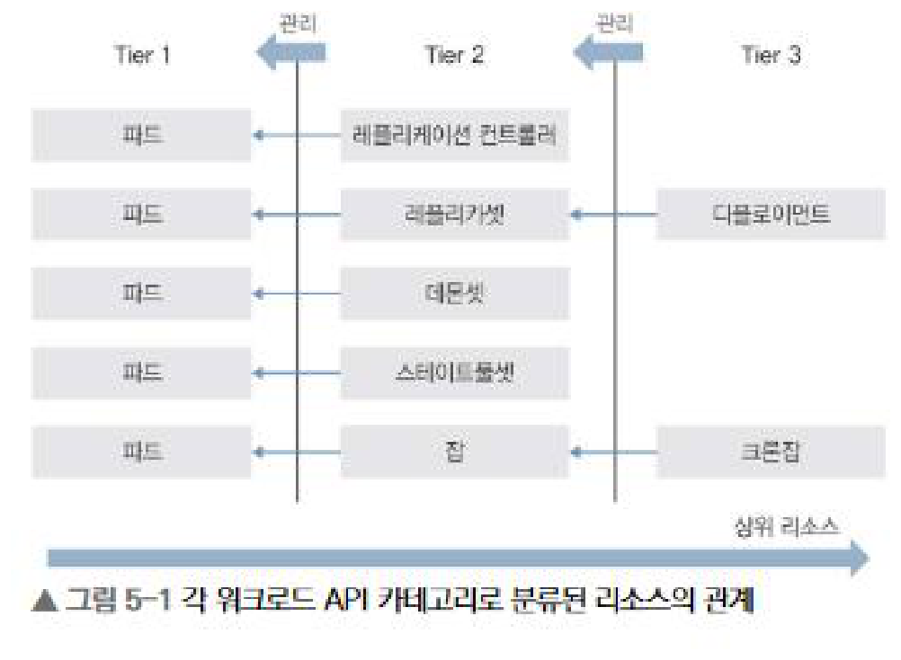
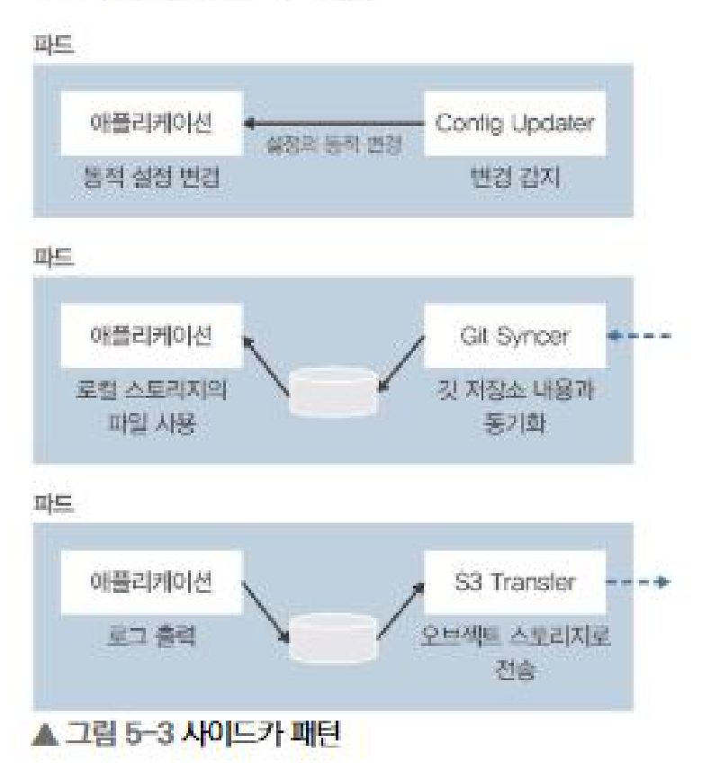
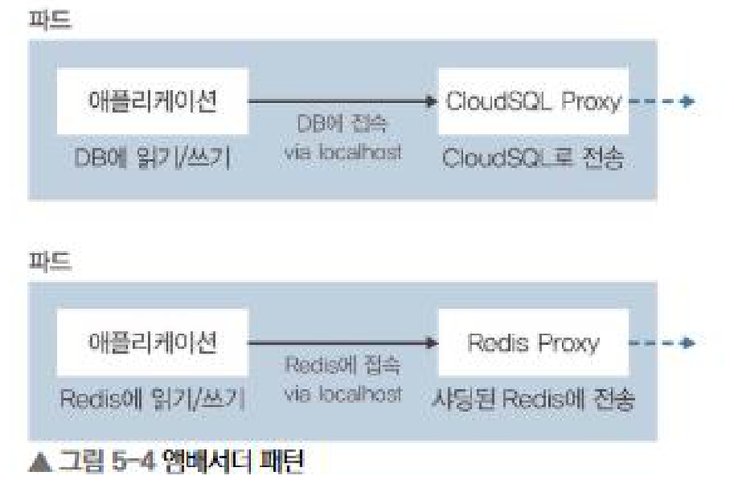
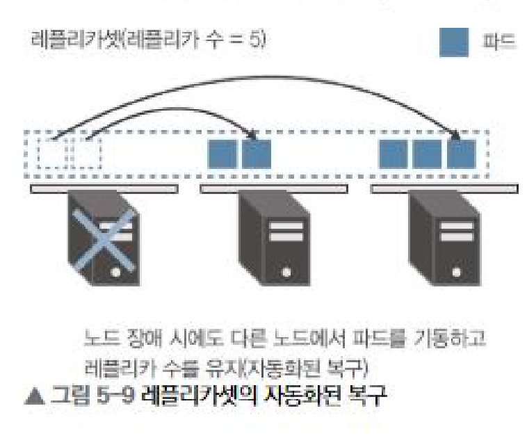
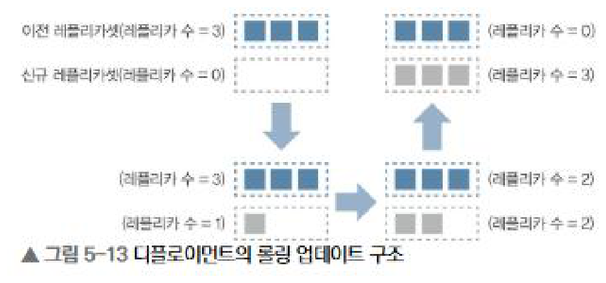
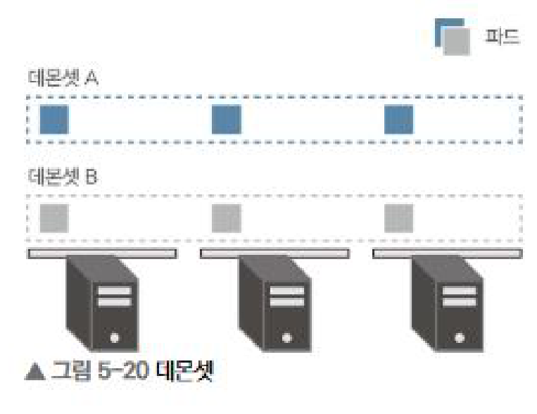
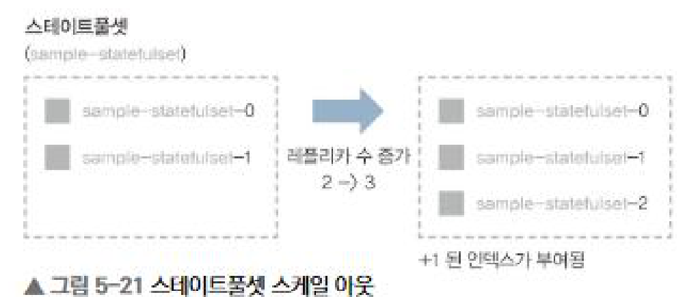
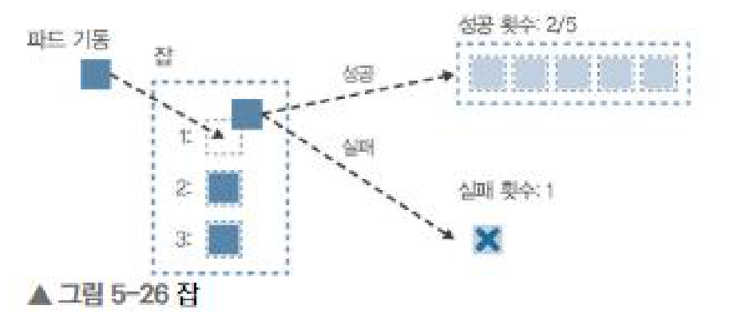
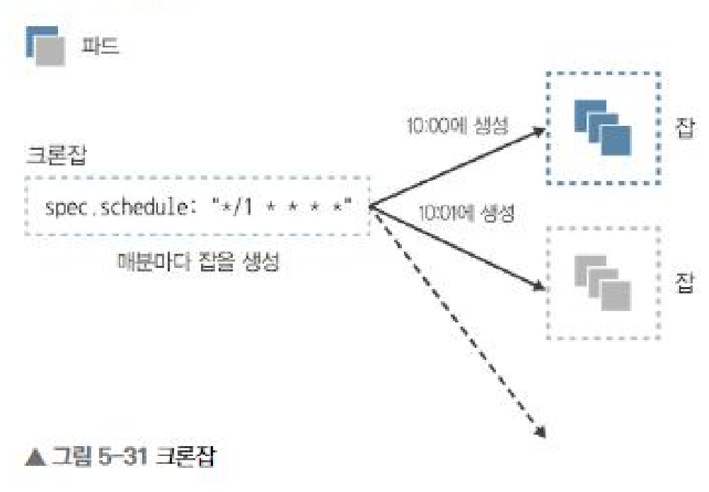

# 5장 워크로드 API 카테고리

## 1. 워크로드 API 카테고리 개요

4장에서 나눈 다섯 가지 리소스 카테고리 중 하나로, 클러스터에 컨테이너를 기동시키기 위해 사용되는 리소스다. 내부에서만 쓰이는 것을 빼면 사용자가 직접 다루는 것은 파드, 레플리케이션 컨트롤러, 레플리카셋, 디플로이먼트, 데몬셋, 스테이트풀셋, 잡, 크론잡의 여덟 가지다.

여덟 개가 많아 보이지만 실제로는 파드를 최소 단위로 하고 그것을 관리하는 상위 리소스가 있는 부모 자식 관계다. 파드가 Tier 1, 파드를 관리하는 레플리케이션 컨트롤러와 레플리카셋과 데몬셋과 스테이트풀셋과 잡이 Tier 2, 다시 그것을 관리하는 디플로이먼트와 크론잡이 Tier 3다. 이 계층만 잡아두면 나머지는 각 리소스의 성격 차이일 뿐이다.

## 2. 파드

워크로드 리소스의 최소 단위다. 한 개 이상의 컨테이너로 구성되며, 같은 파드의 컨테이너끼리는 네트워크적으로 격리되어 있지 않고 IP 주소를 공유한다. 그래서 파드 내부의 컨테이너는 서로 localhost로 통신할 수 있다. 반대로 IP를 공유한다는 말은 포트도 공유한다는 뜻이라, 80/TCP를 바인드하는 컨테이너를 두 개 넣으면 뒤에 뜬 쪽이 Address already in use 에러로 죽는다.

대부분은 하나의 파드에 하나의 컨테이너를 둔다. 여러 컨테이너를 넣는 건 메인 컨테이너를 보조하는 컨테이너가 필요할 때이고, 그 구성은 세 가지 디자인 패턴으로 정리되어 있다.

| 종류 | 개요 |
| --- | --- |
| 사이드카 패턴(sidecar) | 메인 컨테이너에 기능을 추가한다. |
| 앰배서더 패턴(ambassador) | 외부 시스템과의 통신을 중계한다. |
| 어댑터 패턴(adapter) | 외부 접속을 위한 인터페이스를 제공한다. |

사이드카는 설정 변경을 감지해 반영하는 컨테이너, 깃 저장소와 로컬 스토리지를 동기화하는 컨테이너, 로그를 오브젝트 스토리지로 전송하는 컨테이너처럼 대부분 데이터와 설정에 관련된 패턴이다.

앰배서더의 이득은 결합도다. 앰배서더 없이 애플리케이션이 샤딩된 DB 중 하나를 직접 골라 접속하면 결합도가 강해지지만, 앰배서더를 두면 메인 컨테이너는 항상 localhost만 바라보면 되므로 단일 DB를 쓰는 개발 환경과 분산 DB를 쓰는 서비스 환경 모두에서 애플리케이션을 그대로 쓸 수 있다. 어댑터는 서로 다른 데이터 형식을 변환해준다. 프로메테우스는 정의된 형식으로 메트릭을 수집하는데 대부분의 미들웨어는 그 형식을 지원하지 않으므로, 어댑터 컨테이너가 형식을 변환해 반환한다.

DNS 설정은 spec.dnsPolicy에 지정하며 값은 네 가지다.

| 설정값 | 개요 |
| --- | --- |
| ClusterFirst(기본값) | 클러스터 내부 DNS에 질의하고, 해석되지 않으면 업스트림에 질의한다. |
| None | 파드 정의 내에서 정적으로 설정한다. |
| Default | 파드가 기동하는 노드의 /etc/resolv.conf를 상속받는다. |
| ClusterFirstWithHostNet | ClusterFirst와 동작이 같다(hostNetwork 사용 시 설정). |

기본값이 Default가 아니라 ClusterFirst라는 점이 헷갈리기 쉽다. 또 None이나 Default로 외부 DNS만 바라보게 하면 클러스터 내부 DNS를 사용한 서비스 디스커버리를 쓸 수 없게 되므로 주의해야 한다.

## 3. 레플리카셋 / 레플리케이션 컨트롤러

파드의 레플리카를 생성하고 지정한 파드 수를 유지하는 리소스다. 원래 이름은 레플리케이션 컨트롤러였는데 레플리카셋으로 바뀌면서 기능이 추가되었고, 지금은 레플리카셋을 쓰면 된다. 매니페스트에서 중요한 항목은 spec.replicas(유지할 파드 수), spec.selector(관리 대상 레이블), spec.template(복제할 파드 정의) 세 개다.

노드나 파드에 장애가 발생했을 때 지정한 파드 수를 유지하기 위해 다른 노드에서 파드를 기동시켜 준다. 이것이 쿠버네티스의 중요한 콘셉트 중 하나인 자동화된 복구(self-healing)다. 파드가 각각 다른 노드에 흩어져 생성되기 때문에 노드 하나에 장애가 나도 서비스에 미치는 영향을 최소화할 수 있다.

파드 수를 조정하는 방식은 단순하다. spec.selector에 지정한 레이블을 가진 파드 수를 세어, 부족하면 spec.template으로 만들고 많으면 하나를 지운다. 여기서 두 가지 함정이 나온다.

- spec.selector와 spec.template.metadata.labels가 일치하지 않으면 생성 시점에 에러가 난다. 아니었다면 만들어도 셀렉터에 잡히지 않아 파드가 무한히 생성될 것이므로, 이 검증은 안전장치다.
- 레플리카셋 밖에서 같은 레이블을 가진 파드를 만들면 초과 생성으로 판단해 그중 하나를 정지시킨다. 기존 파드가 삭제될 수도 있어 주의가 필요하다.

그래서 익숙해질 때까지는 env, codename, role처럼 여러 레이블을 조합해 유니크하게 붙이는 것이 좋다. 참고로 스케일링은 매니페스트를 고쳐 kubectl apply -f 하거나 kubectl scale로 하는데, IaC를 구현하려면 앞의 방법을 쓰자. 셀렉터는 일치성 기준(=, !=)과 집합성 기준(in, notin, exists) 두 가지를 쓸 수 있고, 집합성 기준은 레플리카셋부터 추가되었으며 스케줄링에도 쓰인다.

## 4. 디플로이먼트

여러 레플리카셋을 관리하여 롤링 업데이트나 롤백 등을 구현하는 리소스다. 디플로이먼트가 레플리카셋을, 레플리카셋이 파드를 관리한다.

신규 레플리카셋을 만들고 그 레플리카 수를 단계적으로 늘리면서 이전 레플리카셋의 레플리카 수를 줄이는 식으로 동작한다. 전환이 끝나면 이전 레플리카셋은 레플리카 수 0으로 남는다. 신규 레플리카셋에 컨테이너가 기동되었는지와 헬스 체크는 통과했는지를 확인하면서 전환하기 때문에 쿠버네티스에서 가장 권장하는 컨테이너 기동 방법이다. 파드로만 배포하면 장애 시 자동 복구가 없고, 레플리카셋으로만 배포하면 롤링 업데이트를 쓸 수 없다.

새 레플리카셋이 생기는 기준은 변경 여부인데, 이 변경에 레플리카 수 변경은 포함되지 않는다. 쿠버네티스는 spec.template 아래의 해시값, 즉 파드 템플릿 해시를 계산해 pod-template-hash 레이블로 관리한다. 이미지 태그를 바꾸면 해시가 달라져 레플리카셋이 새로 생기고, 이전 버전으로 되돌려 해시가 같아지면 기존 레플리카셋을 다시 쓴다.

롤백의 실체도 현재 사용 중인 레플리카셋의 전환이다. 기존 레플리카셋이 레플리카 수 0으로 남아 있기 때문에 그 수를 늘리면 다시 쓸 수 있다. 이력 확인은 kubectl rollout history, 롤백은 kubectl rollout undo, 일시 정지와 해제는 kubectl rollout pause / resume이며 pause 상태에서는 업데이트도 롤백도 되지 않는다. 다만 실제로는 롤백 기능을 잘 쓰지 않는다. CI/CD에서는 이전 매니페스트를 다시 kubectl apply 하는 편이 호환성이 좋고, 이때도 해시가 같으므로 결과적으로 기존 레플리카셋의 파드가 기동되기 때문이다.

업데이트 전략은 spec.strategy.type으로 지정하고 기본값은 RollingUpdate다.

| 전략 | 특징 |
| --- | --- |
| Recreate | 모든 파드를 삭제하고 다시 생성한다. 다운타임이 생기지만 추가 리소스 없이 빠르게 전환한다. |
| RollingUpdate | 파드를 조금씩 교체한다. maxUnavailable과 maxSurge로 동작을 제어한다. |

maxUnavailable은 업데이트 중 동시에 정지 가능한 최대 파드 수, maxSurge는 동시에 생성 가능한 최대 파드 수다. maxUnavailable을 0, maxSurge를 1로 두면 먼저 늘린 다음 이동시키므로 여유 리소스가 필요한 대신 가용성이 우선되고, 반대로 두면 먼저 줄인 다음 이동시켜 리소스를 아낀다. 둘 다 0으로 설정할 수는 없고, 지정하지 않으면 기본값은 각각 25%다. 그 외에 minReadySeconds(파드가 Ready가 된 뒤 기동 완료로 판단하기까지의 최소 시간), revisionHistoryLimit(유지할 레플리카셋 수, 곧 롤백 가능한 이력 수), progressDeadlineSeconds(처리 타임아웃, 경과하면 자동 롤백)를 spec 아래에 설정할 수 있다.

## 5. 데몬셋

레플리카셋의 특수한 형태로, 각 노드에 파드를 하나씩 배치하는 리소스다.

레플리카셋은 총 N개의 파드를 노드 리소스 상황에 맞게 배치하므로 각 노드의 파드 수가 같다고 할 수 없고 모든 노드에 배치된다고도 할 수 없다. 데몬셋은 그 부분이 다르다. 레플리카 수를 지정할 수 없고 한 노드에 두 개를 배치할 수도 없으며, 노드를 늘리면 파드가 자동으로 늘어난 노드에서 기동한다. 배치하고 싶지 않은 노드는 nodeSelector나 노드 안티어피니티로 예외 처리한다.

그래서 각 노드에서 반드시 동작해야 하는 프로세스에 적합하다. 로그를 호스트 단위로 수집하는 플루언트디, 리소스 사용 현황과 노드 상태를 모니터링하는 데이터독 등이 대표적이다.

업데이트 전략은 OnDelete와 RollingUpdate 중 선택하며 기본값은 RollingUpdate다. OnDelete는 매니페스트가 바뀌어도 기존 파드를 그대로 두고 다음에 재생성될 때 반영하는 방식인데, 아무것도 하지 않으면 이전 버전이 장기간 계속 쓰인다는 점에 주의해야 한다. 또 한 노드에 같은 파드를 여러 개 만들 수 없으므로 maxSurge는 설정할 수 없고 maxUnavailable만 지정한다.

## 6. 스테이트풀셋

역시 레플리카셋의 특수한 형태로, 데이터베이스처럼 스테이트풀한 워크로드에 사용한다. 레플리카셋과 달리 파드명에 0번부터 숫자 인덱스가 접미사로 붙고 그 이름이 바뀌지 않으며, 데이터를 영구적으로 저장하기 위한 구조를 가진다. spec.volumeClaimTemplates를 지정하면 각 파드에 영구 볼륨 클레임이 설정되어, 파드를 재기동하거나 다른 노드로 옮겨도 같은 데이터를 가진 채로 다시 생성된다.

레플리카셋이나 데몬셋과 달리 파드를 하나씩만 생성하고 삭제한다. 스케일 아웃은 인덱스가 작은 것부터 만들고 이전 파드가 Ready가 되어야 다음을 만들며, 스케일 인은 반대로 인덱스가 큰 것부터 지운다. 이 순서가 보장되기 때문에 얻는 이점이 있다. 레플리카셋은 파드가 무작위로 삭제되어 특정 파드가 마스터가 되는 애플리케이션에 맞지 않지만, 스테이트풀셋은 0번 파드가 항상 먼저 생성되고 가장 늦게 삭제되므로 0번을 마스터로 쓰는 이중화 구조에 적합하다. 다만 spec.podManagementPolicy를 Parallel로 하면 레플리카셋처럼 병렬로 기동시킬 수도 있다. 기본값은 OrderedReady다.

업데이트 전략은 OnDelete와 RollingUpdate이고 기본값은 RollingUpdate다. 영속성 데이터가 있어 추가 파드를 만들어 롤링 업데이트할 수 없으므로 maxUnavailable을 지정할 수 없고 하나씩 업데이트한다. 대신 partition을 설정해 어떤 인덱스까지 업데이트할지 지정할 수 있다. 파드가 5개일 때 partition을 3으로 두면 인덱스 3 이상만 업데이트되고, 이후 1로 낮추면 1 이상이 업데이트된다. 전체에 영향을 주지 않고 부분적으로 확인하며 적용할 수 있어 안전하다.

주의할 점은 스테이트풀셋이 삭제되어도 영구 볼륨은 동시에 해제되지 않는다는 것이다. 데이터를 백업할 시간을 주기 때문인데, 그래서 삭제 후 다시 생성하면 이전 데이터가 그대로 붙는다. 볼륨이 남아 있으면 관리형 서비스에서는 과금이 발생하고 온프레미스에서도 디스크가 계속 잡혀 있으므로, 삭제 후에는 영구 볼륨도 해제하는 것을 잊으면 안된다.

## 7. 잡

컨테이너를 사용하여 한 번만 실행되는 리소스다. 더 정확히는 N개를 병렬로 실행하면서 지정한 횟수의 정상 종료를 보장한다.

레플리카셋과의 큰 차이는 파드가 정지되는 것을 전제로 만들어졌는지에 있다. 레플리카셋에서 파드의 정지는 예상치 못한 에러지만 잡에서는 정상 종료되는 작업이다. 레플리카셋은 정상 종료 횟수를 셀 수 없기 때문에, rsync나 오브젝트 스토리지 업로드 같은 배치 처리에는 잡을 쓰는 것이 맞다. 실제로 kubectl get 시 레플리카셋은 READY 컨테이너 수를 표시하지만 잡은 정상 종료한 파드 수인 COMPLETIONS를 표시한다.

restartPolicy는 Never 또는 OnFailure 중 하나를 반드시 지정해야 한다. Never는 장애 시 신규 파드를 만들고, OnFailure는 같은 파드를 다시 써서 잡을 재시작한다. 이외에 성공 횟수인 completions, 병렬 수인 parallelism, 실패 허용 횟수인 backoffLimit 세 개가 핵심 파라미터이며 completions만 나중에 변경할 수 없다. 이 조합으로 네 가지 워크로드를 만든다.

| 워크로드 | completions | parallelism | backoffLimit |
| --- | --- | --- | --- |
| 1회만 실행하는 태스크 (One Shot Task) | 1 | 1 | 0 |
| N개 병렬 태스크 (Multi Task) | M | N | P |
| 한 개씩 실행하는 작업 큐 (Single WorkQueue) | 미지정 | 1 | P |
| N개 병렬 작업 큐 (Multi WorkQueue) | 미지정 | N | P |

여기서 감을 잡아야 하는 건 completions를 지정하느냐가 태스크와 작업 큐를 가른다는 점이다. 태스크는 정상 종료가 성공 횟수에 도달할 때까지 실행하고, 작업 큐는 병렬 수만 지정한 뒤 하나라도 정상 종료하면 이후 파드를 만들지 않는다. 이미 실행 중인 파드는 강제 정지하지 않고 끝까지 동작한다. 작업 큐를 쓰려면 진행 관리를 위한 메시지 큐가 별도로 필요하고 큐가 비면 정상 종료하도록 구현해 두어야 한다. 참고로 잡은 종료 후에도 남으므로, spec.ttlSecondsAfterFinished를 설정하면 일정 시간이 지나 자동 삭제되게 할 수 있다.

## 8. 크론잡

크론과 같이 스케줄링된 시간에 잡을 생성하는 리소스다. 쿠버네티스 1.4까지는 스케줄잡이라는 이름이었다.

크론잡과 잡의 관계는 디플로이먼트와 레플리카셋의 관계와 비슷하다. 즉 크론잡이 잡을, 잡이 파드를 관리하는 3계층 구조다. spec.schedule에 Cron 형식으로 시간을 지정하고, 생성할 잡의 정의는 spec.jobTemplate 아래에 쓴다.

- spec.suspend를 true로 하면 스케줄 대상에서 제외된다. 점검 등으로 잡 생성을 멈추고 싶을 때 쓴다.
- spec.startingDeadlineSeconds로 시작 지연을 허용할 시간을 지정한다. 마스터가 일시 정지되면 잡 생성이 늦어질 수 있는데, 기본값에서는 아무리 늦어져도 생성한다.
- spec.successfulJobsHistoryLimit과 spec.failedJobsHistoryLimit으로 잡을 몇 개 남길지 지정한다. 기본값은 둘 다 3이다. 잡이 남아 있으면 파드도 Completed나 Error 상태로 남아 로그를 볼 수 있지만, 실제 운영에서는 외부 로그 시스템으로 수집하는 것을 추천한다.

기존 잡이 아직 실행 중일 때 새 잡을 어떻게 할지는 spec.concurrencyPolicy로 제어한다.

| 정책 | 개요 |
| --- | --- |
| Allow(기본값) | 동시 실행에 제한을 두지 않음 |
| Forbid | 이전 잡이 종료되지 않았으면 다음 잡을 실행하지 않음 |
| Replace | 이전 잡의 레플리카 수를 0으로 만들어 취소하고 새 잡을 시작 |

## 9. 정리

| 리소스 종류 | 사용 방법 |
| --- | --- |
| 파드 | 디버깅이나 확인 용도로 사용 |
| 레플리케이션 컨트롤러 | 추천하지 않으며 대신 레플리카셋을 사용 |
| 레플리카셋 | 파드를 스케일링하여 관리. 기본적으로는 디플로이먼트를 통해 사용 |
| 디플로이먼트 | 스케일링할 워크로드에 사용 |
| 데몬셋 | 각 노드에 파드 하나씩 배포할 때 사용 |
| 스테이트풀셋 | 영속성 데이터 등의 상태를 가진 워크로드에 사용 |
| 잡 | 작업 큐나 태스크 등 컨테이너 종료가 필요한 워크로드에 사용 |
| 크론잡 | 정기적으로 잡을 생성하고 싶은 경우 사용 |

가장 중요한 결론은 하나다. 파드나 레플리카셋을 생성하는 경우에도 처음부터 디플로이먼트를 통해 생성하는 것이 좋다. 파드만 쓰면 자동 복구가 없고, 레플리카셋만 쓰면 롤링 업데이트가 없기 때문이다. 다음 장에서는 이렇게 실행한 워크로드 리소스에 외부에서 접속 가능한 엔드포인트를 제공하는 서비스 API 카테고리를 다룬다.
