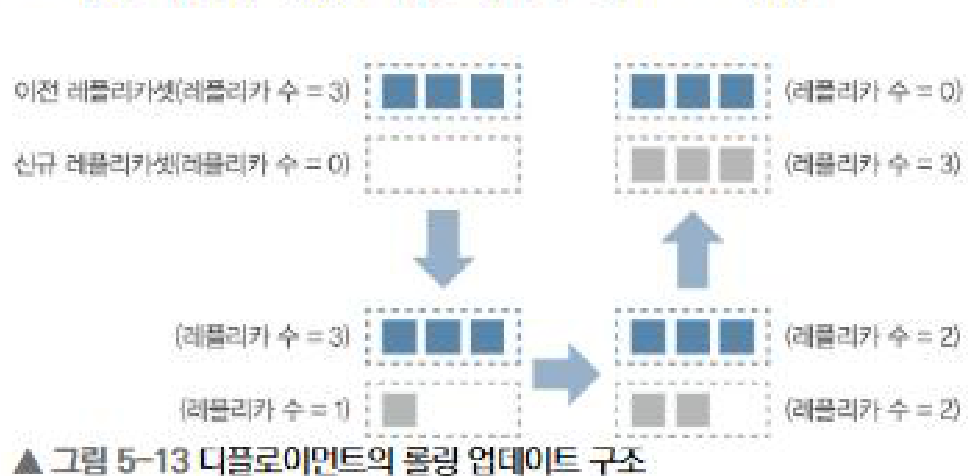
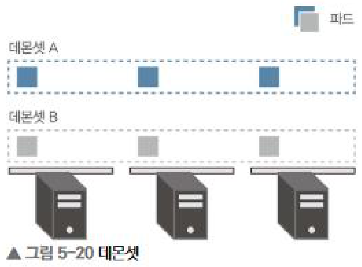
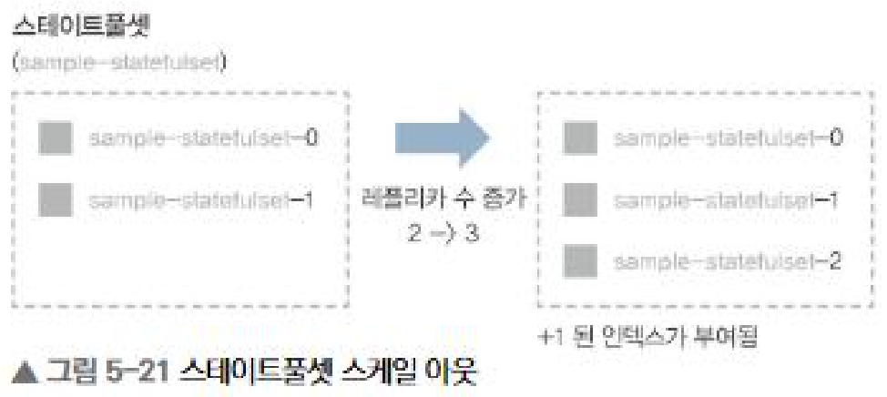
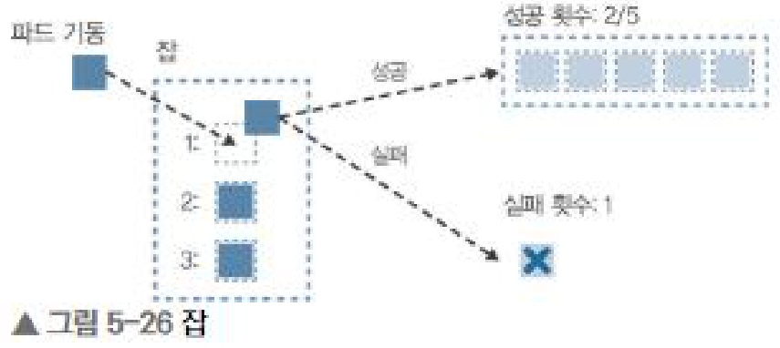
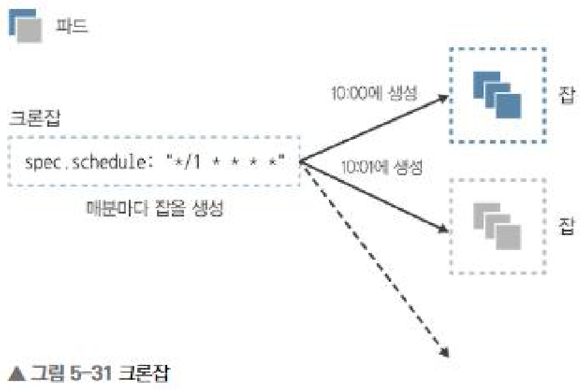

# 5장 워크로드 API 카테고리

파드와 레플리카셋 위에서 파드를 어디에 몇 개 만들고 언제 지울지를 결정하는 리소스들이다. 디플로이먼트, 데몬셋, 스테이트풀셋, 잡, 크론잡 다섯 가지가 여기에 해당한다.

## 1. 디플로이먼트

여러 레플리카셋을 관리하여 롤링 업데이트나 롤백을 구현하는 리소스다. 신규 레플리카셋을 만들어 레플리카 수를 단계적으로 늘리면서 이전 레플리카셋의 레플리카 수를 줄이고, 전환이 끝나면 이전 레플리카셋은 레플리카 수 0으로 남는다.

신규 레플리카셋에 컨테이너가 기동되었는지와 헬스 체크는 통과했는지를 확인하면서 전환하기 때문에 쿠버네티스에서 가장 권장하는 컨테이너 기동 방법이다. 파드만 배포하면 장애 시 자동 복구가 없고, 레플리카셋만 배포하면 롤링 업데이트를 쓸 수 없다.

신규 레플리카셋이 생기는 기준은 spec.template의 변경이며 레플리카 수 변경은 포함되지 않는다. 쿠버네티스는 spec.template 아래의 해시값인 파드 템플릿 해시를 계산해 레이블로 관리하므로, 이미지 태그를 바꾸면 해시가 달라져 레플리카셋이 새로 생기고 이전 버전으로 되돌려 해시가 같아지면 기존 레플리카셋을 다시 쓴다. 롤백의 실체도 결국 레플리카 수 0으로 남아 있는 기존 레플리카셋으로의 전환이다. 다만 실제 환경에서는 kubectl rollout undo보다 이전 매니페스트를 다시 apply하는 편이 호환성이 좋아 롤백 기능을 잘 쓰지 않는다. 참고로 kubectl rollout pause 상태에서는 업데이트도 롤백도 되지 않는다.

업데이트 전략은 spec.strategy.type으로 지정하고 기본값은 RollingUpdate다.

- Recreate : 모든 파드를 삭제하고 다시 생성한다. 몇 초 정도 파드가 없는 시간이 생겨 다운타임이 발생하지만 추가 리소스 없이 빠르게 전환한다.
- RollingUpdate(기본값) : 파드를 조금씩 교체한다. maxUnavailable과 maxSurge로 동작을 제어한다.

maxUnavailable은 업데이트 중 동시에 정지 가능한 최대 파드 수, maxSurge는 동시에 생성 가능한 최대 파드 수다. maxUnavailable을 0, maxSurge를 1로 두면 먼저 늘린 다음 이동시키므로 가용성이 우선되고, 반대로 두면 먼저 줄인 다음 이동시켜 리소스를 아낀다. 둘 다 0으로 설정할 수는 없고, 지정하지 않으면 기본값은 각각 25%다. 그 외에 minReadySeconds(파드가 Ready가 된 뒤 기동 완료로 판단하기까지의 최소 시간), revisionHistoryLimit(유지할 레플리카셋 수, 곧 롤백 가능한 이력 수), progressDeadlineSeconds(처리 타임아웃, 경과하면 자동 롤백)를 spec 아래에 설정할 수 있다.

## 2. 데몬셋

레플리카셋의 특수한 형태로, 각 노드에 파드를 하나씩 배치하는 리소스다.

레플리카셋은 총 N개의 파드를 노드 리소스 상황에 맞게 배치하므로 각 노드의 파드 수가 같다고 할 수 없고 모든 노드에 배치된다고도 할 수 없다. 데몬셋은 레플리카 수를 지정할 수 없고 한 노드에 두 개를 배치할 수도 없으며, 노드를 늘리면 파드가 자동으로 늘어난 노드에서 기동한다. 배치하고 싶지 않은 노드는 nodeSelector나 노드 안티어피니티로 예외 처리한다. 그래서 로그를 호스트 단위로 수집하는 플루언트디, 노드 상태를 모니터링하는 데이터독처럼 모든 노드에서 반드시 동작해야 하는 프로세스에 적합하다.

업데이트 전략은 OnDelete와 RollingUpdate 중 선택하며 기본값은 RollingUpdate다. OnDelete는 매니페스트가 바뀌어도 기존 파드를 그대로 두고 다음에 재생성될 때 반영하는 방식인데, 아무것도 하지 않으면 이전 버전이 장기간 계속 쓰인다는 점에 주의해야 한다. 또 한 노드에 같은 파드를 여러 개 만들 수 없으므로 maxSurge는 설정할 수 없고 maxUnavailable만 지정하며, 기본값은 1이고 0으로 지정할 수 없다.

## 3. 스테이트풀셋

역시 레플리카셋의 특수한 형태로, 데이터베이스처럼 스테이트풀한 워크로드에 사용한다. 파드명에 0번부터 숫자 인덱스가 접미사로 붙고 그 이름이 바뀌지 않으며, spec.volumeClaimTemplates를 지정하면 각 파드에 영구 볼륨 클레임이 설정되어 파드를 재기동하거나 다른 노드로 옮겨도 같은 데이터를 가진 채로 다시 생성된다.

파드를 동시에 하나씩만 생성하고 삭제하는 것도 다른 점이다. 스케일 아웃은 인덱스가 작은 것부터 만들고 이전 파드가 Ready가 되어야 다음을 만들며, 스케일 인은 인덱스가 큰 것부터 지운다. 이 순서가 보장되기 때문에 0번 파드를 마스터로 쓰는 이중화 구조에 적합하다. 다만 spec.podManagementPolicy를 Parallel로 하면 레플리카셋처럼 병렬로 기동시킬 수도 있으며 기본값은 OrderedReady다.

업데이트 전략은 OnDelete와 RollingUpdate이고 기본값은 RollingUpdate다. 영속성 데이터가 있어 추가 파드를 만들어 롤링 업데이트할 수 없으므로 maxUnavailable을 지정할 수 없고 파드마다 Ready를 확인하며 하나씩 업데이트한다. 대신 partition을 설정해 어떤 인덱스까지 업데이트할지 지정할 수 있다. 파드가 5개일 때 partition을 3으로 두면 인덱스 3 이상만 업데이트되고, 이후 1로 낮추면 1 이상이 업데이트되므로 전체에 영향을 주지 않고 부분적으로 확인하며 적용할 수 있다.

주의할 점은 스테이트풀셋이 삭제되어도 영구 볼륨은 동시에 해제되지 않는다는 것이다. 데이터를 백업할 시간을 주기 때문인데, 그래서 삭제 후 다시 생성하면 이전 데이터가 그대로 붙는다. 볼륨이 남아 있으면 관리형 서비스에서는 과금이 발생하고 온프레미스에서도 디스크가 계속 잡혀 있으므로, 삭제 후에는 영구 볼륨도 해제해야 한다.

## 4. 잡

컨테이너를 사용하여 한 번만 실행되는 리소스다. 더 정확히는 N개를 병렬로 실행하면서 지정한 횟수의 정상 종료를 보장한다.

레플리카셋과의 큰 차이는 파드가 정지되는 것을 전제로 만들어졌는지에 있다. 레플리카셋에서 파드의 정지는 예상치 못한 에러지만 잡에서는 정상 종료되는 작업이다. 레플리카셋은 정상 종료 횟수를 셀 수 없기 때문에 rsync나 오브젝트 스토리지 업로드 같은 배치 처리에는 잡을 쓰는 것이 맞다. 실제로 kubectl get 시 레플리카셋은 READY 컨테이너 수를 표시하지만 잡은 정상 종료한 파드 수인 COMPLETIONS를 표시한다.

restartPolicy는 Never 또는 OnFailure 중 하나를 반드시 지정해야 한다. Never는 장애 시 신규 파드를 만들고, OnFailure는 같은 파드를 다시 써서 잡을 재시작한다. 이외에 성공 횟수인 completions, 병렬 수인 parallelism, 실패 허용 횟수인 backoffLimit 세 개가 핵심 파라미터이며 completions만 나중에 변경할 수 없다. 이 조합으로 네 가지 워크로드를 만든다.

| 워크로드 | completions | parallelism | backoffLimit |
| --- | --- | --- | --- |
| 1회만 실행하는 태스크 (One Shot Task) | 1 | 1 | 0 |
| N개 병렬 태스크 (Multi Task) | M | N | P |
| 한 개씩 실행하는 작업 큐 (Single WorkQueue) | 미지정 | 1 | P |
| N개 병렬 작업 큐 (Multi WorkQueue) | 미지정 | N | P |

completions를 지정하느냐가 태스크와 작업 큐를 가른다. 태스크는 정상 종료가 성공 횟수에 도달할 때까지 실행하고, 작업 큐는 병렬 수만 지정한 뒤 하나라도 정상 종료하면 이후 파드를 만들지 않는다. 이미 실행 중인 파드는 강제 정지하지 않고 끝까지 동작한다. 작업 큐를 쓰려면 진행 관리를 위한 메시지 큐가 별도로 필요하고 큐가 비면 정상 종료하도록 구현해 두어야 한다. 참고로 잡은 종료 후에도 남으므로 spec.ttlSecondsAfterFinished를 설정하면 일정 시간이 지나 자동 삭제되게 할 수 있다.

## 5. 크론잡

크론과 같이 spec.schedule에 지정한 시간에 잡을 생성하는 리소스다. 쿠버네티스 1.4까지는 스케줄잡이라는 이름이었다.

크론잡과 잡의 관계는 디플로이먼트와 레플리카셋의 관계와 비슷하다. 즉 크론잡이 잡을, 잡이 파드를 관리하는 3계층 구조이며 생성할 잡의 정의는 spec.jobTemplate 아래에 쓴다.

- spec.suspend를 true로 하면 스케줄 대상에서 제외된다. 점검 등으로 잡 생성을 멈추고 싶을 때 쓴다.
- spec.startingDeadlineSeconds로 시작 지연을 허용할 시간을 지정한다. 마스터가 일시 정지되면 잡 생성이 늦어질 수 있는데, 기본값에서는 아무리 늦어져도 생성한다.
- spec.successfulJobsHistoryLimit과 spec.failedJobsHistoryLimit으로 잡을 몇 개 남길지 지정한다. 기본값은 둘 다 3이고 0이면 종료 시 즉시 삭제된다.

기존 잡이 아직 실행 중일 때 새 잡을 어떻게 할지는 spec.concurrencyPolicy로 제어한다. Allow, Forbid 등이 있다.
