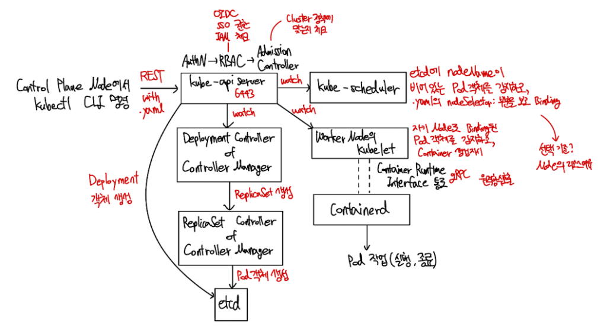

# Kubernetes 7주차 요약 정리

| Day | 제목 | 핵심 주제 |
|-----|------|-----------|
| 4 | Why Kubernetes Is Used | 컨테이너 단독 운영의 한계 & K8s 도입 기준 |
| 5 | Kubernetes Architecture Explained | 컨트롤 플레인·워커 노드 컴포넌트 & 동작 흐름 |
| 6 | Multi Node Cluster Setup (Kind) | Kind 로컬 클러스터 구축 & CKA 시험 팁 |

---

## 왜 쿠버네티스를 사용하는가

### 컨테이너만으로 운영할 때의 문제점

컨테이너가 죽으면 엔지니어가 SSH로 접속해서 직접 재시작해야 하므로 장애 복구가 전부 수동이다. 24/7 글로벌 서비스를 운영하려면 교대 근무와 다중 타임존 인력이 필요해 인건비가 급증한다. 수백 개 컨테이너 중 여러 개가 동시에 크래시하면 소수 인원으로는 대응이 불가능하고, 단일 VM이 죽으면 전체 서비스가 중단된다. v0.9에서 v1.0 같은 업데이트를 수백 컨테이너에 무중단으로 적용하기도 어렵다. 로드밸런서, 라우팅, 리소스 관리, 보안, 서비스 디스커버리 등을 전부 수동으로 구성해야 하는 부담도 크다.

### 쿠버네티스가 해결하는 것

쿠버네티스는 자가 치유(Self-healing), 자동 스케일링, 로드 밸런싱을 제공한다. 무중단 롤아웃과 롤백, 서비스 디스커버리, 시크릿 관리까지 자동화해준다.

### 주의 — K8s가 항상 정답은 아니다

컨테이너 2~3개 규모의 소규모 앱에는 오버엔지니어링이다. 관리형 서비스(EKS/AKS/GKE)를 쓰더라도 클러스터 유지보수 부담은 남는다. 소규모라면 Docker Compose나 VPS(Lightsail, Droplet) 등이 더 효율적이다.

---

## 쿠버네티스 아키텍처

### 아키텍처 전체 흐름도

### 기본 개념

노드(Node)는 K8s 컴포넌트나 워크로드가 실행되는 VM 또는 물리 머신이다. 파드(Pod)는 컨테이너를 감싸는 최소 배포 단위로, 보통 1개의 파드에 1개의 컨테이너가 들어간다.

### 컨트롤 플레인 (Master Node) 컴포넌트

| 컴포넌트 | 역할 |
|----------|------|
| kube-apiserver | 모든 요청의 중앙 관문. 인증·인가·검증 수행. etcd와 유일하게 통신. |
| kube-scheduler | 신규 파드를 배치할 최적 노드를 CPU·메모리 등 조건으로 결정. |
| kube-controller-manager | Node·Deployment·Namespace 등 각종 컨트롤러를 묶어 실행. 현재 상태를 원하는 상태로 유지. |
| etcd | 클러스터 전체 상태를 저장하는 분산 Key-Value 저장소(NoSQL). |

### 워커 노드 컴포넌트

| 컴포넌트 | 역할 |
|----------|------|
| kubelet | 각 노드의 에이전트. API Server 지시를 받아 파드를 생성·삭제하고 상태를 보고. |
| kube-proxy | iptables/ipvs 규칙을 관리하여 파드 간 통신 및 서비스 로드밸런싱을 처리. |

### 파드 생성 워크플로우 (kubectl create pod)

사용자가 kubectl로 파드 생성 요청을 보내면 API Server가 인증과 검증을 수행한다. 검증이 완료되면 etcd에 Pending 상태로 등록한다. Scheduler가 CPU·메모리 등의 조건을 분석하여 최적의 노드를 선정하고 API Server에 통보한다. API Server는 해당 노드의 kubelet에 파드 생성을 지시하고, kubelet이 컨테이너를 생성한 뒤 API Server에 보고한다. 마지막으로 etcd의 상태가 Running으로 갱신되고 사용자에게 완료 응답이 돌아간다.

조회(kubectl get pods) 시에는 etcd에서 바로 읽어오므로 워커 노드에 직접 묻지 않는다.

---

## kind 멀티 노드 클러스터 구축

### 왜 로컬(Kind)을 쓰는가

클라우드 관리형 서비스는 컨트롤 플레인 접근이 차단되어 학습과 트러블슈팅에 제한적이다. Kind는 Docker 컨테이너를 노드로 사용하므로 가볍고 빠르게 멀티 노드 환경을 재현할 수 있다.

macOS에서는 brew install kind, Windows에서는 choco install kind로 설치한다.

### 단일 노드 클러스터

kind create cluster --name cka-cluster-1 --image kindest/node:v1.29.4 명령으로 단일 노드 클러스터를 생성한다. kubectl cluster-info --context kind-cka-cluster-1로 클러스터 정보를 확인하고, kubectl get nodes로 control-plane 노드 1개가 있는지 확인한다.

### 멀티 노드 클러스터 (Control-Plane 1 + Worker 2)

config.yaml 파일을 아래와 같이 작성한다.

| 필드 | 값 |
|------|-----|
| kind | Cluster |
| apiVersion | kind.x-k8s.io/v1alpha4 |
| nodes | control-plane 1개, worker 2개 |

kind create cluster --name cka-cluster-2 --config config.yaml --image kindest/node:v1.29.4 명령으로 멀티 노드 클러스터를 생성한다. kubectl get nodes로 확인하면 control-plane 1개와 worker 2개가 표시된다.

kubectl version --client 명령으로 설치 여부를 확인한다. kubectl 버전과 클러스터 Kubernetes 버전을 가능한 맞추는 것이 권장된다.

