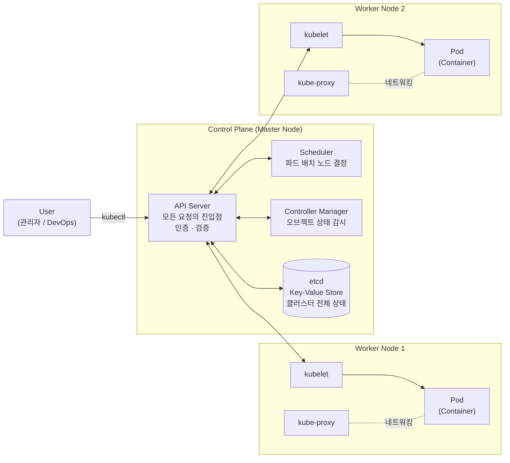
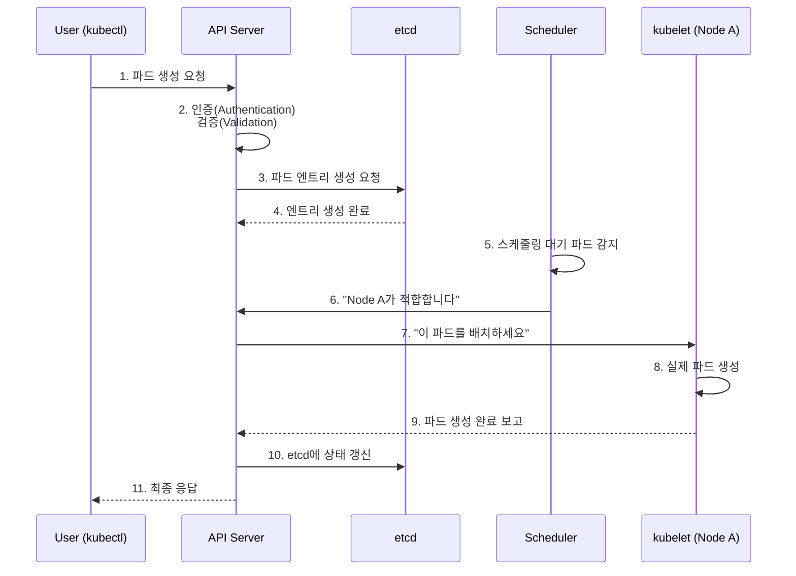

# Week 7 — DAY 4, 5, 6 학습 정리

범위: DAY 4 (Why Kubernetes Is Used) / DAY 5 (Kubernetes Architecture) / DAY 6 (Multi Node Cluster Setup with kind)

---

## DAY 4 — Why Kubernetes Is Used

이 강의는 "쿠버네티스가 무엇인가"가 아니라 **"도커 컨테이너만 쓰면 뭐가 문제인가"** 를 문제 상황을 하나씩 쌓아가며 보여준다. 그 문제들의 답이 결국 쿠버네티스다.


#### 상황 1 — 작은 애플리케이션, 컨테이너 하나가 죽다

VM 한 대 위에 컨테이너 서너 개로 돌아가는 작은 애플리케이션이 있다. 모두 정상이고 사용자도, 개발팀도, 운영팀도 행복하다.

그런데 컨테이너 하나가 죽는다. 그게 프론트엔드든 백엔드든 데이터베이스든, **실시간 사용자에게 바로 영향**이 간다.

해결책은 단순하다. 운영자나 시스템 관리자 한두 명을 배정해서, SSH로 VM에 접속해 컨테이너 로그를 보고 최대한 빨리 고치면 된다. 작은 애플리케이션이라면 이것도 괜찮다.

#### 상황 2 — 근무 시간 외에 장애가 나면?

문제는 **장애가 업무 시간에만 나지 않는다**는 것이다. 배정된 한두 명이 24시간 7일 내내 일할 수는 없다.

그러면 24/7 전담 지원 인력을 둬야 한다. 게다가 전 세계 사용자가 쓰는 애플리케이션이라면 **모든 타임존을 커버**해야 한다. 각 타임존마다 팀을 둔다는 건 사람을 더 뽑는다는 뜻이고, 결국 **비용이 크게 늘어난다.** 작은 애플리케이션에 이렇게 하는 건 권장할 만한 일도 아니다.

#### 상황 3 — 대규모 엔터프라이즈 환경

이번엔 VM 위에 컨테이너가 수백, 수천 개 도는 대형 애플리케이션이다. 큰 팀을 배정했으니 괜찮을까?

**컨테이너 8~10개가 동시에 죽으면** 어떻게 되는가. 몇 사람이 동시에 전부를 들여다보는 건 사실상 불가능하다. 게다가 프로덕션 장애라면 사용자가 영향을 받고 있는 상황이라 **디버깅하고 고칠 시간 자체가 없다.** 이런 일이 5분마다, 10분마다, 하루 종일 일어날 수도 있다.

#### 상황 4 — VM 자체가 죽으면?

애플리케이션이 올라가 있는 VM이 통째로 다운되면 **애플리케이션 전체가 내려간다.**

#### 상황 5 — 배포는 어떻게 하나

지금 컨테이너가 0.9 버전으로 돌고 있는데 1.0을 배포해야 한다. 이걸 **컨테이너 수백 개에 대해** 해야 한다면?

수동으로 할 것인가, 자동화를 직접 만들 것인가. 어느 쪽이든 번거롭다.

#### 상황 6 — 외부 노출은 어떻게 하나

모두 API 엔드포인트만 제공한다면 API Gateway를 두고 라우팅을 맡기면 된다. 그런데 웹 애플리케이션의 여러 컴포넌트라면?

**외부 로드밸런서를 앞에 두고 라우팅 규칙을 일일이 설정**해야 하는데, 이것도 번거롭다.

### 결국 직접 감당해야 하는 것들

오케스트레이션 시스템 없이 컨테이너만 쓰면 아래를 전부 수동으로 관리해야 한다.

- 네트워킹
- 리소스 관리
- 보안
- 고가용성(High Availability)
- 장애 내성(Fault Tolerance)
- 서비스 디스커버리

### 그래서 쿠버네티스

**쿠버네티스가 위의 모든 문제에 대한 답**이다. 최소한의(혹은 최적화된) 개입만으로 이 문제들을 처리해준다. 여기에 더해 스케일링, 로드 밸런싱, 오케스트레이션 등 여러 측면도 함께 다룬다.

### 다만, 쿠버네티스가 항상 답은 아니다

강사가 이 부분을 명확히 짚었다. **컨테이너 애플리케이션이라고 해서 무조건 쿠버네티스에 올리는 건 답이 아니다.**

앞선 영상에서 만든 to-do 리스트 애플리케이션처럼 **컨테이너가 두어 개뿐인 작은 애플리케이션**을 생각해보자. 컨테이너 2개 관리하자고 오케스트레이션 시스템 전체를 도입하는 건:

- 리소스 낭비
- 비용 낭비
- 관리 부담과 팀의 toil 증가

**AKS·EKS·GKE 같은 매니지드 서비스를 써도 마찬가지다.** 클러스터를 관리하고 유지보수하는 노력, 워크로드 최적화, 업그레이드와 패치 일정 계획 등은 여전히 직접 해야 한다.

그래서 도입 전에 충분히 검토해야 한다. 대안으로는 이런 것들이 있다.

- Docker Compose
- 베어메탈이나 VM에서 그냥 컨테이너 실행
- VPS (DigitalOcean Droplet, AWS Lightsail, GCP/Azure 마켓플레이스 이미지 등)

이런 선택지가 **더 적은 비용, 더 적은 관리 노력, 더 적은 유지보수**로 요구사항을 충족할 수 있다면 그쪽이 맞다.

> 핵심 메시지: 쿠버네티스는 강력하지만 공짜가 아니다. 규모와 요구사항을 먼저 따져보고 결정해야 한다.

---

## DAY 5 — Kubernetes Architecture Explained

### 노드(Node)란

노드는 결국 **가상 머신(VM)** 이다. 컴포넌트나 워크로드, 관리용 요소를 올려서 돌리는 머신을 쿠버네티스에서는 노드라고 부른다. 즉 VM의 다른 이름일 뿐이다.

노드는 역할에 따라 두 종류로 나뉜다.

| 구분 | 역할 |
| --- | --- |
| 컨트롤 플레인 (마스터 노드) | 클러스터를 관리·지시하는 컴포넌트들이 올라가는 노드 |
| 워커 노드 | 실제 워크로드(컨테이너, 파드)가 돌아가는 노드 |

강사의 비유가 이해에 도움이 된다. 컨트롤 플레인은 **회사의 이사회(board of directors)** 같은 존재다. 회사를 굴러가게 만들지만 직접 현장 작업을 하지는 않는다. 다른 팀과 매니저에게 지시를 내릴 뿐이다. 실제 작업은 워커 노드에서 일어난다.

프로덕션의 고가용성(HA) 환경에서는 컨트롤 플레인 노드도 보통 한 대가 아니라 여러 대를 둔다.

### 파드(Pod)란

컨테이너는 쿠버네티스에서 그 자체로 단독 실행될 수 없다. 반드시 **파드**라는 것으로 감싸야 한다.

강사의 비유: 뱃속의 아기를 보호하려면 양막(sack)이 필요하다. **파드가 그 양막이고, 컨테이너가 아기다.**

- 파드 안에는 컨테이너가 하나 이상 들어갈 수 있다
- 이상적으로는 파드당 컨테이너 하나
- 다만 헬퍼 컨테이너, 모니터링 에이전트, init 컨테이너 등이 함께 들어가는 경우도 있다
- 같은 파드 안의 컨테이너들은 파드의 리소스를 공유한다
- **파드는 쿠버네티스에서 가장 작은 배포 단위(smallest deployable unit)** 다

### 컨트롤 플레인 컴포넌트

#### API Server

컨트롤 플레인의 **중심**이다. 클라이언트로부터 들어오는 모든 요청은 **가장 먼저 API 서버에 도착**하고, API 서버가 다른 컴포넌트들과 대신 상호작용한다. 클러스터로 들어가는 유일한 진입점이라고 보면 된다.

API 서버가 요청을 받으면 하는 일:

1. **인증(Authentication)** — 유효한 요청인가, 사용자가 권한을 가졌는가
2. **검증(Validation)** — 쿠버네티스나 kubectl이 지원하는 요청인가

#### Scheduler

파드를 **어느 노드에 배치할지 결정**한다. API 서버로부터 요청을 전달받아 적합한 노드를 찾는다.

판단 근거가 되는 요소들:

- 노드의 가용 CPU
- 가용 메모리
- 가용 디스크 스토리지
- requests와 limits 설정
- 그 외 여러 제약 조건

스케줄러는 **계속 컨트롤 플레인을 모니터링**하면서 스케줄링이 필요한 파드가 있는지 감시한다.

#### Controller Manager

여러 **컨트롤러들의 집합**이다. 노드 컨트롤러, 네임스페이스 컨트롤러, 디플로이먼트 컨트롤러 등 다양한 컨트롤러가 들어 있다.

하는 일은 쿠버네티스 오브젝트를 계속 모니터링하면서 정상 상태를 유지하는 것이다. 예를 들어 **파드가 죽으면 그것을 감지해 계속 재시작**시킨다. 워크로드, 노드, 디플로이먼트가 항상 정상이고 살아 있도록 만든다.

#### etcd

**키-값 데이터 저장소(key-value data store)** 다.

강사가 관계형 DB와 비교해 설명한 부분이 핵심이다.

관계형 데이터베이스(RDBMS)는 행과 열로 이루어져 있고 **스키마가 고정**되어 있다. employee 테이블에 id, name, age, sex 컬럼이 있다고 하자. 특정 직원 한 명에게만 address 필드를 추가하고 싶어도 불가능하다. 테이블 전체를 ALTER 해서 컬럼을 추가해야 하고, 모든 레코드가 그 스키마를 따라야 한다.

이런 제약 때문에, 레코드마다 필드가 달라져야 하는 경우에는 RDBMS를 쓸 수 없다. 그래서 **스키마리스인 NoSQL 계열의 키-값 저장소**를 쓴다. 값은 JSON 형태의 문서로 저장되고, 키와 값의 쌍으로 구성된다.

```json
{
  "name": "Piyush",
  "age": 35,
  "address": "XYZ"
}
```

etcd에 저장되는 것:

- 클러스터 정보와 상태(state)
- 노드 상세 정보
- 파드 설정
- 시크릿
- 그 외 모든 관련 데이터

**중요한 규칙: 오직 API 서버만이 etcd와 상호작용한다.** etcd에 변경을 적용할 권한도, 정보를 조회할 권한도 API 서버만 가진다. 클러스터에 어떤 변경이 생기면 그 즉시 etcd에 반영된다.

### 워커 노드 컴포넌트

#### kubelet

**노드 기반 에이전트**다. API 서버로부터 지시를 받아 실제로 행동하고, 결과를 다시 API 서버에 보고한다.

예를 들어 파드 삭제 지시를 받으면, 해당 노드에서 파드를 삭제하고 "이 파드 삭제했습니다"라고 API 서버에 응답한다. 그러면 API 서버가 그 변경을 etcd에 반영한다.

결국 kubelet이 하는 일은 **워커 노드와 컨트롤 플레인 노드 사이의 통신을 가능하게 만드는 것**이다.

#### kube-proxy

**노드 내의 네트워킹을 담당**한다. 파드들이 서로 통신할 수 있게 해준다. 기본적으로 **iptables 규칙을 생성**해서 파드 간 네트워킹과 서비스 통신을 가능하게 만든다.

---

### 전체 아키텍처



핵심은 **모든 화살표가 API 서버를 거친다**는 점이다. 스케줄러도, 컨트롤러 매니저도, kubelet도 서로 직접 통신하지 않는다. 각 컴포넌트는 API 서버에 정보나 요청을 보내고, **결정은 API 서버가 내린다.**

---

### 파드 생성 요청의 End-to-End 흐름

`kubectl create pod` 를 실행했을 때 내부에서 벌어지는 일이다.



주의할 점은 **3번 단계에서 etcd가 파드를 만드는 게 아니라는 것**이다. etcd는 데이터베이스이므로 "파드가 생성되었다"는 엔트리만 기록한다. 실제 파드 생성은 8번에서 kubelet이 한다.

### 조회 요청(get pod)의 흐름

조회는 훨씬 단순하다.

1. 사용자가 `kubectl get pods` 실행
2. API 서버가 인증·검증
3. API 서버가 **etcd에서 정보 조회**
4. 사용자에게 응답

**클러스터에 직접 확인하러 가지 않는다.** etcd에 모든 정보가 저장되어 있으므로 데이터베이스만 보면 된다.

---

## DAY 6 — Multi Node Cluster Setup with kind

### 왜 매니지드 서비스를 먼저 쓰지 않는가

많은 사람이 "어떤 클라우드를 쓰냐"고 물었지만 강사의 답은 **"아무것도 쓰지 않는다"** 였다.

이유가 명확하다. 쿠버네티스를 배우기 전에 Docker와 컨테이너 기초를 먼저 배우듯이, AKS·EKS·GKE 같은 매니지드 서비스를 배우기 전에 **로컬 설치로 쿠버네티스 자체를 먼저 배워야 한다.**

매니지드 서비스를 쓰면 생기는 문제:

- **컨트롤 플레인 노드에 접근조차 못 한다**
- 장애 상황을 트러블슈팅할 수 없다
- 대부분을 클라우드 프로바이더가 관리하므로 배우는 게 최소화된다

로컬 설치가 학습량과 실습량을 최대로 끌어올린다.

### kind란

로컬에 쿠버네티스를 설치하는 방법은 여러 가지가 있다. minikube, k3s, k3d, kind 등이다.

**kind = Kubernetes IN Docker**

백엔드에서 **Docker 컨테이너를 띄우고, 각 컨테이너를 별개의 노드처럼 취급**한다. 그래서 그 노드들을 컨트롤 플레인과 워커 노드로 쓸 수 있다. 구성이 간단하다는 게 장점이다.

### 사전 요구사항

- Go 1.16 이상
- Docker 또는 podman 또는 nerdctl 중 하나

### 설치

| 환경 | 명령어 |
| --- | --- |
| macOS | `brew install kind` |
| Windows | `choco install kind` (chocolatey는 윈도우 패키지 매니저) |
| Linux | 릴리스 바이너리 다운로드 |

소스에서 직접 빌드하는 방법도 있다.

### 단일 노드 클러스터 생성

```bash
kind create cluster \
  --image kindest/node:v1.29.4@sha256:... \
  --name cka-cluster1
```

옵션 설명:

- `--image` — 생략하면 최신 쿠버네티스 버전으로 생성된다. 특정 버전을 쓰려면 kind 릴리스 노트 페이지에서 해당 버전의 노드 이미지를 복사해 지정한다
- `--name` — 생략하면 클러스터 이름이 `kind`가 된다

**버전 선택 팁 (시험 대비)**

강의 녹화 시점(2024년 5월) 기준 CKA 시험 환경은 1.29였다. 시험을 준비한다면 **CNCF 시험 가이드에서 현재 시험에 쓰이는 버전을 확인**하고 그와 같은 버전으로 실습하는 게 좋다. 버전 간 차이는 대부분 미미하지만 맞춰두는 편이 안전하다.

클러스터 생성 시 kind가 하는 일:

```
노드 이미지 pull → 노드 준비 → 설정 작성 → 컨트롤 플레인 시작
```

### 클러스터 정보 확인

```bash
kubectl cluster-info --context kind-cka-cluster1
```

컨트롤 플레인이 어느 포트에서 돌고 있는지, CoreDNS가 떠 있는지 등이 표시된다. CoreDNS는 쿠버네티스 내부에서 DNS 기능을 제공하는 로컬 DNS 서버라고 이해하면 된다.

클러스터가 하나뿐이면 굳이 이 명령을 쓸 필요는 없지만, 여러 클러스터를 운영할 때 현재 어느 클러스터를 보고 있는지 확인하는 용도로 쓴다.

### kubectl 설치와 확인

kubectl은 클러스터가 어디에 있든(EKS, AKS, GKE, VMware, 베어메탈 온프레미스) **모든 쿠버네티스 클러스터와 상호작용할 때 쓰는 공통 도구**다.

```bash
kubectl version --client
```

참고로 kubectl 버전과 쿠버네티스 클러스터 버전은 다를 수 있다. 이상적으로는 같은 버전을 쓰는 게 좋다.

### 노드 확인

```bash
kubectl get nodes
```

```
NAME                        STATUS   ROLES           AGE   VERSION
cka-cluster1-control-plane  Ready    control-plane   1m    v1.29.4
```

이 명령이 실행될 때 내부에서 벌어지는 일은 DAY 5에서 배운 그대로다. **kubectl → API 서버(인증·검증) → etcd 조회 → 응답.**

기본 설정으로는 노드가 하나뿐이다. 컨트롤 플레인과 워커 노드가 분리되어 있지 않다. 하지만 우리가 원하는 건 **컨트롤 플레인과 워커 노드가 분리된 구조**다.

### 멀티 노드 클러스터 생성

설정 파일 `config.yml`을 만든다.

```yaml
kind: Cluster
apiVersion: kind.x-k8s.io/v1alpha4
nodes:
- role: control-plane
- role: worker
- role: worker
```

구조를 보면 `kind`는 오브젝트 타입(Cluster), `apiVersion`은 내부 API를 호출할 때 쓰이는 버전, `nodes`에 역할별로 노드를 나열한다. 위 설정은 컨트롤 플레인 1개 + 워커 2개, 총 3노드 클러스터를 만든다.

```bash
kind create cluster \
  --image kindest/node:v1.29.4@sha256:... \
  --name cka-cluster2 \
  --config config.yml
```

이때 kind가 수행하는 단계:

```
노드 이미지 준비 → 노드 준비 → 컨트롤 플레인 시작
→ CNI(네트워크 플러그인) 설치 → StorageClass 설치 → 워커 노드 join
```

마지막 **join 단계가 중요하다.** 노드 3개가 따로 만들어졌을 때 서로가 같은 클러스터의 일부라는 걸 어떻게 아는가? 워커 노드를 컨트롤 플레인 노드에 join 시켜서 컨텍스트를 맞춰줘야 한다. 그래야 하나의 클러스터가 된다. **클러스터라는 이름 자체가 "함께 묶인 리소스 그룹"이라는 뜻**이다.

```bash
kubectl get nodes
```

```
NAME                         STATUS   ROLES           VERSION
cka-cluster2-control-plane   Ready    control-plane   v1.29.4
cka-cluster2-worker          Ready    <none>          v1.29.4
cka-cluster2-worker2         Ready    <none>          v1.29.4
```

참고로 프로덕션 환경에서는 컨트롤 플레인 노드도 HA 모드로 **최소 3개**를 두는 게 이상적이다. 이 역시 같은 yaml로 설정할 수 있다.

### 컨텍스트 전환 (시험에서 가장 중요한 부분)

클러스터를 두 개 만들면 문제가 생긴다. 지금 kubectl이 **어느 클러스터를 보고 있는지** 알 수 없다. 새로 만든 클러스터로 자동 전환되기 때문이다.

```bash
# 현재 사용 가능한 컨텍스트 목록
kubectl config get-contexts
```

```
CURRENT   NAME                CLUSTER
          kind-cka-cluster1   kind-cka-cluster1
*         kind-cka-cluster2   kind-cka-cluster2
```

**앞의 별표(`*`)가 현재 컨텍스트**다. 지금 실행하는 모든 명령은 이 클러스터를 대상으로 한다.

```bash
# 컨텍스트 전환
kubectl config use-context kind-cka-cluster1
```

전환 후 `kubectl get nodes`를 다시 실행하면 1번 클러스터의 노드 1개가, 2번으로 바꾸면 3개가 나온다.

> **시험 대비 핵심**
>
> 강사가 이 부분을 특히 강조했다. CKA 시험에서는 **모든 문제를 풀기 전에 반드시 해당 컨텍스트로 전환해야 한다.** use-context 명령은 문제에 함께 제공되므로 복사해서 붙여넣으면 된다.
>
> 만약 1번 문제를 cluster1에서 풀고, 2번 문제가 cluster2를 요구하는데 컨텍스트를 바꾸지 않고 계속 작업하면, **모든 작업을 정확히 해도 문제를 통과할 수 없다.** 그리고 왜 안 되는지 계속 헤매게 된다. 문제를 끝까지 제대로 읽는 습관이 중요하다.

### 시험 중 참고 가능한 문서

CKA는 완전한 실습 시험이라 암기가 아니라 **지식과 기술**을 평가한다. 시험 중에 아래 두 도메인과 모든 하위 도메인에 접근할 수 있다.

- `kubernetes.io/docs` 및 하위 도메인
- `kubernetes.io/blog` 및 하위 도메인

특히 **Cheat Sheet 페이지**가 중요하다. kubernetes.io 문서에서 "cheat sheet"으로 검색하면 상위에 나온다. 자주 쓰는 명령이 모여 있다.

다만 명령어를 찾느라 시간을 낭비하면 안 되므로, **충분히 연습해서 웬만한 건 외워두고** 긴 명령만 문서에서 복사하는 전략이 좋다. 그리고 무엇을 검색해야 하는지 아는 것 자체가 실력이므로, 실습을 많이 해보는 게 중요하다.

---

## 정리

이번 주 세 편은 **왜 → 무엇 → 어떻게** 순서로 자연스럽게 이어진다.

DAY 4가 "왜 필요한가"를 문제 상황으로 설득하고, DAY 5가 "그래서 그게 어떤 구조인가"를 설명하고, DAY 6에서 "그 구조를 내 노트북에 직접 만들어본다".

특히 DAY 4에서 나열한 문제들이 DAY 5의 컴포넌트와 하나씩 대응되는 게 인상적이다.

| DAY 4에서 제기한 문제 | DAY 5에서 답하는 컴포넌트 |
| --- | --- |
| 컨테이너가 죽으면 사람이 고쳐야 한다 | Controller Manager (자동 감지·재시작) |
| 어느 머신에 올릴지 직접 정해야 한다 | Scheduler (자원 기준 자동 배치) |
| 상태를 어디서 관리하나 | etcd (클러스터 전체 상태 저장) |
| 수많은 요청을 어떻게 통제하나 | API Server (단일 진입점, 인증·검증) |
| 파드 간 네트워킹은 누가 하나 | kube-proxy (iptables 규칙) |

DAY 5에서는 쿠버네티스의 내부 구조를, DAY 6에서는 그 구조를 로컬에 직접 만들어보는 방법을 배웠다.

두 강의가 자연스럽게 이어진다. DAY 5에서 개념으로만 봤던 컨트롤 플레인과 워커 노드 분리를, DAY 6에서 kind의 `role: control-plane` / `role: worker` 설정으로 실제로 구현한다. 그리고 `kubectl get nodes` 한 줄이 실행될 때 API 서버와 etcd를 거치는 흐름도 DAY 5에서 배운 그대로다.

kind가 클러스터를 만들면서 CNI를 설치하고 워커 노드를 join 시키는 과정은, 노드 여러 대를 하나의 클러스터로 묶는 데 무엇이 필요한지를 보여준다.
