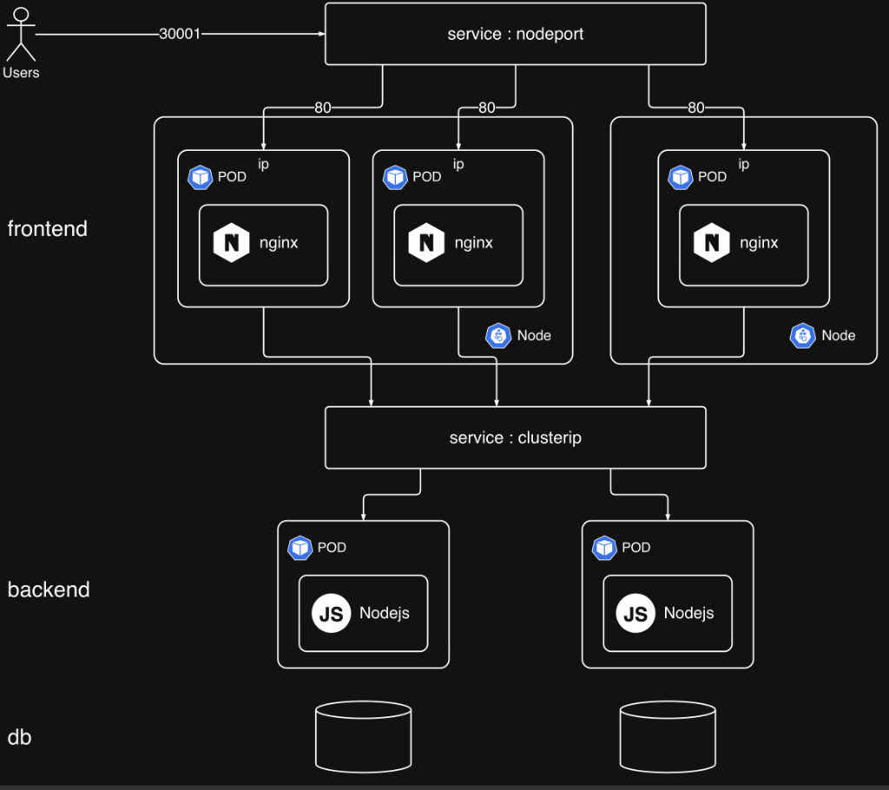

# Kubernetes 스터디 8주차 요약 정리

### 명령형(Imperative)과 선언형(Declarative) 방식

쿠버네티스에서 파드를 생성하는 방법은 크게 두 가지가 있다. 명령형 방식은 kubectl run nginx --image=nginx 처럼 CLI에서 직접 명령어를 입력하는 것이다. 선언형 방식은 YAML 설정 파일에 원하는 상태를 정의한 뒤 kubectl create -f 또는 kubectl apply -f 명령으로 적용하는 것이다.

명령형 방식은 빠른 트러블슈팅이나 로컬 테스트에 적합하고, 선언형 방식은 프로덕션 배포, CI/CD, GitOps 등에 적합하다. 두 방식 모두 실무와 시험에서 중요하므로 반드시 둘 다 익혀야 한다.

### YAML 기본 문법

YAML은 들여쓰기와 공백으로 구조를 표현하는 직렬화 언어로, 쿠버네티스에서 가장 많이 쓰이는 설정 파일 포맷이다. 주석은 # 기호로 작성한다. 문자열, 정수, 실수, 불리언 등 다양한 데이터 타입을 지원한다. 딕셔너리(사전)는 키 아래에 하위 필드를 들여쓰기하여 작성하고, 리스트(배열)는 항목 앞에 - (대시)를 붙여서 작성한다. 중첩 구조도 가능하다. 탭 대신 공백(보통 2칸)을 사용해야 하며 들여쓰기가 어긋나면 구조가 깨지므로 주의해야 한다. 파일 확장자는 .yaml 또는 .yml 둘 다 동일하게 동작한다.

### 쿠버네티스 YAML의 4가지 최상위 필드

모든 쿠버네티스 오브젝트의 YAML은 apiVersion, kind, metadata, spec 네 가지 최상위 필드로 구성된다. 이 필드들은 대소문자를 구분한다. apiVersion은 해당 오브젝트가 사용하는 API 버전이고, kind는 오브젝트 타입, metadata에는 이름과 레이블 등의 메타 정보를 넣고, spec에는 컨테이너 이미지, 포트 등 실제 사양을 정의한다.

### Pod YAML 작성과 실습

Pod YAML을 직접 작성할 때는 metadata 아래에 name과 labels를 지정하고, spec 아래에 containers 리스트를 작성한다. containers 안에 name, image, ports(containerPort) 등을 지정한다. labels 필드 안에는 원하는 키-값 쌍을 자유롭게 추가할 수 있다.

YAML을 수동으로 전부 작성할 필요 없이 kubectl run nginx --image=nginx --dry-run=client -o yaml 명령으로 자동 생성한 뒤 필요한 부분만 수정하면 된다. 이 결과를 > pod.yaml 로 리다이렉트하면 파일로 바로 저장된다. JSON 형식으로도 -o json 옵션으로 출력할 수 있다.

### 유용한 kubectl 명령어

kubectl get pods로 파드 목록을 확인하고, kubectl describe pod (이름)으로 상세 정보(노드, 레이블, 이벤트, 에러 등)를 본다. kubectl get pods --show-labels로 레이블을 함께 확인할 수 있다. kubectl get pods -o wide를 쓰면 파드의 IP와 실행 중인 노드까지 볼 수 있다. kubectl exec -it (파드이름) -- sh로 파드 내부 셸에 진입할 수 있다. kubectl edit pod (이름)으로 실행 중인 파드의 스펙을 직접 수정할 수도 있다. kubectl explain pod 명령으로 해당 오브젝트의 API 버전과 필드 구조를 확인할 수 있다.

---

### 왜 Replication이 필요한가

단일 파드가 크래시하면 사용자가 응답을 받을 수 없게 된다. Replication Controller(또는 ReplicaSet)는 지정된 수의 파드 복제본(replicas)을 항상 유지해주는 쿠버네티스 오브젝트다. 파드가 하나 죽으면 즉시 새 파드를 띄워서 고가용성을 보장한다. 또한 트래픽을 여러 파드에 분산하여 로드 밸런싱 역할도 한다.

### Replication Controller vs ReplicaSet

Replication Controller는 레거시 방식이고, ReplicaSet은 신규 권장 방식이다. 둘 다 동일한 이미지의 파드를 지정된 수만큼 유지한다는 점은 같다. 핵심 차이는 ReplicaSet에는 selector와 matchLabels 필드가 있어서, 해당 ReplicaSet이 직접 생성하지 않은 기존 파드도 레이블이 일치하면 관리 범위에 포함시킬 수 있다는 것이다.

Replication Controller의 apiVersion은 v1이고, ReplicaSet의 apiVersion은 apps/v1이다. 이 버전 정보는 kubectl explain rs 명령으로 확인할 수 있다.

### YAML 구조

Replication Controller와 ReplicaSet의 YAML은 spec 아래에 replicas(원하는 복제 수)와 template(파드 템플릿)을 가진다. template 안에는 Pod YAML의 metadata와 spec을 그대로 넣으면 된다. 즉, Pod YAML에서 apiVersion과 kind를 제외한 나머지를 template 아래에 복사하면 된다. ReplicaSet은 추가로 selector > matchLabels 필드가 필요하다.

### 레플리카 수 변경 방법 세 가지

첫째, YAML 파일에서 replicas 값을 수정한 뒤 kubectl apply -f 로 적용한다. 둘째, kubectl edit rs (이름) 명령으로 실행 중인 오브젝트를 직접 편집하면 저장 즉시 반영된다. 셋째, kubectl scale --replicas=10 rs/(이름) 처럼 명령형으로 즉시 스케일링한다. 시험에서는 시간 절약을 위해 명령형 방식이 유리하다.

### Deployment

Deployment는 ReplicaSet 위에 한 단계 더 감싸는 오브젝트로, ReplicaSet이 제공하지 못하는 롤링 업데이트와 롤백 기능을 추가로 제공한다. 사용자가 Deployment를 생성하면 Deployment가 ReplicaSet을 만들고, ReplicaSet이 Pod를 관리하는 3단 구조가 된다.

롤링 업데이트란 파드를 한 번에 전부 교체하지 않고 하나씩 순차적으로 업데이트하는 방식이다. 예를 들어 nginx 이미지를 latest에서 1.9.1로 변경할 때, 하나의 파드를 먼저 업데이트하고 그 사이 나머지 파드가 트래픽을 처리한다. 이렇게 하면 다운타임 없이 버전을 교체할 수 있다.

kubectl set image deploy/(이름) nginx=nginx:1.9.1 명령으로 이미지를 변경할 수 있다. kubectl rollout history deploy/(이름) 으로 배포 이력(리비전)을 확인하고, kubectl rollout undo deploy/(이름) 으로 이전 버전으로 즉시 롤백할 수 있다. 특정 리비전으로 롤백하는 것도 가능하다.

Deployment YAML을 명령형으로 생성하려면 kubectl create deploy (이름) --image=nginx --dry-run=client -o yaml > deploy.yaml 을 사용하면 된다.

---

### 서비스 아키텍처 다이어그램

### 서비스란 무엇인가

파드는 재시작될 때마다 IP가 바뀌므로, 파드의 IP를 직접 사용하여 통신하는 것은 불안정하다. 서비스(Service)는 파드 앞에 고정된 네트워크 엔드포인트를 제공하여, 파드 IP가 바뀌어도 안정적으로 접근할 수 있게 해주는 쿠버네티스 오브젝트다. 서비스는 selector를 통해 특정 레이블을 가진 파드들을 자동으로 엔드포인트(Endpoints)로 등록하고, 트래픽을 라운드 로빈 방식으로 분산한다. 파드가 재시작되어 IP가 바뀌면 엔드포인트 목록도 자동으로 갱신된다.

### 서비스의 세 가지 포트 개념

NodePort 서비스에는 세 가지 포트가 등장한다. targetPort는 실제 파드가 수신하는 포트다. port는 클러스터 내부에서 다른 파드나 서비스가 이 서비스에 접근할 때 사용하는 포트다. nodePort는 클러스터 외부에서 노드 IP와 함께 접근할 때 사용하는 포트로, 30000~32767 범위에서 지정한다.

### NodePort

NodePort는 애플리케이션을 클러스터 외부에 노출하는 가장 기본적인 방법이다. 외부 사용자는 (노드IP):(nodePort) 형태로 접근하고, 서비스가 내부적으로 targetPort로 트래픽을 전달한다. 여러 노드에 걸쳐 파드가 분산되어 있어도 동일한 nodePort로 접근 가능하며, 서비스가 라운드 로빈으로 트래픽을 분배한다. YAML에서 spec.type을 NodePort로 지정하고, ports 아래에 nodePort, port, targetPort를 명시한다. selector에는 대상 파드의 레이블을 지정한다.

Kind 클러스터에서는 기본적으로 NodePort가 외부에 노출되지 않으므로, 클러스터 생성 시 config YAML에 extraPortMappings(containerPort, hostPort) 설정을 추가하고 클러스터를 재생성해야 한다. 실제 온프레미스나 클라우드 환경에서는 이 추가 작업이 필요 없다.

### ClusterIP

ClusterIP는 기본(default) 서비스 타입으로, 클러스터 내부에서만 접근 가능한 가상 IP를 할당한다. 프론트엔드 파드가 백엔드 파드에 접근하거나, 백엔드가 데이터베이스에 접근할 때처럼 클러스터 내부 통신에 사용한다. YAML에서 type을 생략하거나 ClusterIP로 지정하면 된다. nodePort 필드는 필요 없고 port와 targetPort만 지정한다. kubectl get endpoints 또는 kubectl get ep 명령으로 해당 서비스에 등록된 파드 IP 목록(엔드포인트)을 확인할 수 있다.

### LoadBalancer

LoadBalancer는 클라우드 환경(AWS, Azure, GCP)에서 외부 로드밸런서를 자동 프로비저닝하여 단일 외부 IP(또는 DNS)를 제공하는 서비스 타입이다. 사용자는 개별 노드 IP를 알 필요 없이 하나의 로드밸런서 주소로 접근하면 되고, 로드밸런서가 알고리즘에 따라 트래픽을 여러 파드에 분산한다. YAML에서 spec.type을 LoadBalancer로 지정한다. 외부 로드밸런서가 실제로 프로비저닝되지 않으면(예: Kind 클러스터) External-IP가 pending 상태로 남고, NodePort처럼 동작하게 된다.

### ExternalName

ExternalName은 클러스터 내부의 서비스 이름을 외부 DNS 주소에 매핑하는 서비스 타입이다. selector 대신 externalName 필드에 외부 DNS(예: my-database.example.com)를 지정하면, 클러스터 내부의 다른 파드들이 이 서비스 이름으로 외부 리소스에 접근할 수 있다.
