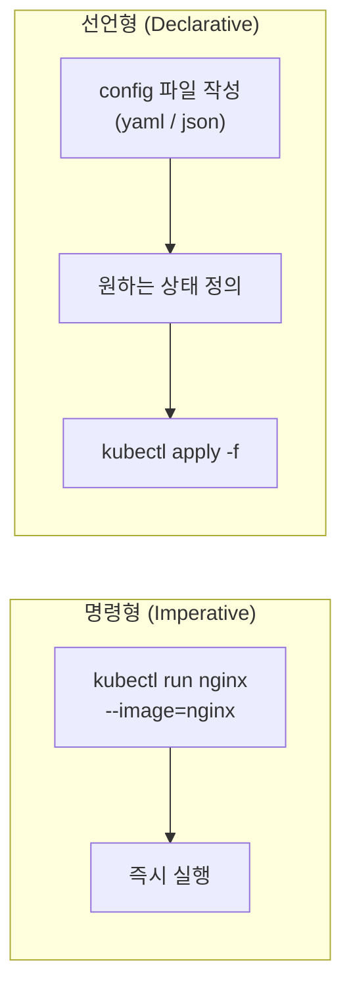
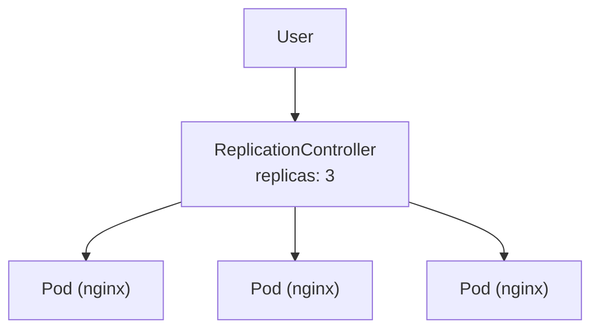
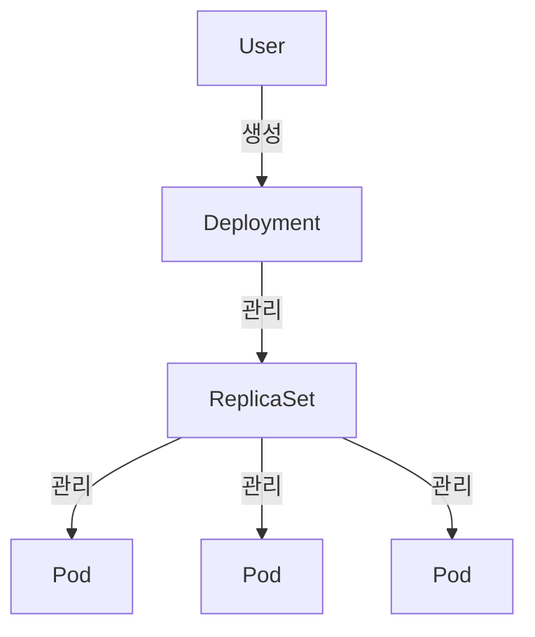
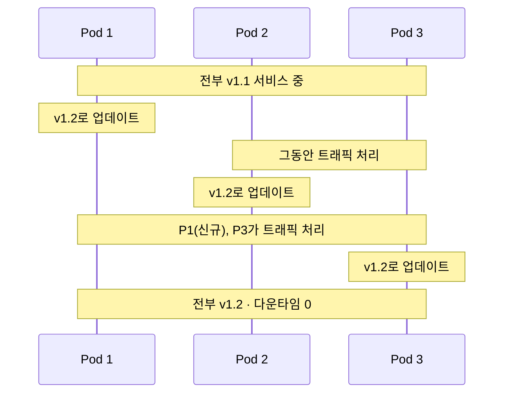
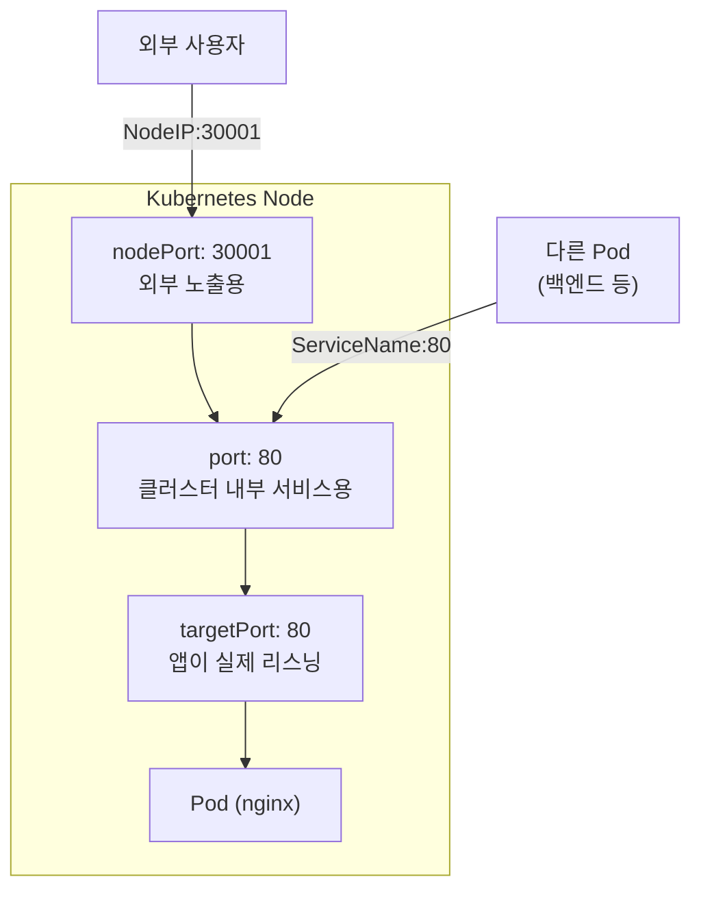
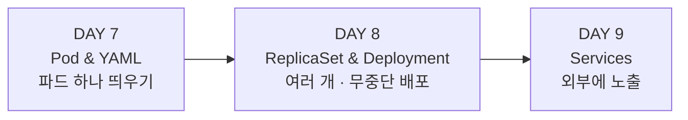

# Week 8 — DAY 7, 8, 9 학습 정리

정리: 김민성
강의: Tech Tutorials with Piyush — CKA Full Course
범위: DAY 7 (Pod & YAML) / DAY 8 (ReplicaSet & Deployment) / DAY 9 (Services)

이번 주부터 본격적인 Hands-On이 시작된다. 세 편이 **파드 하나 띄우기 → 여러 개로 늘리고 무중단 배포하기 → 외부에 노출하기** 순서로 이어진다.

---

## DAY 7 — Pod와 YAML 기초

### 명령형(Imperative) vs 선언형(Declarative)

쿠버네티스에 무언가를 만드는 방식은 크게 두 가지다.



**명령형**은 `kubectl run nginx` 처럼 명령을 직접 내리는 방식이다. "이걸 해라, 저걸 실행해라, 이 정보를 가져와라" 하고 지시한다.

**선언형**은 설정 파일을 만들어 **오브젝트의 원하는 상태(desired state)** 를 정의한 뒤 `kubectl create` 또는 `apply` 를 실행한다. 어떤 API 버전을 쓸지, 어떤 이름과 이미지로 파드를 만들지, 어떤 포트로 노출할지를 파일에 다 적어둔다.

강사가 강조한 점은 **둘 다 알아야 한다**는 것이다. 시험을 떠나서 실무에서도 둘 다 쓴다.

| 방식 | 주 용도 |
| --- | --- |
| 명령형 | 트러블슈팅, 클러스터에 문제가 있을 때, 로컬 배포 |
| 선언형 | 프로덕션 배포, CI/CD, GitOps |

### 명령형으로 파드 만들기

```bash
kubectl run nginx-pod --image=nginx
kubectl get pods
```

```
NAME        READY   STATUS    RESTARTS   AGE
nginx-pod   1/1     Running   0          10s
```

파드는 생성 직후 바로 Running이 되지 않는다. **ContainerCreating을 거쳐 Running**으로 간다.

`READY 1/1` 이 의미하는 것: 이 파드는 컨테이너 **1개**를 갖고 있고, 그중 **1개가 실행 중**이다. 파드 안에 컨테이너가 두 개라면 `2/2` 또는 `2/1` 처럼 표시된다. 여러 컨테이너가 들어가는 경우는 헬퍼 컨테이너, init 컨테이너, 특정 작업만 하고 끝나는 컨테이너 등이다.

### YAML 기초

YAML을 쓰는 이유는 **쓰기 쉽고, 깔끔하고, 직관적**이기 때문이다. 쿠버네티스뿐 아니라 Ansible, Prometheus, Docker Compose 등 수많은 도구가 YAML을 설정 파일 형식으로 쓴다.

JSON도 지원되지만 강사 표현으로 **"JSON 쓰는 사람은 거의 못 봤다"**.

확장자는 `.yaml` 과 `.yml` 둘 다 같은 것이므로 아무거나 써도 된다.

#### 주석과 데이터 타입

```yaml
# 이것은 주석이다

employee:          # 딕셔너리(dictionary)
  name: Piyush     # 문자열 (따옴표는 선택)
  age: 4           # 정수
  address: 1-out-7
```

**들여쓰기가 핵심이다.** JSON은 중괄호로 계층을 표현하지만 YAML은 **들여쓰기와 공백**으로 표현한다.

- 공백 1칸, 2칸 모두 가능하지만 **2칸을 권장**
- **탭(Tab)은 권장하지 않는다.** YAML 파일이 지저분해진다

들여쓰기를 잘못하면 의도와 다르게 해석된다.

```yaml
employee:
  name: Piyush
age: 4             # employee 안이 아니라 별도 최상위 필드가 되어버림
```

#### 리스트

리스트는 하이픈(`-`)으로 표현한다.

```yaml
employee:
  - name: Piyush
    age: 4
  - name: Another
    age: 8
```

중첩 리스트(sub-list)도 가능하다.

```yaml
address:
  - old address
  - new address
```

### 쿠버네티스 매니페스트의 4대 최상위 필드

모든 쿠버네티스 오브젝트는 아래 네 가지 최상위 필드를 갖는다.

```yaml
apiVersion: v1
kind: Pod
metadata:
spec:
```

> **대소문자를 구분한다.** `apiVersion`은 a가 소문자, `kind`·`metadata`·`spec`은 전부 소문자, 값인 `Pod`는 P가 대문자다. 이걸 틀리면 바로 에러가 난다.

#### apiVersion을 모를 때

```bash
kubectl explain pod
```

출력 맨 위에 해당 오브젝트의 `KIND`와 `VERSION`이 나온다. 버전은 alpha, beta, v1, v2 등이 있을 수 있으므로 지원되는 버전을 확인해서 써야 한다. **Pod, ReplicaSet, Deployment, Service 등 모든 오브젝트에 쓸 수 있는 명령**이니 꼭 기억해두자.

### 파드 매니페스트 전체 예시

```yaml
apiVersion: v1
kind: Pod
metadata:
  name: nginx-pod
  labels:
    env: demo
    type: frontend
spec:
  containers:
    - name: nginx-container
      image: nginx
      ports:
        - containerPort: 80
```

구조를 뜯어보면:

- `metadata` 안에는 `name`과 `labels`가 들어간다
- **`metadata`나 `spec`에는 지원되는 필드만** 쓸 수 있다
- 하지만 **`labels` 안에는 원하는 key-value를 자유롭게** 넣을 수 있다. 여러 개도 가능하다
- `spec.containers`는 리스트이므로 `-` 로 시작한다
- `ports`는 `containerPort`를 갖는 중첩 리스트다

### 생성, 삭제, 수정

```bash
kubectl create -f pod.yaml     # 생성 전용 (이미 있으면 에러)
kubectl apply -f pod.yaml      # 생성 또는 업데이트
kubectl delete pod nginx-pod
```

`apply`는 생성과 업데이트를 모두 할 수 있어서 더 범용적이다.

### 트러블슈팅 실습

이미지 이름을 일부러 틀리게(`nginx123`) 바꾸고 apply하면:

```bash
kubectl get pods
```

```
NAME        READY   STATUS             RESTARTS   AGE
nginx-pod   0/1     ImagePullBackOff   0          20s
```

`READY 0/1` 이고 상태가 **ImagePullBackOff**다. 도커허브에서 이미지를 가져오는 데 실패했다는 뜻이다.

```bash
kubectl describe pod nginx-pod
```

맨 아래 **Events** 섹션에 실제 에러가 나온다.

```
Failed to pull and unpack image ...
pull access denied, repository does not exist or may require authorization
```

원인은 둘 중 하나다. **이미지나 태그 이름이 틀렸거나**, 이미지를 pull할 권한이 없거나. 퍼블릭 이미지라면 인증을 요구할 리 없으므로 이름이 틀린 것이다.

#### 고치는 두 가지 방법

**방법 1 — yaml 수정 후 재적용**

```bash
# pod.yaml 수정
kubectl apply -f pod.yaml
```

**방법 2 — 라이브 오브젝트 직접 수정**

```bash
kubectl edit pod nginx-pod
```

vi 에디터가 열리고, 여기서 고치고 저장하면 **apply 없이 즉시 반영**된다. 실행 중인 파드 자체를 수정하는 것이기 때문이다.

### 컨테이너 내부 접속

```bash
kubectl exec -it nginx-pod -- sh
```

도커에서 인터랙티브 셸을 여는 것과 같은 방식이다. 들어가서 `pwd`, 로그 확인 등 필요한 작업을 하고 `exit`로 나온다.

### dry-run으로 YAML 자동 생성 (중요)

매니페스트가 수백 줄이 되면 직접 타이핑하는 건 시간 낭비다. **명령형 명령을 실행하되 실제로 적용하지 않고 YAML만 뽑아내는 방법**이 있다.

```bash
# 실제로 만들지 않고 결과만 확인
kubectl run nginx --image=nginx --dry-run=client

# YAML 형식으로 출력
kubectl run nginx --image=nginx --dry-run=client -o yaml

# 파일로 저장
kubectl run nginx --image=nginx --dry-run=client -o yaml > pod-new.yaml
```

JSON으로도 뽑을 수 있다.

```bash
kubectl run nginx --image=nginx --dry-run=client -o json > pod-new.json
```

JSON도 중괄호만 다를 뿐 `apiVersion`, `kind`, `metadata`, `spec` 네 필드 구조는 동일하다.

생성된 파일에서 `creationTimestamp` 같은 불필요한 필드를 지우고 필요한 부분만 수정하면 된다. **시험에서 시간을 크게 아낄 수 있는 기법이다.**

### 정보 조회 명령어 정리

```bash
kubectl describe pod nginx-pod        # 상세 정보 (조건, 이벤트, 노드 등)
kubectl get pods --show-labels        # 라벨 표시
kubectl get pods -o wide              # IP, NODE 컬럼 추가
kubectl get nodes -o wide             # OS 이미지, 커널 버전, 런타임, External IP
```

`-o wide`는 기본 출력에 확장 정보를 덧붙인다. `get pods` 기본은 NAME/READY/STATUS/RESTARTS/AGE인데, `-o wide`를 붙이면 **IP와 어느 노드에서 도는지**가 추가된다.

**라벨의 쓸모**: 파드가 수백 개일 때 "프론트엔드 애플리케이션에 속한 파드가 뭐지?"를 라벨로 필터링해서 찾을 수 있다.

### 시험 팁 — vi 에디터

시험에서는 **VS Code 같은 에디터를 쓸 수 없고 터미널에서만 작업**한다. vi 에디터 단축키를 충분히 연습해두자. 시험을 떠나서도 오래 쓸 수 있는 기술이다.

### DAY 7 과제

1. 명령형 명령으로 nginx 이미지를 사용해 파드 생성
2. 1번에서 만든 파드로부터 YAML을 생성하고, 파드 이름을 바꿔 새 파드 생성
3. 잘못된 YAML을 고치고 적용 (트러블슈팅 절차 전부 따라하기)

---

## DAY 8 — ReplicaSet과 Deployment

### 왜 필요한가

파드 하나만 띄워놓고 사용자가 접근하고 있는데 **그 파드가 죽으면** 사용자는 빈 응답을 받는다. 이게 도커 컨테이너를 단독으로 돌릴 때의 대표적 단점이다.

오케스트레이션 시스템이라면 **자동 복구(auto heal)** 나 **새 파드 자동 생성** 메커니즘이 있어야 한다. 그게 ReplicationController와 ReplicaSet이다.

### ReplicationController의 역할



- **동일한 파드 인스턴스를 여러 개** 띄운다
- `replicas: 3` 이면 **항상 3개가 떠 있도록 보장**한다. 1개가 죽으면 1개를, 2개가 죽으면 2개를 새로 띄운다
- `replicas: 1` 이어도 그 하나가 죽는 순간 새로 띄우므로 고가용성이 확보된다
- **로드 밸런싱 로직**을 가진다. 트래픽을 파드 하나가 아니라 컨트롤러로 보내면, 컨트롤러가 헬시한 파드를 골라 분산한다

컨트롤러는 **Controller Manager**가 관리하는 여러 컨트롤러 중 하나다. 노드용, 네임스페이스용, 파드용 컨트롤러가 각각 있고, ReplicationController는 레플리카 수를 유지하는 역할을 맡는다.

### 수동 스케일링과 노드 확장

트래픽이 늘면 `replicas`를 2에서 3으로 올려 파드를 늘린다. 파드는 **노드의 CPU·메모리·스토리지를 공유**해서 쓰므로, 노드 용량이 부족해지면 새 노드를 추가하고 거기에 파드를 배치한다.

**ReplicationController는 여러 노드에 걸쳐(span) 동작할 수 있다.** 이후 강의에서 다룰 오토스케일링(HPA, VPA)이 이 과정을 자동화한 것이다.

### ReplicationController 매니페스트

```yaml
apiVersion: v1
kind: ReplicationController
metadata:
  name: nginx-rc
  labels:
    env: demo
spec:
  template:              # 파드를 어떻게 만들지에 대한 설계도
    metadata:
      labels:
        env: demo
    spec:
      containers:
        - name: nginx-container
          image: nginx
          ports:
            - containerPort: 80
  replicas: 3
```

> **헷갈리기 쉬운 지점**: `metadata`와 `spec`이 각각 **두 번** 나온다. 바깥쪽은 ReplicationController의 것이고, `template` 안쪽은 **파드의 것**이다. 파드 YAML에서 `apiVersion`과 `kind`만 빼고 그대로 가져와 `template` 아래에 붙인 형태다.

컨트롤러는 파드가 죽었을 때 새로 만들어야 하는데, **어떤 이미지로 어떤 포트를 열지**를 알아야 한다. 그 정보가 바로 `template`이다.

```bash
kubectl explain rc              # 버전 확인 (v1)
kubectl apply -f rc.yaml
kubectl get pods                # nginx-rc-xxxxx 형태로 3개
kubectl get rc
```

파드 이름은 `컨트롤러이름-랜덤문자열` 로 만들어진다.

### ReplicaSet과의 차이

| 구분 | ReplicationController | ReplicaSet |
| --- | --- | --- |
| 위상 | 레거시(Legacy) | 신규, 권장 |
| apiVersion | `v1` | `apps/v1` |
| 관리 범위 | **자신이 만든 파드만** | `selector`로 **기존 파드도 관리 가능** |

핵심 차이는 **`selector.matchLabels`** 필드다. 이것으로 **자신이 만들지 않은 기존 파드까지 관리 대상에 포함**시킬 수 있다.

```yaml
apiVersion: apps/v1
kind: ReplicaSet
metadata:
  name: nginx-rs
spec:
  selector:
    matchLabels:
      env: demo        # 이 라벨을 가진 모든 파드를 관리
  template:
    ...
  replicas: 3
```

#### apiVersion 함정

`kind: ReplicaSet`에 `apiVersion: v1`을 쓰면 이런 에러가 난다.

```
no matches for kind "ReplicaSet" in version "v1"
```

```bash
kubectl explain rs
```

출력을 보면 `VERSION: v1` 외에 **`GROUP: apps`** 가 추가로 있다. 그래서 완전한 형태는 `apps/v1`, 즉 **`그룹/버전`** 이 된다.

### 스케일링하는 세 가지 방법

```bash
# 1. YAML 수정 후 재적용
kubectl apply -f rs.yaml

# 2. 라이브 오브젝트 직접 편집 (저장 즉시 반영, apply 불필요)
kubectl edit rs nginx-rs

# 3. 명령형 (가장 빠름)
kubectl scale --replicas=10 rs/nginx-rs
```

> **시험 팁**: 같은 작업을 여러 방법으로 할 수 있다면 **가장 시간이 적게 드는 방법**을 쓰자. 시험은 시간이 곧 점수다. 명령을 외우고 있으면 명령형이 빠르고, vi에 익숙하면 `edit`이 편하고, 둘 다 자신 없으면 치트시트에서 복사해 쓰면 된다.

> **vi 단축키**: `Shift + A` 는 커서를 줄 끝으로 옮기면서 입력 모드로 들어간다. `kubectl edit` 할 때 매우 유용하다.

### Deployment

Deployment는 ReplicaSet에 **추가 기능을 얹은 상위 리소스**다.



사용자는 Deployment를 만들고, Deployment가 ReplicaSet을 만들고, ReplicaSet이 파드를 만든다.

#### 롤링 업데이트가 핵심

이미지를 1.1에서 1.2로 올려야 한다고 하자.

**ReplicaSet만 쓰면** 변경 적용 시 **파드를 한꺼번에 전부 재생성**한다. 그동안 사용자는 다운타임을 겪는다.

nginx처럼 가벼운 앱이면 몇 초라 체감이 적을 수 있다. 하지만 **은행 앱이나 주식 거래 앱**이라면? 강사 표현대로 **시간이 곧 돈이라 단 1밀리초의 다운타임도 감당할 수 없다.**

**Deployment는 롤링 업데이트 방식**으로 처리한다.



파드를 하나씩 순차적으로 교체하고, 교체 중인 파드의 트래픽은 나머지 파드가 받는다. 결과적으로 **다운타임 없이 전체 배포가 완료**된다.

여기에 더해 **특정 리비전으로 롤백**하거나 방금 한 변경을 **취소**할 수 있다.

#### 실습 명령어

```bash
kubectl apply -f deploy.yaml
kubectl get deploy
kubectl get all                 # 클러스터의 모든 리소스 조회
```

`kubectl get all` 을 하면 Deployment 1개, ReplicaSet 1개, Pod 3개가 함께 보인다. **Deployment가 ReplicaSet을 만들고 ReplicaSet이 파드를 만든 구조**가 눈으로 확인된다.

```bash
# 이미지 변경
kubectl set image deploy/nginx-deploy nginx-container=nginx:1.9.1

# 확인 (로컬 yaml은 그대로, 라이브 오브젝트만 바뀜)
kubectl describe deploy nginx-deploy

# 배포 이력
kubectl rollout history deploy/nginx-deploy

# 롤백
kubectl rollout undo deploy/nginx-deploy
```

> 주의: `kubectl set image`는 **라이브 오브젝트만 변경**한다. 로컬 YAML 파일은 그대로다. 나중에 그 YAML을 apply하면 변경이 되돌아간다.

`rollout undo`를 하면 새로운 리비전이 하나 더 생기면서 이전 상태로 돌아간다.

#### dry-run으로 Deployment YAML 생성

```bash
kubectl create deploy nginx-new --image=nginx --dry-run=client -o yaml > deploy.yaml
```

기본값으로 replicas 1, selector matchLabels 등이 채워진 상태로 나온다.

---

## DAY 9 — Services

### 왜 필요한가

Deployment로 파드를 여러 개 띄웠지만 **외부에 노출되어 있지 않다.** 노드 안에서나 클러스터 내부에서만 접근할 수 있다.

더 근본적인 문제가 있다. **파드마다 IP가 할당되지만 그 IP는 고정이 아니다.** 파드가 재시작되면 IP가 바뀐다.

실제로 확인해보면:

```bash
kubectl describe pod nginx-xxx     # IP: 10.244.1.2
kubectl delete pod nginx-xxx
kubectl describe pod nginx-yyy     # IP: 10.244.2.3  ← 바뀜
```

그래서 프론트엔드가 백엔드를, 백엔드가 DB를 IP로 직접 부르는 건 불가능하다. **서비스**가 이 문제를 해결한다.

서비스는 애플리케이션을 **느슨하게 결합(loosely coupled)** 시키고, 파드가 어떤 포트에서 리스닝하는지, 누구에게 접근을 허용할지를 정한다.

### 서비스 타입 네 가지

- ClusterIP
- NodePort
- LoadBalancer
- ExternalName

### NodePort — 세 가지 포트 이해하기

이 부분이 DAY 9에서 가장 헷갈리는 지점이다.



| 포트 | 역할 | 범위 |
| --- | --- | --- |
| **nodePort** | **외부에 노출**되는 포트. 사용자가 브라우저로 접근 | **30000 ~ 32767** |
| **port** | **클러스터 내부의 다른 서비스/파드**가 이 서비스를 부를 때 쓰는 포트 | 자유 |
| **targetPort** | **애플리케이션 파드가 실제로 리스닝**하는 포트. 외부 노출 안 됨 | 자유 |

정리하면:

- **외부 사용자**인 나는 `노드IP:30001` 로 접근한다
- **애플리케이션**은 `targetPort` 80에서 돌고 있다
- **백엔드 파드**가 이 프론트엔드를 부르려면 `port` 80을 쓴다

`port`와 `targetPort`는 같아도 되고 달라도 된다. **지정하지 않으면 targetPort는 port와 같은 값**이 된다.

파드가 여러 노드에 흩어져 있어도 동작은 같다. 외부에서 `노드IP:30001` 로 들어오면 서비스가 **라운드 로빈으로 여러 파드에 분산**시킨다.

### NodePort 매니페스트

```yaml
apiVersion: v1
kind: Service
metadata:
  name: nodeport-svc
  labels:
    env: demo
spec:
  type: NodePort
  ports:
    - nodePort: 30001
      port: 80
      targetPort: 80
  selector:
    env: demo
```

#### 실습 중 만난 에러 세 가지 (중요)

강사가 실제로 세 번 틀리면서 보여준 부분이라 그대로 기록한다.

**1. selector에 matchLabels를 쓰면 안 된다**

ReplicaSet에서는 `selector.matchLabels`를 썼지만, **서비스의 selector는 라벨을 직접** 적는다.

```yaml
# 틀림
selector:
  matchLabels:
    env: demo

# 맞음
selector:
  env: demo
```

**2. 대소문자 구분**

`nodeport`가 아니라 **`NodePort`** 다. 에러 메시지가 친절하게 알려준다.

```
Unsupported value: "nodeport": supported values: "ClusterIP", "ExternalName", "LoadBalancer", "NodePort"
```

**3. 포트 범위**

`300001` 처럼 0을 하나 더 쓰면 범위를 벗어난다.

```
Invalid value: 300001: provided port is not in the valid range. The range is 30000-32767
```

### kind 클러스터에서의 추가 작업 (함정)

서비스를 만들었는데 `노드IP:30001` 로 접속이 안 된다. 이유는 **kind 클러스터가 노드 포트를 호스트로 노출하지 않기 때문**이다.

> **중요**: 이건 **kind에서만 필요한 추가 단계**다. 시험 환경이나 온프레미스, 클라우드 클러스터에서는 여기까지 하면 바로 접근된다.

kind 설정 파일에 **extraPortMappings**를 추가해야 한다.

```yaml
kind: Cluster
apiVersion: kind.x-k8s.io/v1alpha4
nodes:
  - role: control-plane
    extraPortMappings:
      - containerPort: 30001
        hostPort: 30001
  - role: worker
  - role: worker
```

kind는 **기존 클러스터를 수정할 수 없으므로 새로 만들어야 한다.**

```bash
kind delete cluster --name cka-cluster3
kind create cluster --config kind.yaml --name cka-cluster3
```

이후에는 노드 IP가 아니라 **localhost로 접근**한다.

```bash
curl localhost:30001
# Welcome to nginx!
```

### ClusterIP

**클러스터 내부 전용** 서비스다. 타입을 지정하지 않으면 **기본값이 ClusterIP**다.

```yaml
apiVersion: v1
kind: Service
metadata:
  name: cluster-svc
spec:
  type: ClusterIP        # 생략 가능
  ports:
    - port: 80
      targetPort: 80
  selector:
    env: demo
```

nodePort가 없다. 외부에 노출하지 않기 때문이다.

```bash
kubectl get svc
# cluster-svc   ClusterIP   10.96.x.x   <none>   80/TCP
```

`EXTERNAL-IP`가 `<none>`인 것이 ClusterIP가 내부 전용임을 보여준다.

#### Endpoints

```bash
kubectl describe svc cluster-svc
kubectl get endpoints        # 또는 kubectl get ep
```

**Endpoints는 서비스가 트래픽을 보내는 파드들의 실제 IP 목록**이다. `kubectl get pods -o wide` 로 본 파드 IP와 정확히 일치한다.

**파드가 재시작되어 IP가 바뀌면 Endpoints도 자동으로 갱신된다.** 이것이 서비스가 IP 변동 문제를 해결하는 방식이다.

### LoadBalancer

파드가 50개 노드에 분산되어 있다면 사용자에게 IP 50개를 줄 수는 없다. `myapp.com` 같은 **단일 진입점**이 필요하다.

```yaml
spec:
  type: LoadBalancer
  ports:
    - port: 80
      targetPort: 80
  selector:
    env: demo
```

AWS, Azure, GCP 같은 **클라우드에서 외부 로드밸런서를 프로비저닝**하고, 쿠버네티스의 LoadBalancer 타입 서비스가 그것을 참조하는 구조다.

```bash
kubectl get svc
# lb-svc   LoadBalancer   10.96.x.x   <pending>   80:31234/TCP
```

kind에서는 **EXTERNAL-IP가 `<pending>`** 으로 남는다. 실제 로드밸런서를 프로비저닝하지 않았기 때문이다. 이 경우 **NodePort처럼 동작**하며 임의의 nodePort가 할당된다.

(kind 문서에 cloud-provider-kind 바이너리로 로드밸런서를 시뮬레이션하는 방법이 있지만, 강사는 혼란을 줄이려고 생략했다.)

### ExternalName

가장 단순하다. 라벨 셀렉터 대신 **외부 DNS 이름에 매핑**한다. 예를 들어 데이터베이스가 특정 DNS에서 서비스되고 있다면, 그 DNS를 ExternalName으로 등록해두고 내부 서비스들이 그 이름으로 참조한다.

### 명령형으로 서비스 만들기

```bash
kubectl expose deployment nginx-deploy --port=80 --target-port=80
```

YAML을 다 쓰지 않고 한 줄로 서비스를 만들 수 있다. **시험에서 유용하다.**

### 편의 설정 — alias와 자동완성

```bash
# ~/.bash_profile 또는 ~/.bashrc
alias k='kubectl'
source ~/.bash_profile

k get pods     # kubectl 대신 k
```

치트시트에 있는 **bash completion** 설정을 적용하면 탭 키로 명령어 자동완성이 된다. 로컬 환경에서 작업 효율이 크게 올라간다.

---

## 세 강의 정리



| 주제 | 해결하는 문제 |
| --- | --- |
| Pod | 컨테이너를 쿠버네티스에서 실행하는 최소 단위 |
| ReplicaSet | 파드가 죽어도 지정한 개수를 유지 (자동 복구) |
| Deployment | 다운타임 없이 버전 업데이트, 롤백 |
| Service | 바뀌는 파드 IP 앞에 고정 접근점 제공, 외부 노출 |

각 단계가 앞 단계의 한계를 메우는 구조다. 파드는 죽으면 끝이라 ReplicaSet이 필요하고, ReplicaSet은 업데이트 시 다운타임이 있어 Deployment가 필요하고, Deployment로 만든 파드들은 IP가 계속 바뀌어서 Service가 필요하다.

### 자주 쓰는 명령어 모음

```bash
# 조회
kubectl get pods -o wide
kubectl get pods --show-labels
kubectl get all
kubectl get svc / ep / rs / deploy
kubectl describe pod|svc|deploy <name>
kubectl explain <object>            # apiVersion 확인

# 생성 · 수정
kubectl apply -f <file>.yaml
kubectl edit <object> <name>        # 라이브 수정, 즉시 반영
kubectl scale --replicas=N rs/<name>
kubectl set image deploy/<name> <container>=<image>
kubectl expose deployment <name> --port=80 --target-port=80

# 배포 관리
kubectl rollout history deploy/<name>
kubectl rollout undo deploy/<name>

# YAML 생성 (시간 절약)
kubectl run nginx --image=nginx --dry-run=client -o yaml > pod.yaml
kubectl create deploy nginx --image=nginx --dry-run=client -o yaml > deploy.yaml

# 디버깅
kubectl exec -it <pod> -- sh
```

### 다음 강의 예고
DAY 10에서는 멀티 컨테이너 파드, command와 arguments, 그리고 네임스페이스를 다룬다.
