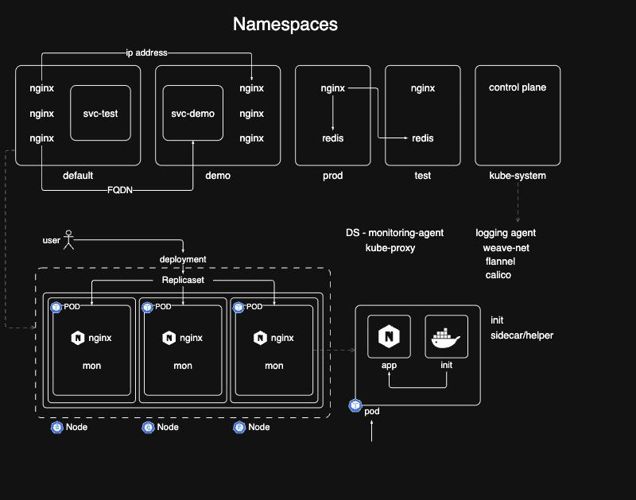

# Kubernetes 9주차 스터디 정리

### 아키텍처 다이어그램

## Kubernetes Namespace

### 네임스페이스의 개념

네임스페이스는 쿠버네티스 클러스터 내부에서 리소스를 논리적으로 분리하고 격리하는 가상 클러스터 단위다. 개발 환경(test, dev), 운영 환경(prod), 공용 시스템 등으로 공간을 나누어 관리할 수 있다.  

네임스페이스를 활용하면 서로 다른 팀이나 프로젝트 간에 이름 충돌 없이 동일한 이름의 파드나 디플로이먼트를 배포할 수 있으며, 네임스페이스 단위로 접근 제어(RBAC)나 리소스 할당량(ResourceQuota)을 부여하여 보안성과 안정성을 높일 수 있다.  

특정 네임스페이스에 속한 관리자가 다른 네임스페이스의 리소스를 실수로 수정하거나 삭제하는 사고도 예방할 수 있다.
  
### 기본 네임스페이스 종류

쿠버네티스 클러스터를 설치하면 기본적으로 네 가지 네임스페이스가 자동 생성된다. 첫째는 default 네임스페이스로, 사용자가 별도의 네임스페이스를 지정하지 않고 생성하는 모든 오브젝트가 기본적으로 배치되는 공간이다. 둘째는 kube-system 네임스페이스로, kube-apiserver, etcd, kube-scheduler, kube-controller-manager, CoreDNS, kube-proxy 등 쿠버네티스 컨트롤 플레인 핵심 컴포넌트들이 실행되는 보호 구역이다. 셋째는 kube-public 네임스페이스로, 클러스터 외부 사용자에게 인증 없이 공개되는 정보가 담기는 공간이다. 넷째는 kube-node-lease 네임스페이스로, 노드의 하트비트를 관리하여 노드의 상태를 점검하는 용도로 쓰인다.

### 네임스페이스 간 네트워크 통신과 FQDN

동일한 네임스페이스 안에서는 서비스 이름만으로 직접 통신할 수 있지만, 서로 다른 네임스페이스 간에는 단순 서비스 이름만으로는 CoreDNS 호스트 이름을 해석할 수 없다. 이를 해결하기 위해 정규화된 도메인 이름인 FQDN(Fully Qualified Domain Name)을 사용해야 한다. FQDN의 구조는 서비스이름.네임스페이스이름.svc.cluster.local 형식으로 구성된다. 예를 들어 default 네임스페이스의 svc-test 서비스에 접근하려면 svc-test.default.svc.cluster.local 형식으로 호출해야 하며, demo 네임스페이스의 svc-demo 서비스에 접근하려면 svc-demo.demo.svc.cluster.local 형식으로 호출해야 한다.

## Multi Container Pod와 Init Container

### 멀티 컨테이너 파드의 개념

쿠버네티스에서 파드는 일반적으로 단일 컨테이너로 운영되지만, 필요에 따라 하나의 파드 안에 두 개 이상의 컨테이너를 함께 묶어 실행할 수 있다. 이를 멀티 컨테이너 파드라고 부른다. 동일한 파드 내의 컨테이너들은 네트워크 네임스페이스(localhost 및 IP)를 공유하고 동일한 볼륨 스토리지와 시스템 리소스를 공유하여 밀접하게 협업할 수 있다.

### Init Container와 Sidecar Container의 차이

메인 애플리케이션 컨테이너를 보조하는 컨테이너는 동작 시점에 따라 Init Container와 Sidecar Container로 나뉜다. 초기화 컨테이너는 메인 앱 컨테이너가 시작되기 전에 먼저 실행되어 필수 선행 작업(데이터베이스 연결 확인, 설정 파일 다운로드, 외부 서비스 준비 대기 등)을 완수한 뒤 성공적으로 종료되어야만 메인 컨테이너를 기동시키는 컨테이너다.   

여러 개의 초기화 컨테이너가 정의되어 있다면 선언된 순서대로 하나씩 직렬 실행되며, 도중에 하나라도 실패하면 파드가 시작되지 않는다. 반면 사이드카 컨테이너는 메인 컨테이너와 동시에 시작되어 파드의 전체 생명주기 동안 함께 계속 실행되면서 실시간 로그 수집, 모니터링 지표 수집, 프록시 통신 대행 등의 보조 작업을 수행한다.

## DaemonSet, Job, CronJob

### DaemonSet의 개념과 Deployment와의 차이

데몬셋(DaemonSet)은 클러스터 내의 모든 워커 노드(또는 특정 노드들)에 정확히 파드 복제본을 하나씩 항상 실행되도록 보장하는 쿠버네티스 워크로드 오브젝트다. 디플로이먼트나 레플리카셋은 replicas 필드를 통해 원하는 파드 수를 명시하고 스케줄러가 노드들의 리소스 여유를 고려하여 분배하지만, 데몬셋은 YAML 파일에 replicas 필드를 지정하지 않는다.

### DaemonSet를 주로 사용하는 경우?

대표적으로 노드의 CPU, 메모리 등의 성능 지표를 수집하는 Prometheus node-exporter 같은 모니터링 에이전트, 노드의 시스템 로그나 컨테이너 로그를 중앙 저장소로 전달하는 Fluentd나 Logstash 같은 로깅 에이전트가 있다. 또한 Weave, Flannel, Calico 같은 CNI 네트워크 플러그인과 파드 간 네트워크 프록시를 처리하는 kube-proxy 역시 모든 노드에서 빠짐없이 동작해야 하므로 kube-system 네임스페이스 내에서 데몬셋으로 운영된다.

### 컨트롤 플레인 노드와 Taint의 관계

3개 노드로 구성된 클러스터에서 커스텀 데몬셋을 배포했을 때 워커 노드 2개에만 파드가 생성되고 컨트롤 플레인(마스터) 노드에는 생성되지 않는 현상이 발생한다. 이는 컨트롤 플레인 노드에 기본적으로 테인트(Taint)가 설정되어 있어 일반 워커 파드가 스케줄링되지 못하도록 보호하고 있기 때문이다. 데몬셋 파드가 마스터 노드에도 실행되도록 하려면 파드 스펙에 해당 테인트를 허용하는 toleration 설정을 명시해야 한다.

### 일회성 작업을 위한 Job

상시 가동되는 웹 서버나 데몬과 달리 한 번만 실행되어 특정 작업을 완료하고 종료되는 배치를 처리하기 위해 쿠버네티스는 Job 오브젝트를 제공한다. Job은 파드가 지정된 작업을 성공적으로 마칠 때까지(exit code 0) 파드의 생명주기를 관리하며, 도중에 컨테이너가 실패하면 지정된 횟수만큼 재시도한다. 데이터베이스 마이그레이션, 배치 데이터 연산, 백업 실행, 초기화 스크립트 실행 등에 주로 사용된다.

