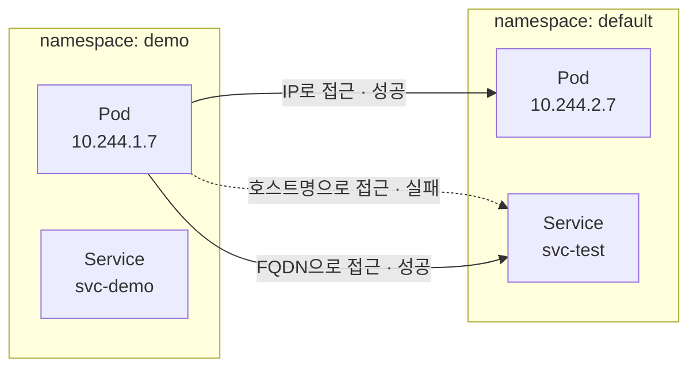
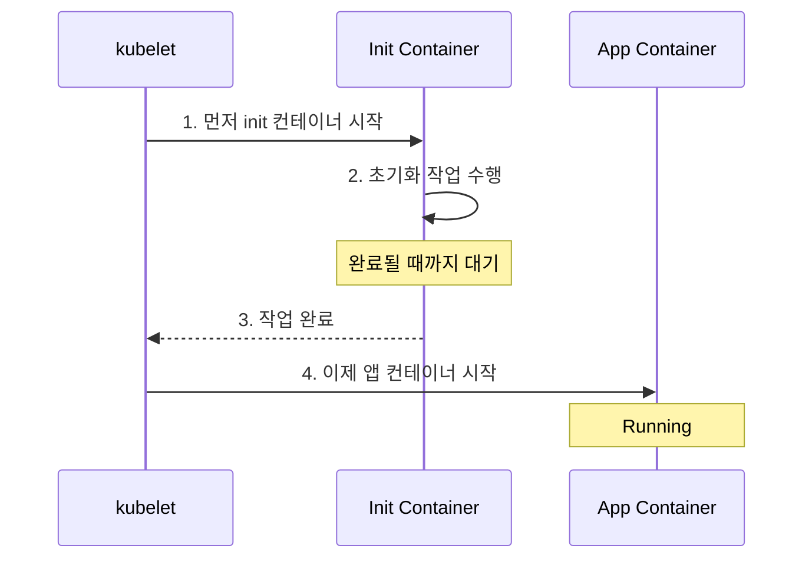
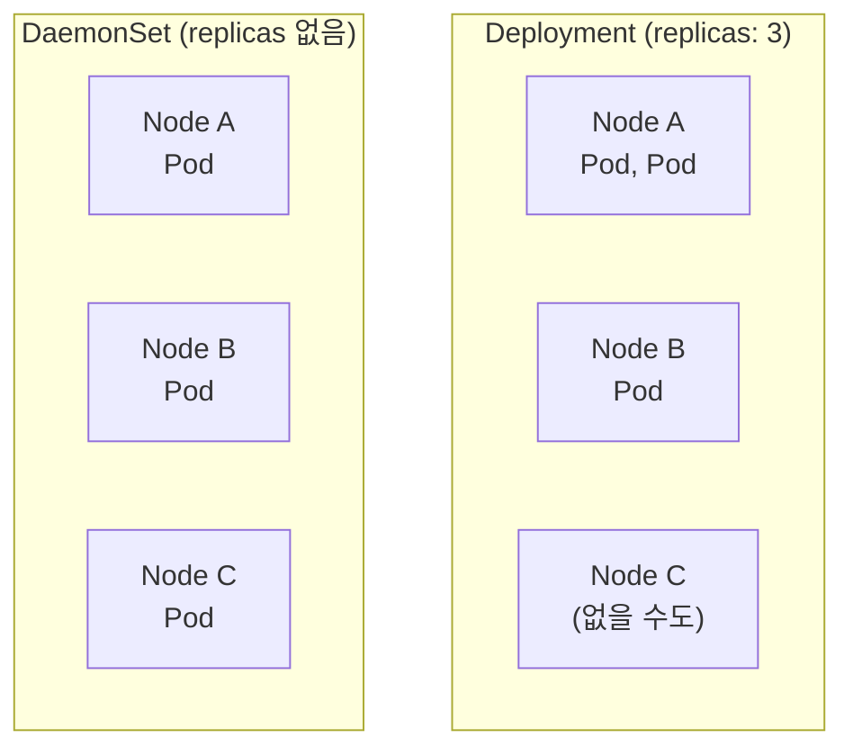
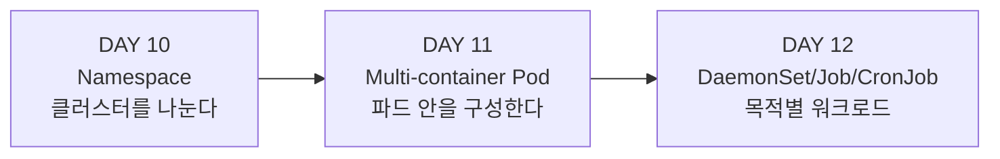

# Week 9 — DAY 10, 11, 12 학습 정리

정리: 김민성
강의: Tech Tutorials with Piyush — CKA Full Course
범위: DAY 10 (Namespaces) / DAY 11 (Multi-container Pods) / DAY 12 (DaemonSet, Job, CronJob)

Week8에 파드를 띄우고 복제하고 외부에 노출하는 것까지 배웠다. 이번 주는 **클러스터를 논리적으로 나누고(네임스페이스), 파드 안을 여러 컨테이너로 구성하고, 목적이 다른 워크로드 리소스를 쓰는 법**을 다룬다.

---

## DAY 10 — Namespaces

### 네임스페이스란

클러스터 안에서 **또 하나의 격리 계층**을 제공한다. 리소스를 논리적으로 분리해서 관리할 수 있게 해준다.

지금까지 네임스페이스를 지정하지 않고 리소스를 만들었는데, 그건 전부 **`default` 네임스페이스**에 생성된 것이다.

### 기본 네임스페이스

클러스터를 만들면 쿠버네티스가 알아서 몇 개를 생성한다.

```bash
kubectl get namespaces      # 또는 kubectl get ns
```

| 네임스페이스 | 용도 |
| --- | --- |
| `default` | 네임스페이스를 지정하지 않으면 여기에 생성 |
| `kube-system` | **컨트롤 플레인 컴포넌트**가 전부 여기 |
| `kube-public` | 모든 사용자가 읽을 수 있는 공개 정보 |
| `kube-node-lease` | 노드 하트비트 정보 |
| `local-path-storage` | kind가 만드는 스토리지용 |

`kube-system` 안을 들여다보면 지금까지 배운 것들이 다 나온다.

```bash
kubectl get all -n kube-system
```

CoreDNS, etcd, kube-apiserver, kube-controller-manager, kube-scheduler, kube-proxy, kindnet(kind의 네트워킹), kube-dns 서비스가 보인다. **DAY 5에서 개념으로 배운 컨트롤 플레인 컴포넌트가 실제로 어디 있는지** 눈으로 확인하는 순간이다.

> `--namespace kube-system` 대신 **`-n kube-system`** 으로 줄여 쓸 수 있다. 하이픈 하나다.

### 왜 네임스페이스가 필요한가

**첫째, 실수 방지다.** 네임스페이스가 세 개 있는데 첫 번째 것의 파드를 지우려다 두 번째 것을 지우는 사고를 막아준다. 네임스페이스를 명시해야만 조작할 수 있으니 한 번 더 걸러진다. 모든 게 한 네임스페이스에 있으면 이런 실수가 훨씬 쉽게 난다.

**둘째, 권한 분리다.** 네임스페이스별로 **서로 다른 RBAC 권한**을 부여할 수 있다.

**셋째, 환경 분리다.** test 환경, prod 환경을 네임스페이스로 나눠 격리할 수 있다.

### 네임스페이스 생성

**선언형** — `spec` 필드가 필요 없다는 점이 특이하다.

```yaml
apiVersion: v1
kind: Namespace
metadata:
  name: demo
```

```bash
kubectl apply -f ns.yaml
```

**명령형** — 훨씬 간단하다.

```bash
kubectl create ns demo
kubectl delete ns demo
```

강사도 **"네 단어만 쓰면 되니 선언형보다 빠르다"** 고 했다. YAML을 만들고 적용하는 것보다 명령 하나가 나은 대표적인 경우다.

### 네임스페이스 지정하기

리소스를 만들거나 조회할 때마다 **`-n` 으로 네임스페이스를 명시**해야 한다.

```bash
# demo 네임스페이스에 생성
kubectl create deploy nginx-demo --image=nginx -n demo

# demo 네임스페이스에서 조회
kubectl get deploy -n demo

# default는 생략 가능
kubectl get deploy
```

**중요한 특성**: 네임스페이스가 다르면 **같은 이름의 오브젝트를 만들 수 있다.** demo 네임스페이스의 `nginx` 와 default 네임스페이스의 `nginx` 는 서로 아무 문제 없이 공존한다. 격리되어 있기 때문이다.

### 핵심 실험 — 네임스페이스 간 통신

강의에서 가장 중요한 부분이다. 서로 다른 네임스페이스의 파드가 통신할 수 있는지 직접 확인한다.



**실험 1 — 파드 IP로 접근**

```bash
kubectl exec -it <pod> -n demo -- sh
curl 10.244.2.7
# Welcome to nginx!  ← 성공
```

**실험 2 — 서비스 호스트명으로 접근**

```bash
curl svc-test
# could not resolve host  ← 실패
```

**실험 3 — FQDN으로 접근**

```bash
curl svc-test.default.svc.cluster.local
# Welcome to nginx!  ← 성공
```

### 결론 — IP는 클러스터 전역, 호스트명은 네임스페이스 범위

| 대상 | 범위 |
| --- | --- |
| **파드 IP** | **클러스터 전역(cluster-wide)**. 네임스페이스가 달라도 IP로는 접근된다 |
| **서비스 호스트명** | **네임스페이스 범위(namespace-wide)**. 같은 네임스페이스 안에서만 짧은 이름이 통한다 |

왜 그런지는 컨테이너 안의 `/etc/resolv.conf` 를 보면 알 수 있다.

```bash
cat /etc/resolv.conf
```

```
nameserver 10.96.0.10
search demo.svc.cluster.local svc.cluster.local cluster.local
options ndots:5
```

**`search` 목록의 맨 앞이 자기 네임스페이스**다. 그래서 짧은 이름을 쓰면 자기 네임스페이스에서 먼저 찾는다. 다른 네임스페이스의 서비스는 이 목록에 없으니 해석에 실패한다.

FQDN 형식은 이렇다.

```
<서비스명>.<네임스페이스명>.svc.cluster.local
```

> 다만 파드 IP는 고정이 아니므로, 실무에서는 **IP 대신 FQDN을 써야 한다.** 이게 서비스를 쓰는 이유이기도 하다.

---

## DAY 11 — Multi-container Pods

### 멀티 컨테이너 파드 구조

파드 안에는 메인 애플리케이션 컨테이너 외에 보조 컨테이너를 둘 수 있다.

| 종류 | 역할 |
| --- | --- |
| **App Container** | 실제 애플리케이션 (예: nginx) |
| **Init Container** | **앱 컨테이너보다 먼저 실행**되어 초기화 작업 수행 |
| **Sidecar (Helper) Container** | 앱 컨테이너와 **함께 계속 실행**되며 보조 |

### Init Container의 동작 원리



핵심 특성 네 가지다.

- **앱 컨테이너의 시작은 init 컨테이너에 전적으로 의존**한다. init이 끝나야 앱이 시작된다
- 앱 컨테이너가 재시작되거나 중지되면 **init 컨테이너도 함께 내려간다**
- **파드의 리소스를 공유**한다. 파드에 할당된 CPU·메모리·스토리지를 모든 컨테이너가 나눠 쓴다
- init 컨테이너가 여러 개면 **전부 완료되어야** 앱이 시작된다

### 환경 변수

```yaml
spec:
  containers:
    - name: my-app-container
      image: busybox
      env:
        - name: FIRSTNAME
          value: "Piyush"
```

`env`도 리스트이므로 여러 개를 넣을 수 있다. 확인은 이렇게 한다.

```bash
kubectl exec -it my-app -- printenv
```

`sh` 자리에 **임의의 명령을 바로 넣을 수 있다.** 셸에 들어가지 않고 명령만 실행하고 싶을 때 유용하다.

### command와 args

도커의 ENTRYPOINT/CMD에 대응하는 개념이다.

**분리해서 쓰는 방식**

```yaml
command: ['sh', '-c']
args: ['until nslookup my-service.default.svc.cluster.local; do echo waiting for service to be up; sleep 2; done']
```

**합쳐서 쓰는 방식**

```yaml
command: ['sh', '-c', 'echo The app is running && sleep 3600']
```

둘은 같은 결과를 낸다. 셸 명령을 넘기므로 `sh`, `-c` 형태를 쓰고, 전체를 **작은따옴표로 감싸야 한다.**

> 강사가 실제로 여기서 실수했다. 작은따옴표를 중간에 하나 더 넣어서 **line 18 에러**가 났다. YAML 에러 메시지의 줄 번호는 **정확하지 않을 수 있으므로 위아래 한두 줄을 함께 봐야 한다.**

> `busybox` 이미지는 작업만 하고 종료하는 성격이라, command를 주지 않으면 **CrashLoopBackOff**가 난다. 그래서 `sleep 3600` 같은 걸 넣어 파드를 살려둔다.

### 실습 — 서비스를 기다리는 init container

전체 매니페스트는 이런 구조다.

```yaml
apiVersion: v1
kind: Pod
metadata:
  name: my-app
  labels:
    app: my-app-pod
spec:
  containers:
    - name: my-app-container
      image: busybox
      command: ['sh', '-c', 'echo The app is running && sleep 3600']
      env:
        - name: FIRSTNAME
          value: "Piyush"
  initContainers:
    - name: init-myservice
      image: busybox:1.28
      command: ['sh', '-c']
      args: ['until nslookup my-service.default.svc.cluster.local; do echo waiting for service to be up; sleep 2; done']
```

`initContainers`는 `containers`와 **같은 레벨**이고, **C가 대문자**다.

적용하면 상태가 이렇게 된다.

```bash
kubectl get pods
```

```
NAME     READY   STATUS     RESTARTS   AGE
my-app   0/1     Init:0/1   0          30s
```

`Init:0/1` — init 컨테이너 1개 중 0개 완료. **초기화 단계에서 멈춰 있다.** 서비스가 아직 없어서 `nslookup` 이 계속 실패하기 때문이다.

```bash
kubectl describe pod my-app
kubectl logs my-app -c init-myservice     # 특정 컨테이너 로그
```

로그에 `waiting for service to be up` 이 2초마다 반복 출력된다.

이제 서비스를 만들면,

```bash
kubectl create deploy nginx-deploy --image=nginx --port=80
kubectl expose deploy nginx-deploy --name=my-service --port=80
```

init 컨테이너가 nslookup에 성공하면서 **반복문을 빠져나오고 완료**된다. 그러면 앱 컨테이너가 시작되어 파드가 Running이 된다.

### 중요한 제약 — init container는 나중에 추가/제거 불가

init 컨테이너를 하나 더 추가하고 apply하면 이런 에러가 난다.

```
Pod "my-app" is invalid: spec.initContainers: Forbidden:
pod updates may not add or remove containers
```

**파드를 삭제하고 다시 만들어야 한다.** 파드는 생성 후 컨테이너 구성을 바꿀 수 없다.

init 컨테이너를 두 개로 늘리면 상태가 `Init:1/2` 로 표시된다. 첫 번째는 완료됐지만 두 번째가 기다리는 중이라는 뜻이고, **둘 다 끝나야** 앱이 시작된다.

### 특정 컨테이너 지정하기

멀티 컨테이너 파드에서는 **`-c` 로 컨테이너를 지정**해야 한다.

```bash
kubectl logs my-app -c init-myservice
kubectl exec -it my-app -c init-myservice -- sh
```

지정하지 않으면 기본적으로 앱 컨테이너로 연결된다.

```bash
# 상태 변화를 실시간으로 보기
kubectl get pods -w
```

---

## DAY 12 — DaemonSet, Job, CronJob

### DaemonSet

Deployment나 ReplicaSet은 `replicas` 로 **몇 개를 띄울지** 정하고, 스케줄러가 노드 상황을 보고 배치한다.

DaemonSet은 다르다. **모든 노드에 정확히 하나씩** 파드를 띄운다.



핵심 동작은 이렇다.

- **노드가 추가되면** DaemonSet이 감지해서 **자동으로 복제본을 생성**한다
- **노드가 삭제되면** 그 위의 복제본도 **함께 삭제**된다
- 복제본을 지우면 컨트롤러가 **즉시 재생성**한다

이 자동 감지는 Deployment, ReplicaSet, 단독 파드에서는 일어나지 않는 **DaemonSet만의 특성**이다.

### DaemonSet 사용 사례

노드마다 하나씩 떠 있어야 하는 것들이다.

- **모니터링 에이전트** — 각 노드의 메트릭을 수집해야 하므로
- **로깅 에이전트** — 노드 레벨 로그를 Splunk, ELK 등으로 전송
- **kube-proxy** — 파드 네트워킹을 담당하는 컨트롤 플레인 컴포넌트
- **CNI 플러그인** — Weave, Flannel, Calico 등

> DAY 5에서 "kube-proxy는 모든 노드에 있다"고 배웠는데, **그게 DaemonSet이기 때문**이다. 개념이 여기서 연결된다.

### DaemonSet 매니페스트

Deployment YAML에서 **두 군데만 바꾸면 된다.**

```yaml
apiVersion: apps/v1
kind: DaemonSet          # Deployment → DaemonSet
metadata:
  name: nginx-ds
spec:
  # replicas 필드 제거 (DaemonSet에는 없음)
  selector:
    matchLabels:
      env: demo
  template:
    ...
```

`apiVersion`은 Deployment와 같은 `apps/v1` 이다. 확인은 `kubectl explain daemonset`.

### 실습 결과 — 노드가 3개인데 파드가 2개인 이유

```bash
kubectl apply -f ds.yaml
kubectl get pods
# 파드가 2개만 생성됨 (노드는 3개)
```

**컨트롤 플레인 노드에는 taint가 걸려 있기 때문**이다. taint는 "이 노드에는 컨트롤 플레인 컴포넌트만 스케줄하라"는 표시다. 우리가 만든 커스텀 워크로드는 그 taint를 **tolerate(감내)** 하지 못해서 배치되지 않는다.

taint와 toleration은 이후 강의에서 자세히 다룬다.

```bash
# 모든 네임스페이스의 DaemonSet 조회
kubectl get ds -A

# 또는 네임스페이스 지정
kubectl get ds -n kube-system
```

`kube-proxy` 와 `kindnet` 이 보이고, **DESIRED 3 / READY 3 / AVAILABLE 3** 으로 노드 수와 일치한다.

단일 노드 클러스터로 컨텍스트를 바꿔서 확인하면 같은 DaemonSet이 **1개만** 떠 있다.

```bash
kubectl config use-context kind-single-node
kubectl get ds -A        # DESIRED 1
```

DaemonSet이 만든 파드도 일반 파드처럼 다룰 수 있다.

```bash
kubectl describe pod <pod>
# Controlled By: DaemonSet/nginx-ds
```

Deployment가 만든 파드는 `Controlled By: ReplicaSet/...` 으로 나오는 것과 대비된다.

### CronJob

정해진 시간이나 주기에 **반복 실행**되는 작업이다.

#### cron 문법

다섯 개 필드로 구성된다.

```
 ┌───────── 분   (0 - 59)
 │ ┌─────── 시   (0 - 23)
 │ │ ┌───── 일   (1 - 31)
 │ │ │ ┌─── 월   (1 - 12)
 │ │ │ │ ┌─ 요일 (0 - 6, 일요일 = 0)
 │ │ │ │ │
 * * * * *
```

예시로 익히는 게 빠르다.

| 원하는 스케줄 | cron 표현식 |
| --- | --- |
| 매주 토요일 | `* * * * 6` |
| 매주 토요일 오후 11시 | `* 23 * * 6` |
| 매주 토요일 오후 11시 45분 | `45 23 * * 6` |
| 5분마다 | `*/5 * * * *` |
| 10분마다 | `*/10 * * * *` |
| 매 분 | `* * * * *` |

**`*/n` 은 n 간격마다**를 의미한다. 시간은 24시간 형식이라 오후 11시는 23이다.

#### CronJob 매니페스트

```yaml
apiVersion: batch/v1
kind: CronJob
metadata:
  name: hello
spec:
  schedule: "* * * * *"
  jobTemplate:
    spec:
      template:
        spec:
          containers:
            - name: hello
              image: busybox:1.28
              command:
                - /bin/sh
                - -c
                - date; echo Hello from the Kubernetes cluster
          restartPolicy: OnFailure
```

매 분마다 파드를 띄워 시간과 메시지를 출력한다.

**사용 사례**: 일간·주간·월간 리포트 생성, 오래된 로그를 지우는 클린업 작업 등.

### Job

CronJob과 거의 같지만 **스케줄 없이 한 번 실행되고 완료**된다.

**사용 사례**: 설치 스크립트, 클러스터 프로비저닝 시 한 번만 돌리는 자동화 작업, 데이터 마이그레이션 등.

> 강사 언급: **Job과 CronJob은 CKA보다 CKAD 커리큘럼에 가깝다.** 시험 비중은 낮지만 개념은 알아둘 필요가 있어서 다뤘다. 반면 **DaemonSet은 CKA 시험에서 중요하다.**

---

## 세 강의 정리



### 워크로드 리소스 전체 비교

지금까지 배운 워크로드 리소스를 한 표로 모으면 선택 기준이 명확해진다.

| 리소스 | 파드 개수 | 실행 방식 | 대표 용도 |
| --- | --- | --- | --- |
| **Deployment** | `replicas` 로 지정 | 계속 실행 | 일반 애플리케이션 |
| **ReplicaSet** | `replicas` 로 지정 | 계속 실행 | Deployment가 내부에서 사용 |
| **DaemonSet** | **노드 수만큼 자동** | 계속 실행 | 모니터링·로깅 에이전트, CNI |
| **Job** | 지정 | **한 번 실행 후 완료** | 일회성 작업, 마이그레이션 |
| **CronJob** | 지정 | **주기적 실행** | 정기 리포트, 클린업 |

핵심 구분은 두 가지다. **파드 개수를 내가 정하느냐 노드 수를 따라가느냐**, 그리고 **계속 떠 있어야 하느냐 끝나야 하느냐**.

### 이번 주 핵심 세 가지

**네임스페이스에서는** IP는 클러스터 전역이고 호스트명은 네임스페이스 범위다. 다른 네임스페이스의 서비스를 부르려면 FQDN이 필요하다.

**init 컨테이너는** 앱 컨테이너보다 먼저 실행되어 완료되어야 하고, 파드 생성 후에는 추가·제거할 수 없다.

**DaemonSet에는** `replicas` 필드가 없다. 노드 수가 곧 파드 수이고, 노드가 늘고 줄 때 자동으로 따라간다.

### 자주 쓰는 명령어

```bash
# 네임스페이스
kubectl get ns
kubectl create ns demo
kubectl get all -n kube-system
kubectl get pods -n demo
kubectl get ds -A                      # 모든 네임스페이스

# 멀티 컨테이너
kubectl logs <pod> -c <container>
kubectl exec -it <pod> -c <container> -- sh
kubectl exec -it <pod> -- printenv     # 임의 명령 실행
kubectl get pods -w                    # 상태 변화 실시간 관찰

# FQDN 형식
<service>.<namespace>.svc.cluster.local
```
